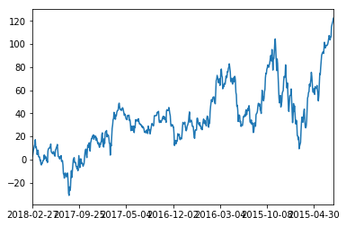
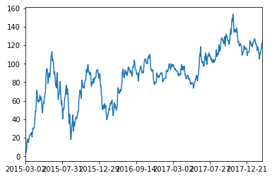
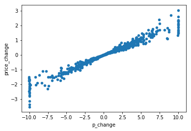
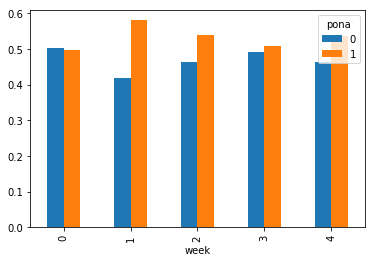
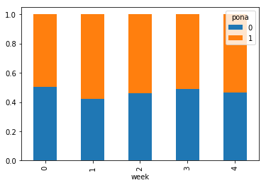
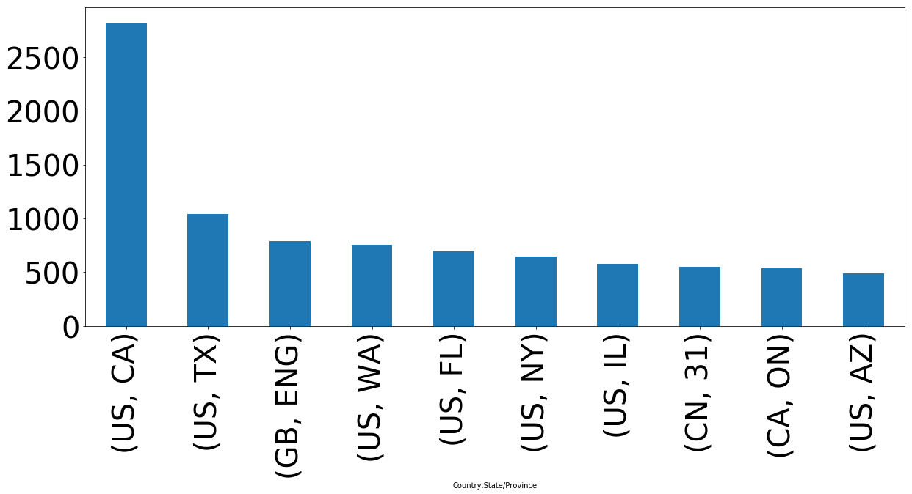
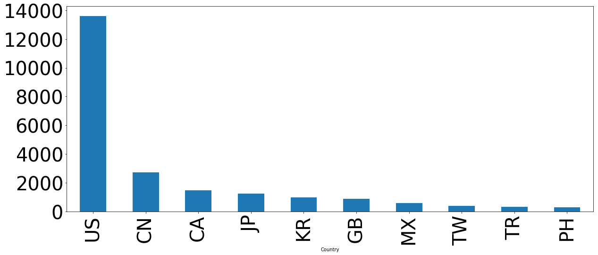

# 1.Pandas是什么
## 1.1Pandas介绍
- panel + data + analysis
    - panel 面板 panel data 面板数据，来源计量经济学 三维数据
- 数据处理工具
- 2008年WesMcKinney开发的库
- 专门用于数据挖掘的开源python库
- 以Numpy为基础，借力Numpy模块在计算方面性能高的优势
- 基于matplotlib，能够简便的画图
- 独特的数据结构

### 1.1.1 三大核心数据结构
- Series
    - 带索引的一维数组
- DataFrame
    - 带行索引和列索引的二维数组，DataFrame是Series的容器
- Panel 
    - MultiIndex与Panel是多维数组
    - Panel是DataFrame的容器

## 1.2使用Pandas的原因
- 便捷的数据处理能力
    - 填写缺失值数据 替换 插补
- 读取文件方便
- 封装类Matplotlib, Numpy的画图和计算

## 1.3DataFrame是什么
### 1.3.1DataFrame结构
- 结构: 既有行索引，又有列索引的二维数组
    - 行索引，表名不同行，横向索引，叫做index
    - 列索引，表名不同列，纵向索引，叫做colums
- 对数组添加索引 
    - **pd.DataFrame(data, index=, columns=)**
    
- 之前我们学过用numpy创建一组数组
    - 但是这样的数据形式很难看见存储的是什么数据，并且也很难获取相应的数据，比如需要获取某个指定股票的数据，很难去获取
    - 如何让这组数据更具有意义的显示, 加上行列索引


```python
# 创建一个符合正态分布的10个股票5天的涨跌幅数据
import random
import numpy as np
stock_change = np.random.normal(0,1,(10,5)) # 平均值为0 标准差为1
stock_change
```


    array([[-2.88930929,  1.06208805, -0.81747296,  0.87739496, -0.20367112],
           [-0.70722712,  0.48723569, -0.10825984,  0.70359771,  0.27915139],
           [ 0.9442169 ,  0.13705276, -0.26357038,  0.30899069, -0.94255207],
           [ 0.06840124,  0.54415478,  1.14323114, -2.21144013,  0.47734736],
           [ 0.55006495, -1.20030068, -0.31836639,  0.04335795,  0.88296565],
           [ 1.08918624,  0.21427402,  0.89084096,  0.78331328,  0.51354345],
           [-1.5955959 ,  0.15088959,  1.32161663, -0.21814411, -1.14305486],
           [ 1.30811061, -0.06995822,  0.11961735,  0.19511925,  1.0163857 ],
           [-0.20727431, -0.19602524,  1.3193415 , -1.44576033,  0.07855679],
           [-0.97853232,  2.16066258,  0.01954552, -0.36506106, -0.12084304]])


```python
import pandas as pd
pd.DataFrame(stock_change)
# 手动添加索引
```


<div>
<style>
    .dataframe thead tr:only-child th {
        text-align: right;
    }

    .dataframe thead th {
        text-align: left;
    }

    .dataframe tbody tr th {
        vertical-align: top;
    }
</style>
<table border="1" class="dataframe">
  <thead>
    <tr style="text-align: right;">
      <th></th>
      <th>0</th>
      <th>1</th>
      <th>2</th>
      <th>3</th>
      <th>4</th>
    </tr>
  </thead>
  <tbody>
    <tr>
      <th>0</th>
      <td>-2.889309</td>
      <td>1.062088</td>
      <td>-0.817473</td>
      <td>0.877395</td>
      <td>-0.203671</td>
    </tr>
    <tr>
      <th>1</th>
      <td>-0.707227</td>
      <td>0.487236</td>
      <td>-0.108260</td>
      <td>0.703598</td>
      <td>0.279151</td>
    </tr>
    <tr>
      <th>2</th>
      <td>0.944217</td>
      <td>0.137053</td>
      <td>-0.263570</td>
      <td>0.308991</td>
      <td>-0.942552</td>
    </tr>
    <tr>
      <th>3</th>
      <td>0.068401</td>
      <td>0.544155</td>
      <td>1.143231</td>
      <td>-2.211440</td>
      <td>0.477347</td>
    </tr>
    <tr>
      <th>4</th>
      <td>0.550065</td>
      <td>-1.200301</td>
      <td>-0.318366</td>
      <td>0.043358</td>
      <td>0.882966</td>
    </tr>
    <tr>
      <th>5</th>
      <td>1.089186</td>
      <td>0.214274</td>
      <td>0.890841</td>
      <td>0.783313</td>
      <td>0.513543</td>
    </tr>
    <tr>
      <th>6</th>
      <td>-1.595596</td>
      <td>0.150890</td>
      <td>1.321617</td>
      <td>-0.218144</td>
      <td>-1.143055</td>
    </tr>
    <tr>
      <th>7</th>
      <td>1.308111</td>
      <td>-0.069958</td>
      <td>0.119617</td>
      <td>0.195119</td>
      <td>1.016386</td>
    </tr>
    <tr>
      <th>8</th>
      <td>-0.207274</td>
      <td>-0.196025</td>
      <td>1.319342</td>
      <td>-1.445760</td>
      <td>0.078557</td>
    </tr>
    <tr>
      <th>9</th>
      <td>-0.978532</td>
      <td>2.160663</td>
      <td>0.019546</td>
      <td>-0.365061</td>
      <td>-0.120843</td>
    </tr>
  </tbody>
</table>
</div>


```python
# 添加行索引
# 构造一个字符串
stock = ["股票 {}".format(i) for i in range(10)]
pd.DataFrame(stock_change, index = stock)
```


<div>
<style>
    .dataframe thead tr:only-child th {
        text-align: right;
    }

    .dataframe thead th {
        text-align: left;
    }

    .dataframe tbody tr th {
        vertical-align: top;
    }
</style>
<table border="1" class="dataframe">
  <thead>
    <tr style="text-align: right;">
      <th></th>
      <th>0</th>
      <th>1</th>
      <th>2</th>
      <th>3</th>
      <th>4</th>
    </tr>
  </thead>
  <tbody>
    <tr>
      <th>股票 0</th>
      <td>-2.889309</td>
      <td>1.062088</td>
      <td>-0.817473</td>
      <td>0.877395</td>
      <td>-0.203671</td>
    </tr>
    <tr>
      <th>股票 1</th>
      <td>-0.707227</td>
      <td>0.487236</td>
      <td>-0.108260</td>
      <td>0.703598</td>
      <td>0.279151</td>
    </tr>
    <tr>
      <th>股票 2</th>
      <td>0.944217</td>
      <td>0.137053</td>
      <td>-0.263570</td>
      <td>0.308991</td>
      <td>-0.942552</td>
    </tr>
    <tr>
      <th>股票 3</th>
      <td>0.068401</td>
      <td>0.544155</td>
      <td>1.143231</td>
      <td>-2.211440</td>
      <td>0.477347</td>
    </tr>
    <tr>
      <th>股票 4</th>
      <td>0.550065</td>
      <td>-1.200301</td>
      <td>-0.318366</td>
      <td>0.043358</td>
      <td>0.882966</td>
    </tr>
    <tr>
      <th>股票 5</th>
      <td>1.089186</td>
      <td>0.214274</td>
      <td>0.890841</td>
      <td>0.783313</td>
      <td>0.513543</td>
    </tr>
    <tr>
      <th>股票 6</th>
      <td>-1.595596</td>
      <td>0.150890</td>
      <td>1.321617</td>
      <td>-0.218144</td>
      <td>-1.143055</td>
    </tr>
    <tr>
      <th>股票 7</th>
      <td>1.308111</td>
      <td>-0.069958</td>
      <td>0.119617</td>
      <td>0.195119</td>
      <td>1.016386</td>
    </tr>
    <tr>
      <th>股票 8</th>
      <td>-0.207274</td>
      <td>-0.196025</td>
      <td>1.319342</td>
      <td>-1.445760</td>
      <td>0.078557</td>
    </tr>
    <tr>
      <th>股票 9</th>
      <td>-0.978532</td>
      <td>2.160663</td>
      <td>0.019546</td>
      <td>-0.365061</td>
      <td>-0.120843</td>
    </tr>
  </tbody>
</table>
</div>


```python
# 添加列索引, 日期索引
# 交易日
date =pd.date_range(start="20190101",periods=5,freq="B")
pd.DataFrame(stock_change, index = stock, columns = date)
```


<div>
<style>
    .dataframe thead tr:only-child th {
        text-align: right;
    }

    .dataframe thead th {
        text-align: left;
    }

    .dataframe tbody tr th {
        vertical-align: top;
    }
</style>
<table border="1" class="dataframe">
  <thead>
    <tr style="text-align: right;">
      <th></th>
      <th>2019-01-01 00:00:00</th>
      <th>2019-01-02 00:00:00</th>
      <th>2019-01-03 00:00:00</th>
      <th>2019-01-04 00:00:00</th>
      <th>2019-01-07 00:00:00</th>
    </tr>
  </thead>
  <tbody>
    <tr>
      <th>股票 0</th>
      <td>-2.889309</td>
      <td>1.062088</td>
      <td>-0.817473</td>
      <td>0.877395</td>
      <td>-0.203671</td>
    </tr>
    <tr>
      <th>股票 1</th>
      <td>-0.707227</td>
      <td>0.487236</td>
      <td>-0.108260</td>
      <td>0.703598</td>
      <td>0.279151</td>
    </tr>
    <tr>
      <th>股票 2</th>
      <td>0.944217</td>
      <td>0.137053</td>
      <td>-0.263570</td>
      <td>0.308991</td>
      <td>-0.942552</td>
    </tr>
    <tr>
      <th>股票 3</th>
      <td>0.068401</td>
      <td>0.544155</td>
      <td>1.143231</td>
      <td>-2.211440</td>
      <td>0.477347</td>
    </tr>
    <tr>
      <th>股票 4</th>
      <td>0.550065</td>
      <td>-1.200301</td>
      <td>-0.318366</td>
      <td>0.043358</td>
      <td>0.882966</td>
    </tr>
    <tr>
      <th>股票 5</th>
      <td>1.089186</td>
      <td>0.214274</td>
      <td>0.890841</td>
      <td>0.783313</td>
      <td>0.513543</td>
    </tr>
    <tr>
      <th>股票 6</th>
      <td>-1.595596</td>
      <td>0.150890</td>
      <td>1.321617</td>
      <td>-0.218144</td>
      <td>-1.143055</td>
    </tr>
    <tr>
      <th>股票 7</th>
      <td>1.308111</td>
      <td>-0.069958</td>
      <td>0.119617</td>
      <td>0.195119</td>
      <td>1.016386</td>
    </tr>
    <tr>
      <th>股票 8</th>
      <td>-0.207274</td>
      <td>-0.196025</td>
      <td>1.319342</td>
      <td>-1.445760</td>
      <td>0.078557</td>
    </tr>
    <tr>
      <th>股票 9</th>
      <td>-0.978532</td>
      <td>2.160663</td>
      <td>0.019546</td>
      <td>-0.365061</td>
      <td>-0.120843</td>
    </tr>
  </tbody>
</table>
</div>


### 1.3.2DataFrame属性
- 常用属性：
    - **shape**
        - data.shape
    - **index**
        - data.index
    - **columns**
        - data.columns
    - **values**
        - data.values 直接获取其中array的值
    - **T**
        - 行列转置
    
- 方法：
    - 想看数据构成，有哪些字段，又不想把所有的数据都显示出来
    - **head()**
    - **tail()**


```python
data = pd.DataFrame(stock_change, index = stock, columns = date)
data # 十行五列的二维数组 shape(10,5)
```


<div>
<style>
    .dataframe thead tr:only-child th {
        text-align: right;
    }

    .dataframe thead th {
        text-align: left;
    }

    .dataframe tbody tr th {
        vertical-align: top;
    }
</style>
<table border="1" class="dataframe">
  <thead>
    <tr style="text-align: right;">
      <th></th>
      <th>2019-01-01 00:00:00</th>
      <th>2019-01-02 00:00:00</th>
      <th>2019-01-03 00:00:00</th>
      <th>2019-01-04 00:00:00</th>
      <th>2019-01-07 00:00:00</th>
    </tr>
  </thead>
  <tbody>
    <tr>
      <th>股票 0</th>
      <td>-2.889309</td>
      <td>1.062088</td>
      <td>-0.817473</td>
      <td>0.877395</td>
      <td>-0.203671</td>
    </tr>
    <tr>
      <th>股票 1</th>
      <td>-0.707227</td>
      <td>0.487236</td>
      <td>-0.108260</td>
      <td>0.703598</td>
      <td>0.279151</td>
    </tr>
    <tr>
      <th>股票 2</th>
      <td>0.944217</td>
      <td>0.137053</td>
      <td>-0.263570</td>
      <td>0.308991</td>
      <td>-0.942552</td>
    </tr>
    <tr>
      <th>股票 3</th>
      <td>0.068401</td>
      <td>0.544155</td>
      <td>1.143231</td>
      <td>-2.211440</td>
      <td>0.477347</td>
    </tr>
    <tr>
      <th>股票 4</th>
      <td>0.550065</td>
      <td>-1.200301</td>
      <td>-0.318366</td>
      <td>0.043358</td>
      <td>0.882966</td>
    </tr>
    <tr>
      <th>股票 5</th>
      <td>1.089186</td>
      <td>0.214274</td>
      <td>0.890841</td>
      <td>0.783313</td>
      <td>0.513543</td>
    </tr>
    <tr>
      <th>股票 6</th>
      <td>-1.595596</td>
      <td>0.150890</td>
      <td>1.321617</td>
      <td>-0.218144</td>
      <td>-1.143055</td>
    </tr>
    <tr>
      <th>股票 7</th>
      <td>1.308111</td>
      <td>-0.069958</td>
      <td>0.119617</td>
      <td>0.195119</td>
      <td>1.016386</td>
    </tr>
    <tr>
      <th>股票 8</th>
      <td>-0.207274</td>
      <td>-0.196025</td>
      <td>1.319342</td>
      <td>-1.445760</td>
      <td>0.078557</td>
    </tr>
    <tr>
      <th>股票 9</th>
      <td>-0.978532</td>
      <td>2.160663</td>
      <td>0.019546</td>
      <td>-0.365061</td>
      <td>-0.120843</td>
    </tr>
  </tbody>
</table>
</div>


```python
data.shape
```


    (10, 5)


```python
data.index
```


    Index(['股票 0', '股票 1', '股票 2', '股票 3', '股票 4', '股票 5', '股票 6', '股票 7', '股票 8',
           '股票 9'],
          dtype='object')


```python
data.columns
```


    DatetimeIndex(['2019-01-01', '2019-01-02', '2019-01-03', '2019-01-04',
                   '2019-01-07'],
                  dtype='datetime64[ns]', freq='B')


```python
data.values
```


    array([[-2.88930929,  1.06208805, -0.81747296,  0.87739496, -0.20367112],
           [-0.70722712,  0.48723569, -0.10825984,  0.70359771,  0.27915139],
           [ 0.9442169 ,  0.13705276, -0.26357038,  0.30899069, -0.94255207],
           [ 0.06840124,  0.54415478,  1.14323114, -2.21144013,  0.47734736],
           [ 0.55006495, -1.20030068, -0.31836639,  0.04335795,  0.88296565],
           [ 1.08918624,  0.21427402,  0.89084096,  0.78331328,  0.51354345],
           [-1.5955959 ,  0.15088959,  1.32161663, -0.21814411, -1.14305486],
           [ 1.30811061, -0.06995822,  0.11961735,  0.19511925,  1.0163857 ],
           [-0.20727431, -0.19602524,  1.3193415 , -1.44576033,  0.07855679],
           [-0.97853232,  2.16066258,  0.01954552, -0.36506106, -0.12084304]])


```python
data.T
```


<div>
<style>
    .dataframe thead tr:only-child th {
        text-align: right;
    }

    .dataframe thead th {
        text-align: left;
    }

    .dataframe tbody tr th {
        vertical-align: top;
    }
</style>
<table border="1" class="dataframe">
  <thead>
    <tr style="text-align: right;">
      <th></th>
      <th>股票 0</th>
      <th>股票 1</th>
      <th>股票 2</th>
      <th>股票 3</th>
      <th>股票 4</th>
      <th>股票 5</th>
      <th>股票 6</th>
      <th>股票 7</th>
      <th>股票 8</th>
      <th>股票 9</th>
    </tr>
  </thead>
  <tbody>
    <tr>
      <th>2019-01-01</th>
      <td>-2.889309</td>
      <td>-0.707227</td>
      <td>0.944217</td>
      <td>0.068401</td>
      <td>0.550065</td>
      <td>1.089186</td>
      <td>-1.595596</td>
      <td>1.308111</td>
      <td>-0.207274</td>
      <td>-0.978532</td>
    </tr>
    <tr>
      <th>2019-01-02</th>
      <td>1.062088</td>
      <td>0.487236</td>
      <td>0.137053</td>
      <td>0.544155</td>
      <td>-1.200301</td>
      <td>0.214274</td>
      <td>0.150890</td>
      <td>-0.069958</td>
      <td>-0.196025</td>
      <td>2.160663</td>
    </tr>
    <tr>
      <th>2019-01-03</th>
      <td>-0.817473</td>
      <td>-0.108260</td>
      <td>-0.263570</td>
      <td>1.143231</td>
      <td>-0.318366</td>
      <td>0.890841</td>
      <td>1.321617</td>
      <td>0.119617</td>
      <td>1.319342</td>
      <td>0.019546</td>
    </tr>
    <tr>
      <th>2019-01-04</th>
      <td>0.877395</td>
      <td>0.703598</td>
      <td>0.308991</td>
      <td>-2.211440</td>
      <td>0.043358</td>
      <td>0.783313</td>
      <td>-0.218144</td>
      <td>0.195119</td>
      <td>-1.445760</td>
      <td>-0.365061</td>
    </tr>
    <tr>
      <th>2019-01-07</th>
      <td>-0.203671</td>
      <td>0.279151</td>
      <td>-0.942552</td>
      <td>0.477347</td>
      <td>0.882966</td>
      <td>0.513543</td>
      <td>-1.143055</td>
      <td>1.016386</td>
      <td>0.078557</td>
      <td>-0.120843</td>
    </tr>
  </tbody>
</table>
</div>


```python
data.head()
#默认返回前5行
```


<div>
<style>
    .dataframe thead tr:only-child th {
        text-align: right;
    }

    .dataframe thead th {
        text-align: left;
    }

    .dataframe tbody tr th {
        vertical-align: top;
    }
</style>
<table border="1" class="dataframe">
  <thead>
    <tr style="text-align: right;">
      <th></th>
      <th>2019-01-01 00:00:00</th>
      <th>2019-01-02 00:00:00</th>
      <th>2019-01-03 00:00:00</th>
      <th>2019-01-04 00:00:00</th>
      <th>2019-01-07 00:00:00</th>
    </tr>
  </thead>
  <tbody>
    <tr>
      <th>股票 0</th>
      <td>-2.889309</td>
      <td>1.062088</td>
      <td>-0.817473</td>
      <td>0.877395</td>
      <td>-0.203671</td>
    </tr>
    <tr>
      <th>股票 1</th>
      <td>-0.707227</td>
      <td>0.487236</td>
      <td>-0.108260</td>
      <td>0.703598</td>
      <td>0.279151</td>
    </tr>
    <tr>
      <th>股票 2</th>
      <td>0.944217</td>
      <td>0.137053</td>
      <td>-0.263570</td>
      <td>0.308991</td>
      <td>-0.942552</td>
    </tr>
    <tr>
      <th>股票 3</th>
      <td>0.068401</td>
      <td>0.544155</td>
      <td>1.143231</td>
      <td>-2.211440</td>
      <td>0.477347</td>
    </tr>
    <tr>
      <th>股票 4</th>
      <td>0.550065</td>
      <td>-1.200301</td>
      <td>-0.318366</td>
      <td>0.043358</td>
      <td>0.882966</td>
    </tr>
  </tbody>
</table>
</div>


```python
data.head(3)
```


<div>
<style>
    .dataframe thead tr:only-child th {
        text-align: right;
    }

    .dataframe thead th {
        text-align: left;
    }

    .dataframe tbody tr th {
        vertical-align: top;
    }
</style>
<table border="1" class="dataframe">
  <thead>
    <tr style="text-align: right;">
      <th></th>
      <th>2019-01-01 00:00:00</th>
      <th>2019-01-02 00:00:00</th>
      <th>2019-01-03 00:00:00</th>
      <th>2019-01-04 00:00:00</th>
      <th>2019-01-07 00:00:00</th>
    </tr>
  </thead>
  <tbody>
    <tr>
      <th>股票 0</th>
      <td>-2.889309</td>
      <td>1.062088</td>
      <td>-0.817473</td>
      <td>0.877395</td>
      <td>-0.203671</td>
    </tr>
    <tr>
      <th>股票 1</th>
      <td>-0.707227</td>
      <td>0.487236</td>
      <td>-0.108260</td>
      <td>0.703598</td>
      <td>0.279151</td>
    </tr>
    <tr>
      <th>股票 2</th>
      <td>0.944217</td>
      <td>0.137053</td>
      <td>-0.263570</td>
      <td>0.308991</td>
      <td>-0.942552</td>
    </tr>
  </tbody>
</table>
</div>


```python
data.tail() #  默认返回后5行
```


<div>
<style>
    .dataframe thead tr:only-child th {
        text-align: right;
    }

    .dataframe thead th {
        text-align: left;
    }

    .dataframe tbody tr th {
        vertical-align: top;
    }
</style>
<table border="1" class="dataframe">
  <thead>
    <tr style="text-align: right;">
      <th></th>
      <th>2019-01-01 00:00:00</th>
      <th>2019-01-02 00:00:00</th>
      <th>2019-01-03 00:00:00</th>
      <th>2019-01-04 00:00:00</th>
      <th>2019-01-07 00:00:00</th>
    </tr>
  </thead>
  <tbody>
    <tr>
      <th>股票 5</th>
      <td>1.089186</td>
      <td>0.214274</td>
      <td>0.890841</td>
      <td>0.783313</td>
      <td>0.513543</td>
    </tr>
    <tr>
      <th>股票 6</th>
      <td>-1.595596</td>
      <td>0.150890</td>
      <td>1.321617</td>
      <td>-0.218144</td>
      <td>-1.143055</td>
    </tr>
    <tr>
      <th>股票 7</th>
      <td>1.308111</td>
      <td>-0.069958</td>
      <td>0.119617</td>
      <td>0.195119</td>
      <td>1.016386</td>
    </tr>
    <tr>
      <th>股票 8</th>
      <td>-0.207274</td>
      <td>-0.196025</td>
      <td>1.319342</td>
      <td>-1.445760</td>
      <td>0.078557</td>
    </tr>
    <tr>
      <th>股票 9</th>
      <td>-0.978532</td>
      <td>2.160663</td>
      <td>0.019546</td>
      <td>-0.365061</td>
      <td>-0.120843</td>
    </tr>
  </tbody>
</table>
</div>


### 1.3.3DataFrame索引的设置
- 修改行列索引值
    - 不能单独修改，必须要整体修改
- 重设索引
    - reset_index(drop=False)
        - 设置新的下标索引
        - drop：默认是False，不删除原来的索引，如果为True，删除原来的索引值
- 设置新的索引

#### 1修改行列索引值
- 修改行列索引值
    - 不能单独修改，必须要整体修改
- **data.index = new_index**


```python
data.head()
```


<div>
<style>
    .dataframe thead tr:only-child th {
        text-align: right;
    }

    .dataframe thead th {
        text-align: left;
    }

    .dataframe tbody tr th {
        vertical-align: top;
    }
</style>
<table border="1" class="dataframe">
  <thead>
    <tr style="text-align: right;">
      <th></th>
      <th>2019-01-01 00:00:00</th>
      <th>2019-01-02 00:00:00</th>
      <th>2019-01-03 00:00:00</th>
      <th>2019-01-04 00:00:00</th>
      <th>2019-01-07 00:00:00</th>
    </tr>
  </thead>
  <tbody>
    <tr>
      <th>股票 0</th>
      <td>-2.889309</td>
      <td>1.062088</td>
      <td>-0.817473</td>
      <td>0.877395</td>
      <td>-0.203671</td>
    </tr>
    <tr>
      <th>股票 1</th>
      <td>-0.707227</td>
      <td>0.487236</td>
      <td>-0.108260</td>
      <td>0.703598</td>
      <td>0.279151</td>
    </tr>
    <tr>
      <th>股票 2</th>
      <td>0.944217</td>
      <td>0.137053</td>
      <td>-0.263570</td>
      <td>0.308991</td>
      <td>-0.942552</td>
    </tr>
    <tr>
      <th>股票 3</th>
      <td>0.068401</td>
      <td>0.544155</td>
      <td>1.143231</td>
      <td>-2.211440</td>
      <td>0.477347</td>
    </tr>
    <tr>
      <th>股票 4</th>
      <td>0.550065</td>
      <td>-1.200301</td>
      <td>-0.318366</td>
      <td>0.043358</td>
      <td>0.882966</td>
    </tr>
  </tbody>
</table>
</div>


```python
data.index[2] = "股票88" # 不能单独修改，必须要整体修改
```


    ---------------------------------------------------------------------------

    TypeError                                 Traceback (most recent call last)

    <ipython-input-17-1dbe39a8a038> in <module>()
    ----> 1 data.index[2] = "股票88" # 不能单独修改，必须要整体修改
    

    D:\anaconda\lib\site-packages\pandas\core\indexes\base.py in __setitem__(self, key, value)
       1668 
       1669     def __setitem__(self, key, value):
    -> 1670         raise TypeError("Index does not support mutable operations")
       1671 
       1672     def __getitem__(self, key):
    

    TypeError: Index does not support mutable operations


```python
stock_ = ["股票_{}".format(i) for i in range(10)]
stock_
```


    ['股票_0',
     '股票_1',
     '股票_2',
     '股票_3',
     '股票_4',
     '股票_5',
     '股票_6',
     '股票_7',
     '股票_8',
     '股票_9']


```python
data.index
```


    Index(['股票 0', '股票 1', '股票 2', '股票 3', '股票 4', '股票 5', '股票 6', '股票 7', '股票 8',
           '股票 9'],
          dtype='object')


```python
data.index = stock_
data.index
```


    Index(['股票_0', '股票_1', '股票_2', '股票_3', '股票_4', '股票_5', '股票_6', '股票_7', '股票_8',
           '股票_9'],
          dtype='object')


```python
data
```


<div>
<style>
    .dataframe thead tr:only-child th {
        text-align: right;
    }

    .dataframe thead th {
        text-align: left;
    }

    .dataframe tbody tr th {
        vertical-align: top;
    }
</style>
<table border="1" class="dataframe">
  <thead>
    <tr style="text-align: right;">
      <th></th>
      <th>2019-01-01 00:00:00</th>
      <th>2019-01-02 00:00:00</th>
      <th>2019-01-03 00:00:00</th>
      <th>2019-01-04 00:00:00</th>
      <th>2019-01-07 00:00:00</th>
    </tr>
  </thead>
  <tbody>
    <tr>
      <th>股票_0</th>
      <td>-2.889309</td>
      <td>1.062088</td>
      <td>-0.817473</td>
      <td>0.877395</td>
      <td>-0.203671</td>
    </tr>
    <tr>
      <th>股票_1</th>
      <td>-0.707227</td>
      <td>0.487236</td>
      <td>-0.108260</td>
      <td>0.703598</td>
      <td>0.279151</td>
    </tr>
    <tr>
      <th>股票_2</th>
      <td>0.944217</td>
      <td>0.137053</td>
      <td>-0.263570</td>
      <td>0.308991</td>
      <td>-0.942552</td>
    </tr>
    <tr>
      <th>股票_3</th>
      <td>0.068401</td>
      <td>0.544155</td>
      <td>1.143231</td>
      <td>-2.211440</td>
      <td>0.477347</td>
    </tr>
    <tr>
      <th>股票_4</th>
      <td>0.550065</td>
      <td>-1.200301</td>
      <td>-0.318366</td>
      <td>0.043358</td>
      <td>0.882966</td>
    </tr>
    <tr>
      <th>股票_5</th>
      <td>1.089186</td>
      <td>0.214274</td>
      <td>0.890841</td>
      <td>0.783313</td>
      <td>0.513543</td>
    </tr>
    <tr>
      <th>股票_6</th>
      <td>-1.595596</td>
      <td>0.150890</td>
      <td>1.321617</td>
      <td>-0.218144</td>
      <td>-1.143055</td>
    </tr>
    <tr>
      <th>股票_7</th>
      <td>1.308111</td>
      <td>-0.069958</td>
      <td>0.119617</td>
      <td>0.195119</td>
      <td>1.016386</td>
    </tr>
    <tr>
      <th>股票_8</th>
      <td>-0.207274</td>
      <td>-0.196025</td>
      <td>1.319342</td>
      <td>-1.445760</td>
      <td>0.078557</td>
    </tr>
    <tr>
      <th>股票_9</th>
      <td>-0.978532</td>
      <td>2.160663</td>
      <td>0.019546</td>
      <td>-0.365061</td>
      <td>-0.120843</td>
    </tr>
  </tbody>
</table>
</div>


#### 2重设索引
- **reset_index(drop=False)**
    - 设置新的下标索引
    - drop:默认为False，不删除原来索引，如果为True，删除原来的索引值


```python
data.reset_index()
```


<div>
<style>
    .dataframe thead tr:only-child th {
        text-align: right;
    }

    .dataframe thead th {
        text-align: left;
    }

    .dataframe tbody tr th {
        vertical-align: top;
    }
</style>
<table border="1" class="dataframe">
  <thead>
    <tr style="text-align: right;">
      <th></th>
      <th>index</th>
      <th>2019-01-01 00:00:00</th>
      <th>2019-01-02 00:00:00</th>
      <th>2019-01-03 00:00:00</th>
      <th>2019-01-04 00:00:00</th>
      <th>2019-01-07 00:00:00</th>
    </tr>
  </thead>
  <tbody>
    <tr>
      <th>0</th>
      <td>股票_0</td>
      <td>-2.889309</td>
      <td>1.062088</td>
      <td>-0.817473</td>
      <td>0.877395</td>
      <td>-0.203671</td>
    </tr>
    <tr>
      <th>1</th>
      <td>股票_1</td>
      <td>-0.707227</td>
      <td>0.487236</td>
      <td>-0.108260</td>
      <td>0.703598</td>
      <td>0.279151</td>
    </tr>
    <tr>
      <th>2</th>
      <td>股票_2</td>
      <td>0.944217</td>
      <td>0.137053</td>
      <td>-0.263570</td>
      <td>0.308991</td>
      <td>-0.942552</td>
    </tr>
    <tr>
      <th>3</th>
      <td>股票_3</td>
      <td>0.068401</td>
      <td>0.544155</td>
      <td>1.143231</td>
      <td>-2.211440</td>
      <td>0.477347</td>
    </tr>
    <tr>
      <th>4</th>
      <td>股票_4</td>
      <td>0.550065</td>
      <td>-1.200301</td>
      <td>-0.318366</td>
      <td>0.043358</td>
      <td>0.882966</td>
    </tr>
    <tr>
      <th>5</th>
      <td>股票_5</td>
      <td>1.089186</td>
      <td>0.214274</td>
      <td>0.890841</td>
      <td>0.783313</td>
      <td>0.513543</td>
    </tr>
    <tr>
      <th>6</th>
      <td>股票_6</td>
      <td>-1.595596</td>
      <td>0.150890</td>
      <td>1.321617</td>
      <td>-0.218144</td>
      <td>-1.143055</td>
    </tr>
    <tr>
      <th>7</th>
      <td>股票_7</td>
      <td>1.308111</td>
      <td>-0.069958</td>
      <td>0.119617</td>
      <td>0.195119</td>
      <td>1.016386</td>
    </tr>
    <tr>
      <th>8</th>
      <td>股票_8</td>
      <td>-0.207274</td>
      <td>-0.196025</td>
      <td>1.319342</td>
      <td>-1.445760</td>
      <td>0.078557</td>
    </tr>
    <tr>
      <th>9</th>
      <td>股票_9</td>
      <td>-0.978532</td>
      <td>2.160663</td>
      <td>0.019546</td>
      <td>-0.365061</td>
      <td>-0.120843</td>
    </tr>
  </tbody>
</table>
</div>


```python
data.reset_index().shape # 多了一列
```


    (10, 6)


```python
data.reset_index(drop = True)  # 原来索引那列被删除了
```


<div>
<style>
    .dataframe thead tr:only-child th {
        text-align: right;
    }

    .dataframe thead th {
        text-align: left;
    }

    .dataframe tbody tr th {
        vertical-align: top;
    }
</style>
<table border="1" class="dataframe">
  <thead>
    <tr style="text-align: right;">
      <th></th>
      <th>2019-01-01 00:00:00</th>
      <th>2019-01-02 00:00:00</th>
      <th>2019-01-03 00:00:00</th>
      <th>2019-01-04 00:00:00</th>
      <th>2019-01-07 00:00:00</th>
    </tr>
  </thead>
  <tbody>
    <tr>
      <th>0</th>
      <td>-2.889309</td>
      <td>1.062088</td>
      <td>-0.817473</td>
      <td>0.877395</td>
      <td>-0.203671</td>
    </tr>
    <tr>
      <th>1</th>
      <td>-0.707227</td>
      <td>0.487236</td>
      <td>-0.108260</td>
      <td>0.703598</td>
      <td>0.279151</td>
    </tr>
    <tr>
      <th>2</th>
      <td>0.944217</td>
      <td>0.137053</td>
      <td>-0.263570</td>
      <td>0.308991</td>
      <td>-0.942552</td>
    </tr>
    <tr>
      <th>3</th>
      <td>0.068401</td>
      <td>0.544155</td>
      <td>1.143231</td>
      <td>-2.211440</td>
      <td>0.477347</td>
    </tr>
    <tr>
      <th>4</th>
      <td>0.550065</td>
      <td>-1.200301</td>
      <td>-0.318366</td>
      <td>0.043358</td>
      <td>0.882966</td>
    </tr>
    <tr>
      <th>5</th>
      <td>1.089186</td>
      <td>0.214274</td>
      <td>0.890841</td>
      <td>0.783313</td>
      <td>0.513543</td>
    </tr>
    <tr>
      <th>6</th>
      <td>-1.595596</td>
      <td>0.150890</td>
      <td>1.321617</td>
      <td>-0.218144</td>
      <td>-1.143055</td>
    </tr>
    <tr>
      <th>7</th>
      <td>1.308111</td>
      <td>-0.069958</td>
      <td>0.119617</td>
      <td>0.195119</td>
      <td>1.016386</td>
    </tr>
    <tr>
      <th>8</th>
      <td>-0.207274</td>
      <td>-0.196025</td>
      <td>1.319342</td>
      <td>-1.445760</td>
      <td>0.078557</td>
    </tr>
    <tr>
      <th>9</th>
      <td>-0.978532</td>
      <td>2.160663</td>
      <td>0.019546</td>
      <td>-0.365061</td>
      <td>-0.120843</td>
    </tr>
  </tbody>
</table>
</div>


```python
data.reset_index(drop = True).shape
```


    (10, 5)


#### 3设置新的索引
- **set_index(keys,drop=True)**
    - 原来的索引扔掉类，数据集内某一列作为新的列索引
    - keys: 列索引名称或者列索引名称的列表
    - drop： boolean，default True，当做新的索引，删除原来的列
- 用字典生成dataframe


```python
# 用字典生成dataframe
df = pd.DataFrame({'month': [1, 4, 7, 10],
                    'year': [2012, 2014, 2013, 2014],
                    'sale':[55, 40, 84, 31]})
```


```python
df
```


<div>
<style>
    .dataframe thead tr:only-child th {
        text-align: right;
    }

    .dataframe thead th {
        text-align: left;
    }

    .dataframe tbody tr th {
        vertical-align: top;
    }
</style>
<table border="1" class="dataframe">
  <thead>
    <tr style="text-align: right;">
      <th></th>
      <th>month</th>
      <th>sale</th>
      <th>year</th>
    </tr>
  </thead>
  <tbody>
    <tr>
      <th>0</th>
      <td>1</td>
      <td>55</td>
      <td>2012</td>
    </tr>
    <tr>
      <th>1</th>
      <td>4</td>
      <td>40</td>
      <td>2014</td>
    </tr>
    <tr>
      <th>2</th>
      <td>7</td>
      <td>84</td>
      <td>2013</td>
    </tr>
    <tr>
      <th>3</th>
      <td>10</td>
      <td>31</td>
      <td>2014</td>
    </tr>
  </tbody>
</table>
</div>


```python
# 以月份设置成新的索引
df.set_index("month")
```


<div>
<style>
    .dataframe thead tr:only-child th {
        text-align: right;
    }

    .dataframe thead th {
        text-align: left;
    }

    .dataframe tbody tr th {
        vertical-align: top;
    }
</style>
<table border="1" class="dataframe">
  <thead>
    <tr style="text-align: right;">
      <th></th>
      <th>sale</th>
      <th>year</th>
    </tr>
    <tr>
      <th>month</th>
      <th></th>
      <th></th>
    </tr>
  </thead>
  <tbody>
    <tr>
      <th>1</th>
      <td>55</td>
      <td>2012</td>
    </tr>
    <tr>
      <th>4</th>
      <td>40</td>
      <td>2014</td>
    </tr>
    <tr>
      <th>7</th>
      <td>84</td>
      <td>2013</td>
    </tr>
    <tr>
      <th>10</th>
      <td>31</td>
      <td>2014</td>
    </tr>
  </tbody>
</table>
</div>


```python
df.set_index("month", drop = False)
```


<div>
<style>
    .dataframe thead tr:only-child th {
        text-align: right;
    }

    .dataframe thead th {
        text-align: left;
    }

    .dataframe tbody tr th {
        vertical-align: top;
    }
</style>
<table border="1" class="dataframe">
  <thead>
    <tr style="text-align: right;">
      <th></th>
      <th>month</th>
      <th>sale</th>
      <th>year</th>
    </tr>
    <tr>
      <th>month</th>
      <th></th>
      <th></th>
      <th></th>
    </tr>
  </thead>
  <tbody>
    <tr>
      <th>1</th>
      <td>1</td>
      <td>55</td>
      <td>2012</td>
    </tr>
    <tr>
      <th>4</th>
      <td>4</td>
      <td>40</td>
      <td>2014</td>
    </tr>
    <tr>
      <th>7</th>
      <td>7</td>
      <td>84</td>
      <td>2013</td>
    </tr>
    <tr>
      <th>10</th>
      <td>10</td>
      <td>31</td>
      <td>2014</td>
    </tr>
  </tbody>
</table>
</div>


```python
df.index
```


    RangeIndex(start=0, stop=4, step=1)


```python
# month和sale都做为索引
new_def = df.set_index(["month","year"])
new_def
```


<div>
<style>
    .dataframe thead tr:only-child th {
        text-align: right;
    }

    .dataframe thead th {
        text-align: left;
    }

    .dataframe tbody tr th {
        vertical-align: top;
    }
</style>
<table border="1" class="dataframe">
  <thead>
    <tr style="text-align: right;">
      <th></th>
      <th></th>
      <th>sale</th>
    </tr>
    <tr>
      <th>month</th>
      <th>year</th>
      <th></th>
    </tr>
  </thead>
  <tbody>
    <tr>
      <th>1</th>
      <th>2012</th>
      <td>55</td>
    </tr>
    <tr>
      <th>4</th>
      <th>2014</th>
      <td>40</td>
    </tr>
    <tr>
      <th>7</th>
      <th>2013</th>
      <td>84</td>
    </tr>
    <tr>
      <th>10</th>
      <th>2014</th>
      <td>31</td>
    </tr>
  </tbody>
</table>
</div>


```python
new_def.index
```


    MultiIndex(levels=[[1, 4, 7, 10], [2012, 2013, 2014]],
               labels=[[0, 1, 2, 3], [0, 2, 1, 2]],
               names=['month', 'year'])


## 1.4MultiIndex与Panel是什么
- 可以用来表示三维数据了
- 通过刚才的设置，这样 Data Frame就变成类一个具有MultiIndex的DataFrame
- 三维数组推荐使用MultiIndex 不推荐使用Panel
### 1.4.1MultiIndex是什么
- 多级或分层索引对象
- indexd的属性
    - **names**：levels的名称
    - **levels**： 每个level的元组值


```python
new_def.index
```


    MultiIndex(levels=[[1, 4, 7, 10], [2012, 2013, 2014]],
               labels=[[0, 1, 2, 3], [0, 2, 1, 2]],
               names=['month', 'year'])


```python
new_def.index.names ## 这样的一个data frame，有几个索引，索引的名字
```


    FrozenList(['month', 'year'])


```python
new_def.index.levels  ##
```


    FrozenList([[1, 4, 7, 10], [2012, 2013, 2014]])


### 1.4.2Panel是什么
- 用来存储三维结构的面板
- class pandas.Panel(data=None,items=None,major_axis=None,minor_axis=None,copy=False,dtype=None)
- **Panel看出data frame的容器**
- **items axis 0**, 每个项目对应于内部包含的数据帧(DataFrame)
- **major_axis axis 1**, 他是每个数据帧(DataFrame)的索引(行)
- **minor_axis axis 2**, 他是每个数据帧(DataFrame)的列
- 推荐使用用于表示3D数据的方法是DataFrame上的MultiIndex的方法


```python
p = pd.Panel(np.arange(24).reshape(4,3,2),
                 items=list('ABCD'),
                 major_axis=pd.date_range('20130101', periods=3),
                 minor_axis=['first', 'second'])
p
```


    <class 'pandas.core.panel.Panel'>
    Dimensions: 4 (items) x 3 (major_axis) x 2 (minor_axis)
    Items axis: A to D
    Major_axis axis: 2013-01-01 00:00:00 to 2013-01-03 00:00:00
    Minor_axis axis: first to second


```python
p["A"]
```


<div>
<style>
    .dataframe thead tr:only-child th {
        text-align: right;
    }

    .dataframe thead th {
        text-align: left;
    }

    .dataframe tbody tr th {
        vertical-align: top;
    }
</style>
<table border="1" class="dataframe">
  <thead>
    <tr style="text-align: right;">
      <th></th>
      <th>first</th>
      <th>second</th>
    </tr>
  </thead>
  <tbody>
    <tr>
      <th>2013-01-01</th>
      <td>0</td>
      <td>1</td>
    </tr>
    <tr>
      <th>2013-01-02</th>
      <td>2</td>
      <td>3</td>
    </tr>
    <tr>
      <th>2013-01-03</th>
      <td>4</td>
      <td>5</td>
    </tr>
  </tbody>
</table>
</div>


```python
p["B"]
```


<div>
<style>
    .dataframe thead tr:only-child th {
        text-align: right;
    }

    .dataframe thead th {
        text-align: left;
    }

    .dataframe tbody tr th {
        vertical-align: top;
    }
</style>
<table border="1" class="dataframe">
  <thead>
    <tr style="text-align: right;">
      <th></th>
      <th>first</th>
      <th>second</th>
    </tr>
  </thead>
  <tbody>
    <tr>
      <th>2013-01-01</th>
      <td>6</td>
      <td>7</td>
    </tr>
    <tr>
      <th>2013-01-02</th>
      <td>8</td>
      <td>9</td>
    </tr>
    <tr>
      <th>2013-01-03</th>
      <td>10</td>
      <td>11</td>
    </tr>
  </tbody>
</table>
</div>


```python
p.major_xs("20130101")
```


<div>
<style>
    .dataframe thead tr:only-child th {
        text-align: right;
    }

    .dataframe thead th {
        text-align: left;
    }

    .dataframe tbody tr th {
        vertical-align: top;
    }
</style>
<table border="1" class="dataframe">
  <thead>
    <tr style="text-align: right;">
      <th></th>
      <th>A</th>
      <th>B</th>
      <th>C</th>
      <th>D</th>
    </tr>
  </thead>
  <tbody>
    <tr>
      <th>first</th>
      <td>0</td>
      <td>6</td>
      <td>12</td>
      <td>18</td>
    </tr>
    <tr>
      <th>second</th>
      <td>1</td>
      <td>7</td>
      <td>13</td>
      <td>19</td>
    </tr>
  </tbody>
</table>
</div>


```python
p.minor_xs("first")
```


<div>
<style>
    .dataframe thead tr:only-child th {
        text-align: right;
    }

    .dataframe thead th {
        text-align: left;
    }

    .dataframe tbody tr th {
        vertical-align: top;
    }
</style>
<table border="1" class="dataframe">
  <thead>
    <tr style="text-align: right;">
      <th></th>
      <th>A</th>
      <th>B</th>
      <th>C</th>
      <th>D</th>
    </tr>
  </thead>
  <tbody>
    <tr>
      <th>2013-01-01</th>
      <td>0</td>
      <td>6</td>
      <td>12</td>
      <td>18</td>
    </tr>
    <tr>
      <th>2013-01-02</th>
      <td>2</td>
      <td>8</td>
      <td>14</td>
      <td>20</td>
    </tr>
    <tr>
      <th>2013-01-03</th>
      <td>4</td>
      <td>10</td>
      <td>16</td>
      <td>22</td>
    </tr>
  </tbody>
</table>
</div>


## 1.5Series是什么

- 带索引的一维数组
- series结构只有行索引
- 属性
    - index
    - values 一维数组 ndarray
- 方法
### 1.5.1eries获取索引和值
- index
- values


```python
data
```


<div>
<style>
    .dataframe thead tr:only-child th {
        text-align: right;
    }

    .dataframe thead th {
        text-align: left;
    }

    .dataframe tbody tr th {
        vertical-align: top;
    }
</style>
<table border="1" class="dataframe">
  <thead>
    <tr style="text-align: right;">
      <th></th>
      <th>2019-01-01 00:00:00</th>
      <th>2019-01-02 00:00:00</th>
      <th>2019-01-03 00:00:00</th>
      <th>2019-01-04 00:00:00</th>
      <th>2019-01-07 00:00:00</th>
    </tr>
  </thead>
  <tbody>
    <tr>
      <th>股票_0</th>
      <td>-2.889309</td>
      <td>1.062088</td>
      <td>-0.817473</td>
      <td>0.877395</td>
      <td>-0.203671</td>
    </tr>
    <tr>
      <th>股票_1</th>
      <td>-0.707227</td>
      <td>0.487236</td>
      <td>-0.108260</td>
      <td>0.703598</td>
      <td>0.279151</td>
    </tr>
    <tr>
      <th>股票_2</th>
      <td>0.944217</td>
      <td>0.137053</td>
      <td>-0.263570</td>
      <td>0.308991</td>
      <td>-0.942552</td>
    </tr>
    <tr>
      <th>股票_3</th>
      <td>0.068401</td>
      <td>0.544155</td>
      <td>1.143231</td>
      <td>-2.211440</td>
      <td>0.477347</td>
    </tr>
    <tr>
      <th>股票_4</th>
      <td>0.550065</td>
      <td>-1.200301</td>
      <td>-0.318366</td>
      <td>0.043358</td>
      <td>0.882966</td>
    </tr>
    <tr>
      <th>股票_5</th>
      <td>1.089186</td>
      <td>0.214274</td>
      <td>0.890841</td>
      <td>0.783313</td>
      <td>0.513543</td>
    </tr>
    <tr>
      <th>股票_6</th>
      <td>-1.595596</td>
      <td>0.150890</td>
      <td>1.321617</td>
      <td>-0.218144</td>
      <td>-1.143055</td>
    </tr>
    <tr>
      <th>股票_7</th>
      <td>1.308111</td>
      <td>-0.069958</td>
      <td>0.119617</td>
      <td>0.195119</td>
      <td>1.016386</td>
    </tr>
    <tr>
      <th>股票_8</th>
      <td>-0.207274</td>
      <td>-0.196025</td>
      <td>1.319342</td>
      <td>-1.445760</td>
      <td>0.078557</td>
    </tr>
    <tr>
      <th>股票_9</th>
      <td>-0.978532</td>
      <td>2.160663</td>
      <td>0.019546</td>
      <td>-0.365061</td>
      <td>-0.120843</td>
    </tr>
  </tbody>
</table>
</div>


```python
sr = data.iloc[1,:]  #股票1的数据，抽取了一行
sr
```


    2019-01-01   -0.707227
    2019-01-02    0.487236
    2019-01-03   -0.108260
    2019-01-04    0.703598
    2019-01-07    0.279151
    Freq: B, Name: 股票_1, dtype: float64


```python
sr.index
```


    DatetimeIndex(['2019-01-01', '2019-01-02', '2019-01-03', '2019-01-04',
                   '2019-01-07'],
                  dtype='datetime64[ns]', freq='B')


```python
sr.values 
```


    array([-0.70722712,  0.48723569, -0.10825984,  0.70359771,  0.27915139])


```python
data.iloc[1,:]
```


    2019-01-01   -0.707227
    2019-01-02    0.487236
    2019-01-03   -0.108260
    2019-01-04    0.703598
    2019-01-07    0.279151
    Freq: B, Name: 股票_1, dtype: float64


```python
data.iloc[1,:].index
```


    DatetimeIndex(['2019-01-01', '2019-01-02', '2019-01-03', '2019-01-04',
                   '2019-01-07'],
                  dtype='datetime64[ns]', freq='B')


### 1.5.2Series创建
- 通过已有数据创建
    - 指定内容，默认索引
        - **pd.Series(np.arange(10))**
    - 指定索引
        - **pd.Series([6.7,5.6,3,10,2],index=['A','B','C'])**
    - 通过字典数据创建
        -**pd.Series({'red':100,'blue':200,'green':500,'yellow'})**


```python
# Series是带索引的一维数组，所以第一列为索引 
pd.Series(np.arange(3,9,2))
```


    0    3
    1    5
    2    7
    dtype: int32


```python
pd.Series(np.arange(3,9,2),index=['A','B','C'])
```


    A    3
    B    5
    C    7
    dtype: int32


```python
pd.Series({'red':3,'blue':5,'yellow':7})
```


    blue      5
    red       3
    yellow    7
    dtype: int64


```python
pd.Series([6.7,5.6,3,10,2],index=[1,2,3,4,5])
```


    1     6.7
    2     5.6
    3     3.0
    4    10.0
    5     2.0
    dtype: float64


```python
pd.Series({'red':100,'blue':200,'green':500,'yellow':7})
```


    blue      200
    green     500
    red       100
    yellow      7
    dtype: int64


# 2基础数据操作


```python
# 读取文件
data = pd.read_csv("stock_day.csv")
data.head()
```


<div>
<style>
    .dataframe thead tr:only-child th {
        text-align: right;
    }

    .dataframe thead th {
        text-align: left;
    }

    .dataframe tbody tr th {
        vertical-align: top;
    }
</style>
<table border="1" class="dataframe">
  <thead>
    <tr style="text-align: right;">
      <th></th>
      <th>open</th>
      <th>high</th>
      <th>close</th>
      <th>low</th>
      <th>volume</th>
      <th>price_change</th>
      <th>p_change</th>
      <th>ma5</th>
      <th>ma10</th>
      <th>ma20</th>
      <th>v_ma5</th>
      <th>v_ma10</th>
      <th>v_ma20</th>
      <th>turnover</th>
    </tr>
  </thead>
  <tbody>
    <tr>
      <th>2018-02-27</th>
      <td>23.53</td>
      <td>25.88</td>
      <td>24.16</td>
      <td>23.53</td>
      <td>95578.03</td>
      <td>0.63</td>
      <td>2.68</td>
      <td>22.942</td>
      <td>22.142</td>
      <td>22.875</td>
      <td>53782.64</td>
      <td>46738.65</td>
      <td>55576.11</td>
      <td>2.39</td>
    </tr>
    <tr>
      <th>2018-02-26</th>
      <td>22.80</td>
      <td>23.78</td>
      <td>23.53</td>
      <td>22.80</td>
      <td>60985.11</td>
      <td>0.69</td>
      <td>3.02</td>
      <td>22.406</td>
      <td>21.955</td>
      <td>22.942</td>
      <td>40827.52</td>
      <td>42736.34</td>
      <td>56007.50</td>
      <td>1.53</td>
    </tr>
    <tr>
      <th>2018-02-23</th>
      <td>22.88</td>
      <td>23.37</td>
      <td>22.82</td>
      <td>22.71</td>
      <td>52914.01</td>
      <td>0.54</td>
      <td>2.42</td>
      <td>21.938</td>
      <td>21.929</td>
      <td>23.022</td>
      <td>35119.58</td>
      <td>41871.97</td>
      <td>56372.85</td>
      <td>1.32</td>
    </tr>
    <tr>
      <th>2018-02-22</th>
      <td>22.25</td>
      <td>22.76</td>
      <td>22.28</td>
      <td>22.02</td>
      <td>36105.01</td>
      <td>0.36</td>
      <td>1.64</td>
      <td>21.446</td>
      <td>21.909</td>
      <td>23.137</td>
      <td>35397.58</td>
      <td>39904.78</td>
      <td>60149.60</td>
      <td>0.90</td>
    </tr>
    <tr>
      <th>2018-02-14</th>
      <td>21.49</td>
      <td>21.99</td>
      <td>21.92</td>
      <td>21.48</td>
      <td>23331.04</td>
      <td>0.44</td>
      <td>2.05</td>
      <td>21.366</td>
      <td>21.923</td>
      <td>23.253</td>
      <td>33590.21</td>
      <td>42935.74</td>
      <td>61716.11</td>
      <td>0.58</td>
    </tr>
  </tbody>
</table>
</div>


```python
data = data.drop(["ma5","ma10","ma20","v_ma5","v_ma10","v_ma20"], axis=1)
```

## 2.1索引操作
### 2.1.1直接索引 
- **必须先列后行**


```python
# numpy当中我们已经讲过使用索引选取序列和切片选择
stock_change
```


    array([[-2.88930929,  1.06208805, -0.81747296,  0.87739496, -0.20367112],
           [-0.70722712,  0.48723569, -0.10825984,  0.70359771,  0.27915139],
           [ 0.9442169 ,  0.13705276, -0.26357038,  0.30899069, -0.94255207],
           [ 0.06840124,  0.54415478,  1.14323114, -2.21144013,  0.47734736],
           [ 0.55006495, -1.20030068, -0.31836639,  0.04335795,  0.88296565],
           [ 1.08918624,  0.21427402,  0.89084096,  0.78331328,  0.51354345],
           [-1.5955959 ,  0.15088959,  1.32161663, -0.21814411, -1.14305486],
           [ 1.30811061, -0.06995822,  0.11961735,  0.19511925,  1.0163857 ],
           [-0.20727431, -0.19602524,  1.3193415 , -1.44576033,  0.07855679],
           [-0.97853232,  2.16066258,  0.01954552, -0.36506106, -0.12084304]])


```python
stock_change[1,2]
```


    -0.10825983752577428


```python
data.head()
```


<div>
<style>
    .dataframe thead tr:only-child th {
        text-align: right;
    }

    .dataframe thead th {
        text-align: left;
    }

    .dataframe tbody tr th {
        vertical-align: top;
    }
</style>
<table border="1" class="dataframe">
  <thead>
    <tr style="text-align: right;">
      <th></th>
      <th>open</th>
      <th>high</th>
      <th>close</th>
      <th>low</th>
      <th>volume</th>
      <th>price_change</th>
      <th>p_change</th>
      <th>turnover</th>
    </tr>
  </thead>
  <tbody>
    <tr>
      <th>2018-02-27</th>
      <td>23.53</td>
      <td>25.88</td>
      <td>24.16</td>
      <td>23.53</td>
      <td>95578.03</td>
      <td>0.63</td>
      <td>2.68</td>
      <td>2.39</td>
    </tr>
    <tr>
      <th>2018-02-26</th>
      <td>22.80</td>
      <td>23.78</td>
      <td>23.53</td>
      <td>22.80</td>
      <td>60985.11</td>
      <td>0.69</td>
      <td>3.02</td>
      <td>1.53</td>
    </tr>
    <tr>
      <th>2018-02-23</th>
      <td>22.88</td>
      <td>23.37</td>
      <td>22.82</td>
      <td>22.71</td>
      <td>52914.01</td>
      <td>0.54</td>
      <td>2.42</td>
      <td>1.32</td>
    </tr>
    <tr>
      <th>2018-02-22</th>
      <td>22.25</td>
      <td>22.76</td>
      <td>22.28</td>
      <td>22.02</td>
      <td>36105.01</td>
      <td>0.36</td>
      <td>1.64</td>
      <td>0.90</td>
    </tr>
    <tr>
      <th>2018-02-14</th>
      <td>21.49</td>
      <td>21.99</td>
      <td>21.92</td>
      <td>21.48</td>
      <td>23331.04</td>
      <td>0.44</td>
      <td>2.05</td>
      <td>0.58</td>
    </tr>
  </tbody>
</table>
</div>


- data[2,1] #不能进行直接进行数字索引


```python
##必须先列后行
data["open"]["2018-02-26"]
```


    22.800000000000001


### 2.1.2按名字索引
- **loc** 使用索引


```python
data.loc["2018-02-26"]["open"]
```


    22.800000000000001


```python
data.loc["2018-02-26","open"]
```


    22.800000000000001


### 2.1.3按数字索引
- **iloc**使用索引


```python
data.iloc[1,0]
```


    22.800000000000001


### 2.1.4组合索引
- 数字和名字混用
- **ix**


```python
data.ix[0:4,['open','close','high','low']]
```


<div>
<style>
    .dataframe thead tr:only-child th {
        text-align: right;
    }

    .dataframe thead th {
        text-align: left;
    }

    .dataframe tbody tr th {
        vertical-align: top;
    }
</style>
<table border="1" class="dataframe">
  <thead>
    <tr style="text-align: right;">
      <th></th>
      <th>open</th>
      <th>close</th>
      <th>high</th>
      <th>low</th>
    </tr>
  </thead>
  <tbody>
    <tr>
      <th>2018-02-27</th>
      <td>23.53</td>
      <td>24.16</td>
      <td>25.88</td>
      <td>23.53</td>
    </tr>
    <tr>
      <th>2018-02-26</th>
      <td>22.80</td>
      <td>23.53</td>
      <td>23.78</td>
      <td>22.80</td>
    </tr>
    <tr>
      <th>2018-02-23</th>
      <td>22.88</td>
      <td>22.82</td>
      <td>23.37</td>
      <td>22.71</td>
    </tr>
    <tr>
      <th>2018-02-22</th>
      <td>22.25</td>
      <td>22.28</td>
      <td>22.76</td>
      <td>22.02</td>
    </tr>
  </tbody>
</table>
</div>


### 2.1.5推荐使用名字索引和数字索引


```python
data.index[0:4]
```


    Index(['2018-02-27', '2018-02-26', '2018-02-23', '2018-02-22'], dtype='object')


```python
data.index.get_indexer(['2018-02-27', '2018-02-26', '2018-02-23', '2018-02-22'])
```


    array([0, 1, 2, 3], dtype=int64)


```python
data.loc[data.index[0:4],['open','close','high','low']]
```


<div>
<style>
    .dataframe thead tr:only-child th {
        text-align: right;
    }

    .dataframe thead th {
        text-align: left;
    }

    .dataframe tbody tr th {
        vertical-align: top;
    }
</style>
<table border="1" class="dataframe">
  <thead>
    <tr style="text-align: right;">
      <th></th>
      <th>open</th>
      <th>close</th>
      <th>high</th>
      <th>low</th>
    </tr>
  </thead>
  <tbody>
    <tr>
      <th>2018-02-27</th>
      <td>23.53</td>
      <td>24.16</td>
      <td>25.88</td>
      <td>23.53</td>
    </tr>
    <tr>
      <th>2018-02-26</th>
      <td>22.80</td>
      <td>23.53</td>
      <td>23.78</td>
      <td>22.80</td>
    </tr>
    <tr>
      <th>2018-02-23</th>
      <td>22.88</td>
      <td>22.82</td>
      <td>23.37</td>
      <td>22.71</td>
    </tr>
    <tr>
      <th>2018-02-22</th>
      <td>22.25</td>
      <td>22.28</td>
      <td>22.76</td>
      <td>22.02</td>
    </tr>
  </tbody>
</table>
</div>


```python
data.columns.get_indexer(['open','close','high','low'])
```


    array([0, 2, 1, 3], dtype=int64)


```python
data.iloc[0:4,data.columns.get_indexer(['open','close','high','low'])]
```


<div>
<style>
    .dataframe thead tr:only-child th {
        text-align: right;
    }

    .dataframe thead th {
        text-align: left;
    }

    .dataframe tbody tr th {
        vertical-align: top;
    }
</style>
<table border="1" class="dataframe">
  <thead>
    <tr style="text-align: right;">
      <th></th>
      <th>open</th>
      <th>close</th>
      <th>high</th>
      <th>low</th>
    </tr>
  </thead>
  <tbody>
    <tr>
      <th>2018-02-27</th>
      <td>23.53</td>
      <td>24.16</td>
      <td>25.88</td>
      <td>23.53</td>
    </tr>
    <tr>
      <th>2018-02-26</th>
      <td>22.80</td>
      <td>23.53</td>
      <td>23.78</td>
      <td>22.80</td>
    </tr>
    <tr>
      <th>2018-02-23</th>
      <td>22.88</td>
      <td>22.82</td>
      <td>23.37</td>
      <td>22.71</td>
    </tr>
    <tr>
      <th>2018-02-22</th>
      <td>22.25</td>
      <td>22.28</td>
      <td>22.76</td>
      <td>22.02</td>
    </tr>
  </tbody>
</table>
</div>


## 2.2赋值操作
- 对DataFrame当中的close列进行重新赋值为1


```python
data['close']=1
data.head()
```


<div>
<style>
    .dataframe thead tr:only-child th {
        text-align: right;
    }

    .dataframe thead th {
        text-align: left;
    }

    .dataframe tbody tr th {
        vertical-align: top;
    }
</style>
<table border="1" class="dataframe">
  <thead>
    <tr style="text-align: right;">
      <th></th>
      <th>open</th>
      <th>high</th>
      <th>close</th>
      <th>low</th>
      <th>volume</th>
      <th>price_change</th>
      <th>p_change</th>
      <th>turnover</th>
    </tr>
  </thead>
  <tbody>
    <tr>
      <th>2018-02-27</th>
      <td>23.53</td>
      <td>25.88</td>
      <td>1</td>
      <td>23.53</td>
      <td>95578.03</td>
      <td>0.63</td>
      <td>2.68</td>
      <td>2.39</td>
    </tr>
    <tr>
      <th>2018-02-26</th>
      <td>22.80</td>
      <td>23.78</td>
      <td>1</td>
      <td>22.80</td>
      <td>60985.11</td>
      <td>0.69</td>
      <td>3.02</td>
      <td>1.53</td>
    </tr>
    <tr>
      <th>2018-02-23</th>
      <td>22.88</td>
      <td>23.37</td>
      <td>1</td>
      <td>22.71</td>
      <td>52914.01</td>
      <td>0.54</td>
      <td>2.42</td>
      <td>1.32</td>
    </tr>
    <tr>
      <th>2018-02-22</th>
      <td>22.25</td>
      <td>22.76</td>
      <td>1</td>
      <td>22.02</td>
      <td>36105.01</td>
      <td>0.36</td>
      <td>1.64</td>
      <td>0.90</td>
    </tr>
    <tr>
      <th>2018-02-14</th>
      <td>21.49</td>
      <td>21.99</td>
      <td>1</td>
      <td>21.48</td>
      <td>23331.04</td>
      <td>0.44</td>
      <td>2.05</td>
      <td>0.58</td>
    </tr>
  </tbody>
</table>
</div>


```python
data.close = 1
data.head()
```


<div>
<style>
    .dataframe thead tr:only-child th {
        text-align: right;
    }

    .dataframe thead th {
        text-align: left;
    }

    .dataframe tbody tr th {
        vertical-align: top;
    }
</style>
<table border="1" class="dataframe">
  <thead>
    <tr style="text-align: right;">
      <th></th>
      <th>open</th>
      <th>high</th>
      <th>close</th>
      <th>low</th>
      <th>volume</th>
      <th>price_change</th>
      <th>p_change</th>
      <th>turnover</th>
    </tr>
  </thead>
  <tbody>
    <tr>
      <th>2018-02-27</th>
      <td>23.53</td>
      <td>25.88</td>
      <td>1</td>
      <td>23.53</td>
      <td>95578.03</td>
      <td>0.63</td>
      <td>2.68</td>
      <td>2.39</td>
    </tr>
    <tr>
      <th>2018-02-26</th>
      <td>22.80</td>
      <td>23.78</td>
      <td>1</td>
      <td>22.80</td>
      <td>60985.11</td>
      <td>0.69</td>
      <td>3.02</td>
      <td>1.53</td>
    </tr>
    <tr>
      <th>2018-02-23</th>
      <td>22.88</td>
      <td>23.37</td>
      <td>1</td>
      <td>22.71</td>
      <td>52914.01</td>
      <td>0.54</td>
      <td>2.42</td>
      <td>1.32</td>
    </tr>
    <tr>
      <th>2018-02-22</th>
      <td>22.25</td>
      <td>22.76</td>
      <td>1</td>
      <td>22.02</td>
      <td>36105.01</td>
      <td>0.36</td>
      <td>1.64</td>
      <td>0.90</td>
    </tr>
    <tr>
      <th>2018-02-14</th>
      <td>21.49</td>
      <td>21.99</td>
      <td>1</td>
      <td>21.48</td>
      <td>23331.04</td>
      <td>0.44</td>
      <td>2.05</td>
      <td>0.58</td>
    </tr>
  </tbody>
</table>
</div>


```python
data.iloc[1,0]=222
data.head()
```


<div>
<style>
    .dataframe thead tr:only-child th {
        text-align: right;
    }

    .dataframe thead th {
        text-align: left;
    }

    .dataframe tbody tr th {
        vertical-align: top;
    }
</style>
<table border="1" class="dataframe">
  <thead>
    <tr style="text-align: right;">
      <th></th>
      <th>open</th>
      <th>high</th>
      <th>close</th>
      <th>low</th>
      <th>volume</th>
      <th>price_change</th>
      <th>p_change</th>
      <th>turnover</th>
    </tr>
  </thead>
  <tbody>
    <tr>
      <th>2018-02-27</th>
      <td>23.53</td>
      <td>25.88</td>
      <td>1</td>
      <td>23.53</td>
      <td>95578.03</td>
      <td>0.63</td>
      <td>2.68</td>
      <td>2.39</td>
    </tr>
    <tr>
      <th>2018-02-26</th>
      <td>222.00</td>
      <td>23.78</td>
      <td>1</td>
      <td>22.80</td>
      <td>60985.11</td>
      <td>0.69</td>
      <td>3.02</td>
      <td>1.53</td>
    </tr>
    <tr>
      <th>2018-02-23</th>
      <td>22.88</td>
      <td>23.37</td>
      <td>1</td>
      <td>22.71</td>
      <td>52914.01</td>
      <td>0.54</td>
      <td>2.42</td>
      <td>1.32</td>
    </tr>
    <tr>
      <th>2018-02-22</th>
      <td>22.25</td>
      <td>22.76</td>
      <td>1</td>
      <td>22.02</td>
      <td>36105.01</td>
      <td>0.36</td>
      <td>1.64</td>
      <td>0.90</td>
    </tr>
    <tr>
      <th>2018-02-14</th>
      <td>21.49</td>
      <td>21.99</td>
      <td>1</td>
      <td>21.48</td>
      <td>23331.04</td>
      <td>0.44</td>
      <td>2.05</td>
      <td>0.58</td>
    </tr>
  </tbody>
</table>
</div>


## 2.3排序
- 一种是对内容进行排序
- 一种是对索引进行排序
### 2.3.1DataFrame排序
- 内容排序
    - 使用**df.sort_values(key=,ascending=)**对内容进行排序
        - 单个键或者多个键进行排序，默认升序
        - ascending = True：升序
        - ascending = False：降序
    - 按照单个值排序
    - 按照多个值进行排序
- 按照索引进行排序
    - **df.sort_index()**


```python
# 按照涨幅大小进行排序，使用ascending指定按照大小排序
import pandas as pd
data = pd.read_csv("stock_day.csv")
data = data.drop(["ma5","ma10","ma20","v_ma5","v_ma10","v_ma20"], axis=1)
data1 = data.sort_values(by = "high",ascending=False).head()
data1
```


<div>
<style>
    .dataframe thead tr:only-child th {
        text-align: right;
    }

    .dataframe thead th {
        text-align: left;
    }

    .dataframe tbody tr th {
        vertical-align: top;
    }
</style>
<table border="1" class="dataframe">
  <thead>
    <tr style="text-align: right;">
      <th></th>
      <th>open</th>
      <th>high</th>
      <th>close</th>
      <th>low</th>
      <th>volume</th>
      <th>price_change</th>
      <th>p_change</th>
      <th>turnover</th>
    </tr>
  </thead>
  <tbody>
    <tr>
      <th>2015-06-10</th>
      <td>34.10</td>
      <td>36.35</td>
      <td>33.85</td>
      <td>32.23</td>
      <td>269033.12</td>
      <td>0.51</td>
      <td>1.53</td>
      <td>9.21</td>
    </tr>
    <tr>
      <th>2015-06-12</th>
      <td>34.69</td>
      <td>35.98</td>
      <td>35.21</td>
      <td>34.01</td>
      <td>159825.88</td>
      <td>0.82</td>
      <td>2.38</td>
      <td>5.47</td>
    </tr>
    <tr>
      <th>2017-10-31</th>
      <td>32.62</td>
      <td>35.22</td>
      <td>34.44</td>
      <td>32.20</td>
      <td>361660.88</td>
      <td>2.38</td>
      <td>7.42</td>
      <td>9.05</td>
    </tr>
    <tr>
      <th>2015-06-15</th>
      <td>34.99</td>
      <td>34.99</td>
      <td>31.69</td>
      <td>31.69</td>
      <td>199369.53</td>
      <td>-3.52</td>
      <td>-10.00</td>
      <td>6.82</td>
    </tr>
    <tr>
      <th>2015-06-11</th>
      <td>33.17</td>
      <td>34.98</td>
      <td>34.39</td>
      <td>32.51</td>
      <td>173075.73</td>
      <td>0.54</td>
      <td>1.59</td>
      <td>5.92</td>
    </tr>
  </tbody>
</table>
</div>


```python
# 按照多个键进行排序
data2 = data.sort_values(by = ['open','high']).head()
data2
```


<div>
<style>
    .dataframe thead tr:only-child th {
        text-align: right;
    }

    .dataframe thead th {
        text-align: left;
    }

    .dataframe tbody tr th {
        vertical-align: top;
    }
</style>
<table border="1" class="dataframe">
  <thead>
    <tr style="text-align: right;">
      <th></th>
      <th>open</th>
      <th>high</th>
      <th>close</th>
      <th>low</th>
      <th>volume</th>
      <th>price_change</th>
      <th>p_change</th>
      <th>turnover</th>
    </tr>
  </thead>
  <tbody>
    <tr>
      <th>2015-03-02</th>
      <td>12.25</td>
      <td>12.67</td>
      <td>12.52</td>
      <td>12.20</td>
      <td>96291.73</td>
      <td>0.32</td>
      <td>2.62</td>
      <td>3.30</td>
    </tr>
    <tr>
      <th>2015-09-02</th>
      <td>12.30</td>
      <td>14.11</td>
      <td>12.36</td>
      <td>12.30</td>
      <td>70201.74</td>
      <td>-1.10</td>
      <td>-8.17</td>
      <td>2.40</td>
    </tr>
    <tr>
      <th>2015-03-03</th>
      <td>12.52</td>
      <td>13.06</td>
      <td>12.70</td>
      <td>12.52</td>
      <td>139071.61</td>
      <td>0.18</td>
      <td>1.44</td>
      <td>4.76</td>
    </tr>
    <tr>
      <th>2015-03-04</th>
      <td>12.80</td>
      <td>12.92</td>
      <td>12.90</td>
      <td>12.61</td>
      <td>67075.44</td>
      <td>0.20</td>
      <td>1.57</td>
      <td>2.30</td>
    </tr>
    <tr>
      <th>2015-03-05</th>
      <td>12.88</td>
      <td>13.45</td>
      <td>13.16</td>
      <td>12.87</td>
      <td>93180.39</td>
      <td>0.26</td>
      <td>2.02</td>
      <td>3.19</td>
    </tr>
  </tbody>
</table>
</div>


```python
# 按照索引来排序
data3 = data.sort_index().head()
data3
```


<div>
<style>
    .dataframe thead tr:only-child th {
        text-align: right;
    }

    .dataframe thead th {
        text-align: left;
    }

    .dataframe tbody tr th {
        vertical-align: top;
    }
</style>
<table border="1" class="dataframe">
  <thead>
    <tr style="text-align: right;">
      <th></th>
      <th>open</th>
      <th>high</th>
      <th>close</th>
      <th>low</th>
      <th>volume</th>
      <th>price_change</th>
      <th>p_change</th>
      <th>turnover</th>
    </tr>
  </thead>
  <tbody>
    <tr>
      <th>2015-03-02</th>
      <td>12.25</td>
      <td>12.67</td>
      <td>12.52</td>
      <td>12.20</td>
      <td>96291.73</td>
      <td>0.32</td>
      <td>2.62</td>
      <td>3.30</td>
    </tr>
    <tr>
      <th>2015-03-03</th>
      <td>12.52</td>
      <td>13.06</td>
      <td>12.70</td>
      <td>12.52</td>
      <td>139071.61</td>
      <td>0.18</td>
      <td>1.44</td>
      <td>4.76</td>
    </tr>
    <tr>
      <th>2015-03-04</th>
      <td>12.80</td>
      <td>12.92</td>
      <td>12.90</td>
      <td>12.61</td>
      <td>67075.44</td>
      <td>0.20</td>
      <td>1.57</td>
      <td>2.30</td>
    </tr>
    <tr>
      <th>2015-03-05</th>
      <td>12.88</td>
      <td>13.45</td>
      <td>13.16</td>
      <td>12.87</td>
      <td>93180.39</td>
      <td>0.26</td>
      <td>2.02</td>
      <td>3.19</td>
    </tr>
    <tr>
      <th>2015-03-06</th>
      <td>13.17</td>
      <td>14.48</td>
      <td>14.28</td>
      <td>13.13</td>
      <td>179831.72</td>
      <td>1.12</td>
      <td>8.51</td>
      <td>6.16</td>
    </tr>
  </tbody>
</table>
</div>


### 2.3.2Series排序
- 一维，不用指定来排序
- **sr.sort_values()**
- **sr.sort_index()**


```python
## 取open这一列
sr = data["open"]
sr.head()
```


    2018-02-27    23.53
    2018-02-26    22.80
    2018-02-23    22.88
    2018-02-22    22.25
    2018-02-14    21.49
    Name: open, dtype: float64


```python
sr.sort_values(ascending = False).head()
```


    2015-06-15    34.99
    2015-06-12    34.69
    2015-06-10    34.10
    2017-11-01    33.85
    2015-06-11    33.17
    Name: open, dtype: float64


```python
sr.sort_index().head()
```


    2015-03-02    12.25
    2015-03-03    12.52
    2015-03-04    12.80
    2015-03-05    12.88
    2015-03-06    13.17
    Name: open, dtype: float64


# 3DataFrame运算

## 3.1算术运算
- 得出的结果可以添加在新的一列中
- **data['price change'] = close.sub(openprice)**


```python
data1 =  data["open"] + 3
data1.head()
```


    2018-02-27    26.53
    2018-02-26    25.80
    2018-02-23    25.88
    2018-02-22    25.25
    2018-02-14    24.49
    Name: open, dtype: float64


```python
data["open"].add(3).head()
```


    2018-02-27    26.53
    2018-02-26    25.80
    2018-02-23    25.88
    2018-02-22    25.25
    2018-02-14    24.49
    Name: open, dtype: float64


```python
data["open"].sub(3).head()
```


    2018-02-27    20.53
    2018-02-26    19.80
    2018-02-23    19.88
    2018-02-22    19.25
    2018-02-14    18.49
    Name: open, dtype: float64


```python
# 想要得到每天的涨跌大小 close-open的值
close = data["close"]
openprice = data["open"]
```


```python
data['price change'] = close.sub(openprice)
data['price change'].head()
```


    2018-02-27    0.63
    2018-02-26    0.73
    2018-02-23   -0.06
    2018-02-22    0.03
    2018-02-14    0.43
    Name: price change, dtype: float64


```python
data["close"].sub(data["open"]).head()
```


    2018-02-27    0.63
    2018-02-26    0.73
    2018-02-23   -0.06
    2018-02-22    0.03
    2018-02-14    0.43
    dtype: float64


## 3.2逻辑运算
### 3.2.1逻辑运算符
    - <,>,|,&
    - 布尔索引
    - 多个条件筛选

- 逻辑运算符
data['p_change']>2


```python
data[data['p_change']>2].head()
```


<div>
<style>
    .dataframe thead tr:only-child th {
        text-align: right;
    }

    .dataframe thead th {
        text-align: left;
    }

    .dataframe tbody tr th {
        vertical-align: top;
    }
</style>
<table border="1" class="dataframe">
  <thead>
    <tr style="text-align: right;">
      <th></th>
      <th>open</th>
      <th>high</th>
      <th>close</th>
      <th>low</th>
      <th>volume</th>
      <th>price_change</th>
      <th>p_change</th>
      <th>turnover</th>
      <th>price change</th>
      <th>price change222</th>
    </tr>
  </thead>
  <tbody>
    <tr>
      <th>2018-02-27</th>
      <td>23.53</td>
      <td>25.88</td>
      <td>24.16</td>
      <td>23.53</td>
      <td>95578.03</td>
      <td>0.63</td>
      <td>2.68</td>
      <td>2.39</td>
      <td>0.63</td>
      <td>0.63</td>
    </tr>
    <tr>
      <th>2018-02-26</th>
      <td>22.80</td>
      <td>23.78</td>
      <td>23.53</td>
      <td>22.80</td>
      <td>60985.11</td>
      <td>0.69</td>
      <td>3.02</td>
      <td>1.53</td>
      <td>0.73</td>
      <td>0.73</td>
    </tr>
    <tr>
      <th>2018-02-23</th>
      <td>22.88</td>
      <td>23.37</td>
      <td>22.82</td>
      <td>22.71</td>
      <td>52914.01</td>
      <td>0.54</td>
      <td>2.42</td>
      <td>1.32</td>
      <td>-0.06</td>
      <td>-0.06</td>
    </tr>
    <tr>
      <th>2018-02-14</th>
      <td>21.49</td>
      <td>21.99</td>
      <td>21.92</td>
      <td>21.48</td>
      <td>23331.04</td>
      <td>0.44</td>
      <td>2.05</td>
      <td>0.58</td>
      <td>0.43</td>
      <td>0.43</td>
    </tr>
    <tr>
      <th>2018-02-12</th>
      <td>20.70</td>
      <td>21.40</td>
      <td>21.19</td>
      <td>20.63</td>
      <td>32445.39</td>
      <td>0.82</td>
      <td>4.03</td>
      <td>0.81</td>
      <td>0.49</td>
      <td>0.49</td>
    </tr>
  </tbody>
</table>
</div>


- (data['p_change']>2) & (data["low"]>15)


```python
data[(data['p_change']>2) & (data["low"]>15)].head()
```


<div>
<style>
    .dataframe thead tr:only-child th {
        text-align: right;
    }

    .dataframe thead th {
        text-align: left;
    }

    .dataframe tbody tr th {
        vertical-align: top;
    }
</style>
<table border="1" class="dataframe">
  <thead>
    <tr style="text-align: right;">
      <th></th>
      <th>open</th>
      <th>high</th>
      <th>close</th>
      <th>low</th>
      <th>volume</th>
      <th>price_change</th>
      <th>p_change</th>
      <th>turnover</th>
      <th>price change</th>
      <th>price change222</th>
    </tr>
  </thead>
  <tbody>
    <tr>
      <th>2018-02-27</th>
      <td>23.53</td>
      <td>25.88</td>
      <td>24.16</td>
      <td>23.53</td>
      <td>95578.03</td>
      <td>0.63</td>
      <td>2.68</td>
      <td>2.39</td>
      <td>0.63</td>
      <td>0.63</td>
    </tr>
    <tr>
      <th>2018-02-26</th>
      <td>22.80</td>
      <td>23.78</td>
      <td>23.53</td>
      <td>22.80</td>
      <td>60985.11</td>
      <td>0.69</td>
      <td>3.02</td>
      <td>1.53</td>
      <td>0.73</td>
      <td>0.73</td>
    </tr>
    <tr>
      <th>2018-02-23</th>
      <td>22.88</td>
      <td>23.37</td>
      <td>22.82</td>
      <td>22.71</td>
      <td>52914.01</td>
      <td>0.54</td>
      <td>2.42</td>
      <td>1.32</td>
      <td>-0.06</td>
      <td>-0.06</td>
    </tr>
    <tr>
      <th>2018-02-14</th>
      <td>21.49</td>
      <td>21.99</td>
      <td>21.92</td>
      <td>21.48</td>
      <td>23331.04</td>
      <td>0.44</td>
      <td>2.05</td>
      <td>0.58</td>
      <td>0.43</td>
      <td>0.43</td>
    </tr>
    <tr>
      <th>2018-02-12</th>
      <td>20.70</td>
      <td>21.40</td>
      <td>21.19</td>
      <td>20.63</td>
      <td>32445.39</td>
      <td>0.82</td>
      <td>4.03</td>
      <td>0.81</td>
      <td>0.49</td>
      <td>0.49</td>
    </tr>
  </tbody>
</table>
</div>


### 3.2.2逻辑运算函数
    - **query(expr)**
        - expr:查询字符串
    - **isin(values)**


```python
data.query("p_change>2 & low>15").head() 
```


<div>
<style>
    .dataframe thead tr:only-child th {
        text-align: right;
    }

    .dataframe thead th {
        text-align: left;
    }

    .dataframe tbody tr th {
        vertical-align: top;
    }
</style>
<table border="1" class="dataframe">
  <thead>
    <tr style="text-align: right;">
      <th></th>
      <th>open</th>
      <th>high</th>
      <th>close</th>
      <th>low</th>
      <th>volume</th>
      <th>price_change</th>
      <th>p_change</th>
      <th>turnover</th>
      <th>price change</th>
      <th>price change222</th>
    </tr>
  </thead>
  <tbody>
    <tr>
      <th>2018-02-27</th>
      <td>23.53</td>
      <td>25.88</td>
      <td>24.16</td>
      <td>23.53</td>
      <td>95578.03</td>
      <td>0.63</td>
      <td>2.68</td>
      <td>2.39</td>
      <td>0.63</td>
      <td>0.63</td>
    </tr>
    <tr>
      <th>2018-02-26</th>
      <td>22.80</td>
      <td>23.78</td>
      <td>23.53</td>
      <td>22.80</td>
      <td>60985.11</td>
      <td>0.69</td>
      <td>3.02</td>
      <td>1.53</td>
      <td>0.73</td>
      <td>0.73</td>
    </tr>
    <tr>
      <th>2018-02-23</th>
      <td>22.88</td>
      <td>23.37</td>
      <td>22.82</td>
      <td>22.71</td>
      <td>52914.01</td>
      <td>0.54</td>
      <td>2.42</td>
      <td>1.32</td>
      <td>-0.06</td>
      <td>-0.06</td>
    </tr>
    <tr>
      <th>2018-02-14</th>
      <td>21.49</td>
      <td>21.99</td>
      <td>21.92</td>
      <td>21.48</td>
      <td>23331.04</td>
      <td>0.44</td>
      <td>2.05</td>
      <td>0.58</td>
      <td>0.43</td>
      <td>0.43</td>
    </tr>
    <tr>
      <th>2018-02-12</th>
      <td>20.70</td>
      <td>21.40</td>
      <td>21.19</td>
      <td>20.63</td>
      <td>32445.39</td>
      <td>0.82</td>
      <td>4.03</td>
      <td>0.81</td>
      <td>0.49</td>
      <td>0.49</td>
    </tr>
  </tbody>
</table>
</div>


```python
data["low"].isin([23.53,21.48]).head()
```


    2018-02-27     True
    2018-02-26    False
    2018-02-23    False
    2018-02-22    False
    2018-02-14     True
    Name: low, dtype: bool


```python
data[data["low"].isin([23.53,21.48])]
```


<div>
<style>
    .dataframe thead tr:only-child th {
        text-align: right;
    }

    .dataframe thead th {
        text-align: left;
    }

    .dataframe tbody tr th {
        vertical-align: top;
    }
</style>
<table border="1" class="dataframe">
  <thead>
    <tr style="text-align: right;">
      <th></th>
      <th>open</th>
      <th>high</th>
      <th>close</th>
      <th>low</th>
      <th>volume</th>
      <th>price_change</th>
      <th>p_change</th>
      <th>turnover</th>
      <th>price change</th>
      <th>price change222</th>
    </tr>
  </thead>
  <tbody>
    <tr>
      <th>2018-02-27</th>
      <td>23.53</td>
      <td>25.88</td>
      <td>24.16</td>
      <td>23.53</td>
      <td>95578.03</td>
      <td>0.63</td>
      <td>2.68</td>
      <td>2.39</td>
      <td>0.63</td>
      <td>0.63</td>
    </tr>
    <tr>
      <th>2018-02-14</th>
      <td>21.49</td>
      <td>21.99</td>
      <td>21.92</td>
      <td>21.48</td>
      <td>23331.04</td>
      <td>0.44</td>
      <td>2.05</td>
      <td>0.58</td>
      <td>0.43</td>
      <td>0.43</td>
    </tr>
    <tr>
      <th>2016-10-14</th>
      <td>22.20</td>
      <td>22.20</td>
      <td>21.75</td>
      <td>21.48</td>
      <td>58782.33</td>
      <td>-0.49</td>
      <td>-2.20</td>
      <td>1.47</td>
      <td>-0.45</td>
      <td>-0.45</td>
    </tr>
    <tr>
      <th>2015-11-20</th>
      <td>23.93</td>
      <td>24.49</td>
      <td>24.23</td>
      <td>23.53</td>
      <td>101795.66</td>
      <td>0.32</td>
      <td>1.34</td>
      <td>3.48</td>
      <td>0.30</td>
      <td>0.30</td>
    </tr>
  </tbody>
</table>
</div>


## 3.3统计运算

- describe()
    - count, mean, std, min, max,var, std
    - data.describe()
- 统计函数
    - sum, mean, median, min, max, mode, abs, prod, std, var, idxmax, idxmin
- 返回具体某个数所在的位置
    - idxmax(),idxmin
    - Numpy里面返回某个数值所在的位置，用np.argmax() np.argmin()
- 累计统计函数
    - cumsum
    - cummax
    - cummin
    - cumprod


```python
data.describe()
```


<div>
<style>
    .dataframe thead tr:only-child th {
        text-align: right;
    }

    .dataframe thead th {
        text-align: left;
    }

    .dataframe tbody tr th {
        vertical-align: top;
    }
</style>
<table border="1" class="dataframe">
  <thead>
    <tr style="text-align: right;">
      <th></th>
      <th>open</th>
      <th>high</th>
      <th>close</th>
      <th>low</th>
      <th>volume</th>
      <th>price_change</th>
      <th>p_change</th>
      <th>turnover</th>
      <th>price change</th>
      <th>price change222</th>
    </tr>
  </thead>
  <tbody>
    <tr>
      <th>count</th>
      <td>643.000000</td>
      <td>643.000000</td>
      <td>643.000000</td>
      <td>643.000000</td>
      <td>643.000000</td>
      <td>643.000000</td>
      <td>643.000000</td>
      <td>643.000000</td>
      <td>643.000000</td>
      <td>643.000000</td>
    </tr>
    <tr>
      <th>mean</th>
      <td>21.272706</td>
      <td>21.900513</td>
      <td>21.336267</td>
      <td>20.771835</td>
      <td>99905.519114</td>
      <td>0.018802</td>
      <td>0.190280</td>
      <td>2.936190</td>
      <td>0.063561</td>
      <td>0.063561</td>
    </tr>
    <tr>
      <th>std</th>
      <td>3.930973</td>
      <td>4.077578</td>
      <td>3.942806</td>
      <td>3.791968</td>
      <td>73879.119354</td>
      <td>0.898476</td>
      <td>4.079698</td>
      <td>2.079375</td>
      <td>0.800565</td>
      <td>0.800565</td>
    </tr>
    <tr>
      <th>min</th>
      <td>12.250000</td>
      <td>12.670000</td>
      <td>12.360000</td>
      <td>12.200000</td>
      <td>1158.120000</td>
      <td>-3.520000</td>
      <td>-10.030000</td>
      <td>0.040000</td>
      <td>-3.300000</td>
      <td>-3.300000</td>
    </tr>
    <tr>
      <th>25%</th>
      <td>19.000000</td>
      <td>19.500000</td>
      <td>19.045000</td>
      <td>18.525000</td>
      <td>48533.210000</td>
      <td>-0.390000</td>
      <td>-1.850000</td>
      <td>1.360000</td>
      <td>-0.300000</td>
      <td>-0.300000</td>
    </tr>
    <tr>
      <th>50%</th>
      <td>21.440000</td>
      <td>21.970000</td>
      <td>21.450000</td>
      <td>20.980000</td>
      <td>83175.930000</td>
      <td>0.050000</td>
      <td>0.260000</td>
      <td>2.500000</td>
      <td>0.080000</td>
      <td>0.080000</td>
    </tr>
    <tr>
      <th>75%</th>
      <td>23.400000</td>
      <td>24.065000</td>
      <td>23.415000</td>
      <td>22.850000</td>
      <td>127580.055000</td>
      <td>0.455000</td>
      <td>2.305000</td>
      <td>3.915000</td>
      <td>0.450000</td>
      <td>0.450000</td>
    </tr>
    <tr>
      <th>max</th>
      <td>34.990000</td>
      <td>36.350000</td>
      <td>35.210000</td>
      <td>34.010000</td>
      <td>501915.410000</td>
      <td>3.030000</td>
      <td>10.030000</td>
      <td>12.560000</td>
      <td>3.410000</td>
      <td>3.410000</td>
    </tr>
  </tbody>
</table>
</div>


```python
data.max()
```


    open                   34.99
    high                   36.35
    close                  35.21
    low                    34.01
    volume             501915.41
    price_change            3.03
    p_change               10.03
    turnover               12.56
    price change            3.41
    price change222         3.41
    dtype: float64


```python
data.min()
```


    open                 12.25
    high                 12.67
    close                12.36
    low                  12.20
    volume             1158.12
    price_change         -3.52
    p_change            -10.03
    turnover              0.04
    price change         -3.30
    price change222      -3.30
    dtype: float64


```python
data.var()
```


    open               1.545255e+01
    high               1.662665e+01
    close              1.554572e+01
    low                1.437902e+01
    volume             5.458124e+09
    price_change       8.072595e-01
    p_change           1.664394e+01
    turnover           4.323800e+00
    price change       6.409037e-01
    price change222    6.409037e-01
    dtype: float64


```python
data.max(axis=0)
```


    open                   34.99
    high                   36.35
    close                  35.21
    low                    34.01
    volume             501915.41
    price_change            3.03
    p_change               10.03
    turnover               12.56
    price change            3.41
    price change222         3.41
    dtype: float64


```python
data.idxmax()
```


    open               2015-06-15
    high               2015-06-10
    close              2015-06-12
    low                2015-06-12
    volume             2017-10-26
    price_change       2015-06-09
    p_change           2015-08-28
    turnover           2017-10-26
    price change       2015-07-10
    price change222    2015-07-10
    dtype: object


```python
data.idxmin()
```


    open               2015-03-02
    high               2015-03-02
    close              2015-09-02
    low                2015-03-02
    volume             2016-07-06
    price_change       2015-06-15
    p_change           2015-09-01
    turnover           2016-07-06
    price change       2015-06-15
    price change222    2015-06-15
    dtype: object


## 3.4累计统计函数


```python
data["p_change"].head()
```


    2018-02-27    2.68
    2018-02-26    3.02
    2018-02-23    2.42
    2018-02-22    1.64
    2018-02-14    2.05
    Name: p_change, dtype: float64


```python
data["p_change"].cumsum().head()
```


    2018-02-27     2.68
    2018-02-26     5.70
    2018-02-23     8.12
    2018-02-22     9.76
    2018-02-14    11.81
    Name: p_change, dtype: float64


```python
import pandas as pd
import matplotlib.pyplot as plt
data["p_change"].cumsum().plot() ## series画图
plt.show() ## 但是这里时间不对 时间应该按照顺序累加
```





```python
## 首先先进行时间排序
import matplotlib.pyplot as plt
data["p_change"].sort_index().cumsum().plot()
plt.show()
```





## 3.5自定义运算
- **apply(func,axis=0)**
    - func:自定义函数
    - axis=0:默认是列，axis=1为行进行运算
- 定义一个对列，最大值-最小值的函数
    - **data[['open','close']].apply(lambda x: x.max()-x.min(),axis=0)**


```python
data.head()
```


<div>
<style>
    .dataframe thead tr:only-child th {
        text-align: right;
    }

    .dataframe thead th {
        text-align: left;
    }

    .dataframe tbody tr th {
        vertical-align: top;
    }
</style>
<table border="1" class="dataframe">
  <thead>
    <tr style="text-align: right;">
      <th></th>
      <th>open</th>
      <th>high</th>
      <th>close</th>
      <th>low</th>
      <th>volume</th>
      <th>price_change</th>
      <th>p_change</th>
      <th>turnover</th>
      <th>price change</th>
      <th>price change222</th>
    </tr>
  </thead>
  <tbody>
    <tr>
      <th>2018-02-27</th>
      <td>23.53</td>
      <td>25.88</td>
      <td>24.16</td>
      <td>23.53</td>
      <td>95578.03</td>
      <td>0.63</td>
      <td>2.68</td>
      <td>2.39</td>
      <td>0.63</td>
      <td>0.63</td>
    </tr>
    <tr>
      <th>2018-02-26</th>
      <td>22.80</td>
      <td>23.78</td>
      <td>23.53</td>
      <td>22.80</td>
      <td>60985.11</td>
      <td>0.69</td>
      <td>3.02</td>
      <td>1.53</td>
      <td>0.73</td>
      <td>0.73</td>
    </tr>
    <tr>
      <th>2018-02-23</th>
      <td>22.88</td>
      <td>23.37</td>
      <td>22.82</td>
      <td>22.71</td>
      <td>52914.01</td>
      <td>0.54</td>
      <td>2.42</td>
      <td>1.32</td>
      <td>-0.06</td>
      <td>-0.06</td>
    </tr>
    <tr>
      <th>2018-02-22</th>
      <td>22.25</td>
      <td>22.76</td>
      <td>22.28</td>
      <td>22.02</td>
      <td>36105.01</td>
      <td>0.36</td>
      <td>1.64</td>
      <td>0.90</td>
      <td>0.03</td>
      <td>0.03</td>
    </tr>
    <tr>
      <th>2018-02-14</th>
      <td>21.49</td>
      <td>21.99</td>
      <td>21.92</td>
      <td>21.48</td>
      <td>23331.04</td>
      <td>0.44</td>
      <td>2.05</td>
      <td>0.58</td>
      <td>0.43</td>
      <td>0.43</td>
    </tr>
  </tbody>
</table>
</div>


```python
data[['open','close']].apply(lambda x: x.max() - x.min())
```


    open     22.74
    close    22.85
    dtype: float64


```python
data.apply(lambda x: x.max() - x.min())
```


    open                   22.74
    high                   23.68
    close                  22.85
    low                    21.81
    volume             500757.29
    price_change            6.55
    p_change               20.06
    turnover               12.52
    price change            6.71
    price change222         6.71
    dtype: float64


# 4Pandas画图
- **pandas.DataFrame.plot**
    - DataFrame.plot(x=None,y=None,kind='line')
    - x:label or position, default None
    - y:label, position or list of label, position, default None
        - allows plotting of one column versus another
    - kind: str
        - line: line plot(default) 折线
        - bar: vertical bar plot 柱状图
        - barh: horizontal bar plot 
        - hist: histogram 直方图
        - pie: pie plot 饼图
        - scatter: scatter plot 散点图


```python
data.plot(x = 'p_change',y = 'price_change',kind = 'scatter')
plt.show()
```





```python
data.plot(x = 'high',y = 'low',kind = 'scatter')
plt.show()
```


# 5文件读取与存储
## 5.1CSV是什么
### 5.1.1读取CSV文件
- **pandas.read_csv(filepath_or_buffer,sep=',',delimiter=None)**
    - **filepath_or_buffer**: 文件路径
    - **usecols**:指定读取的列名，列表形式


```python
pd.read_csv('stock_day.csv', usecols=['open','high','close','volume']).head()
```


<div>
<style>
    .dataframe thead tr:only-child th {
        text-align: right;
    }

    .dataframe thead th {
        text-align: left;
    }

    .dataframe tbody tr th {
        vertical-align: top;
    }
</style>
<table border="1" class="dataframe">
  <thead>
    <tr style="text-align: right;">
      <th></th>
      <th>open</th>
      <th>high</th>
      <th>close</th>
      <th>volume</th>
    </tr>
  </thead>
  <tbody>
    <tr>
      <th>2018-02-27</th>
      <td>23.53</td>
      <td>25.88</td>
      <td>24.16</td>
      <td>95578.03</td>
    </tr>
    <tr>
      <th>2018-02-26</th>
      <td>22.80</td>
      <td>23.78</td>
      <td>23.53</td>
      <td>60985.11</td>
    </tr>
    <tr>
      <th>2018-02-23</th>
      <td>22.88</td>
      <td>23.37</td>
      <td>22.82</td>
      <td>52914.01</td>
    </tr>
    <tr>
      <th>2018-02-22</th>
      <td>22.25</td>
      <td>22.76</td>
      <td>22.28</td>
      <td>36105.01</td>
    </tr>
    <tr>
      <th>2018-02-14</th>
      <td>21.49</td>
      <td>21.99</td>
      <td>21.92</td>
      <td>23331.04</td>
    </tr>
  </tbody>
</table>
</div>


```python
pd.read_csv('stock_day2.csv').head()   ## 默认第一行做字段了
```


<div>
<style>
    .dataframe thead tr:only-child th {
        text-align: right;
    }

    .dataframe thead th {
        text-align: left;
    }

    .dataframe tbody tr th {
        vertical-align: top;
    }
</style>
<table border="1" class="dataframe">
  <thead>
    <tr style="text-align: right;">
      <th></th>
      <th>2018-02-27</th>
      <th>23.53</th>
      <th>25.88</th>
      <th>24.16</th>
      <th>23.53.1</th>
      <th>95578.03</th>
      <th>0.63</th>
      <th>2.68</th>
      <th>22.942</th>
      <th>22.142</th>
      <th>22.875</th>
      <th>53782.64</th>
      <th>46738.65</th>
      <th>55576.11</th>
      <th>2.39</th>
    </tr>
  </thead>
  <tbody>
    <tr>
      <th>0</th>
      <td>2018-02-26</td>
      <td>22.80</td>
      <td>23.78</td>
      <td>23.53</td>
      <td>22.80</td>
      <td>60985.11</td>
      <td>0.69</td>
      <td>3.02</td>
      <td>22.406</td>
      <td>21.955</td>
      <td>22.942</td>
      <td>40827.52</td>
      <td>42736.34</td>
      <td>56007.50</td>
      <td>1.53</td>
    </tr>
    <tr>
      <th>1</th>
      <td>2018-02-23</td>
      <td>22.88</td>
      <td>23.37</td>
      <td>22.82</td>
      <td>22.71</td>
      <td>52914.01</td>
      <td>0.54</td>
      <td>2.42</td>
      <td>21.938</td>
      <td>21.929</td>
      <td>23.022</td>
      <td>35119.58</td>
      <td>41871.97</td>
      <td>56372.85</td>
      <td>1.32</td>
    </tr>
    <tr>
      <th>2</th>
      <td>2018-02-22</td>
      <td>22.25</td>
      <td>22.76</td>
      <td>22.28</td>
      <td>22.02</td>
      <td>36105.01</td>
      <td>0.36</td>
      <td>1.64</td>
      <td>21.446</td>
      <td>21.909</td>
      <td>23.137</td>
      <td>35397.58</td>
      <td>39904.78</td>
      <td>60149.60</td>
      <td>0.90</td>
    </tr>
    <tr>
      <th>3</th>
      <td>2018-02-14</td>
      <td>21.49</td>
      <td>21.99</td>
      <td>21.92</td>
      <td>21.48</td>
      <td>23331.04</td>
      <td>0.44</td>
      <td>2.05</td>
      <td>21.366</td>
      <td>21.923</td>
      <td>23.253</td>
      <td>33590.21</td>
      <td>42935.74</td>
      <td>61716.11</td>
      <td>0.58</td>
    </tr>
    <tr>
      <th>4</th>
      <td>2018-02-13</td>
      <td>21.40</td>
      <td>21.90</td>
      <td>21.48</td>
      <td>21.31</td>
      <td>30802.45</td>
      <td>0.28</td>
      <td>1.32</td>
      <td>21.342</td>
      <td>22.103</td>
      <td>23.387</td>
      <td>39694.65</td>
      <td>45518.14</td>
      <td>65161.68</td>
      <td>0.77</td>
    </tr>
  </tbody>
</table>
</div>


```python
data = pd.read_csv('stock_day2.csv', names = ["open", "high", "close", "low", "volume", "price_change", "p_change", "ma5", "ma10", "ma20", "v_ma5", "v_ma10", "v_ma20", "turnover"])
data.head()
```


<div>
<style>
    .dataframe thead tr:only-child th {
        text-align: right;
    }

    .dataframe thead th {
        text-align: left;
    }

    .dataframe tbody tr th {
        vertical-align: top;
    }
</style>
<table border="1" class="dataframe">
  <thead>
    <tr style="text-align: right;">
      <th></th>
      <th>open</th>
      <th>high</th>
      <th>close</th>
      <th>low</th>
      <th>volume</th>
      <th>price_change</th>
      <th>p_change</th>
      <th>ma5</th>
      <th>ma10</th>
      <th>ma20</th>
      <th>v_ma5</th>
      <th>v_ma10</th>
      <th>v_ma20</th>
      <th>turnover</th>
    </tr>
  </thead>
  <tbody>
    <tr>
      <th>2018-02-27</th>
      <td>23.53</td>
      <td>25.88</td>
      <td>24.16</td>
      <td>23.53</td>
      <td>95578.03</td>
      <td>0.63</td>
      <td>2.68</td>
      <td>22.942</td>
      <td>22.142</td>
      <td>22.875</td>
      <td>53782.64</td>
      <td>46738.65</td>
      <td>55576.11</td>
      <td>2.39</td>
    </tr>
    <tr>
      <th>2018-02-26</th>
      <td>22.80</td>
      <td>23.78</td>
      <td>23.53</td>
      <td>22.80</td>
      <td>60985.11</td>
      <td>0.69</td>
      <td>3.02</td>
      <td>22.406</td>
      <td>21.955</td>
      <td>22.942</td>
      <td>40827.52</td>
      <td>42736.34</td>
      <td>56007.50</td>
      <td>1.53</td>
    </tr>
    <tr>
      <th>2018-02-23</th>
      <td>22.88</td>
      <td>23.37</td>
      <td>22.82</td>
      <td>22.71</td>
      <td>52914.01</td>
      <td>0.54</td>
      <td>2.42</td>
      <td>21.938</td>
      <td>21.929</td>
      <td>23.022</td>
      <td>35119.58</td>
      <td>41871.97</td>
      <td>56372.85</td>
      <td>1.32</td>
    </tr>
    <tr>
      <th>2018-02-22</th>
      <td>22.25</td>
      <td>22.76</td>
      <td>22.28</td>
      <td>22.02</td>
      <td>36105.01</td>
      <td>0.36</td>
      <td>1.64</td>
      <td>21.446</td>
      <td>21.909</td>
      <td>23.137</td>
      <td>35397.58</td>
      <td>39904.78</td>
      <td>60149.60</td>
      <td>0.90</td>
    </tr>
    <tr>
      <th>2018-02-14</th>
      <td>21.49</td>
      <td>21.99</td>
      <td>21.92</td>
      <td>21.48</td>
      <td>23331.04</td>
      <td>0.44</td>
      <td>2.05</td>
      <td>21.366</td>
      <td>21.923</td>
      <td>23.253</td>
      <td>33590.21</td>
      <td>42935.74</td>
      <td>61716.11</td>
      <td>0.58</td>
    </tr>
  </tbody>
</table>
</div>


### 5.1.2存储CSV文件
- **DataFrame.to_csv(path_or_buf=None,sep='',columns=None,header=True,index=True,index_label=None,mode='w',encoding=None)**
    - model:w追加模式，a追加
- **Series.to_csv(path)**


```python
# 保存open列的数据
data[:10].to_csv("opentest.csv",columns=['open'])
```


```python
# 再读取
pd.read_csv("opentest.csv")
```


<div>
<style>
    .dataframe thead tr:only-child th {
        text-align: right;
    }

    .dataframe thead th {
        text-align: left;
    }

    .dataframe tbody tr th {
        vertical-align: top;
    }
</style>
<table border="1" class="dataframe">
  <thead>
    <tr style="text-align: right;">
      <th></th>
      <th>Unnamed: 0</th>
      <th>open</th>
    </tr>
  </thead>
  <tbody>
    <tr>
      <th>0</th>
      <td>2018-02-27</td>
      <td>23.53</td>
    </tr>
    <tr>
      <th>1</th>
      <td>2018-02-26</td>
      <td>22.80</td>
    </tr>
    <tr>
      <th>2</th>
      <td>2018-02-23</td>
      <td>22.88</td>
    </tr>
    <tr>
      <th>3</th>
      <td>2018-02-22</td>
      <td>22.25</td>
    </tr>
    <tr>
      <th>4</th>
      <td>2018-02-14</td>
      <td>21.49</td>
    </tr>
    <tr>
      <th>5</th>
      <td>2018-02-13</td>
      <td>21.40</td>
    </tr>
    <tr>
      <th>6</th>
      <td>2018-02-12</td>
      <td>20.70</td>
    </tr>
    <tr>
      <th>7</th>
      <td>2018-02-09</td>
      <td>21.20</td>
    </tr>
    <tr>
      <th>8</th>
      <td>2018-02-08</td>
      <td>21.79</td>
    </tr>
    <tr>
      <th>9</th>
      <td>2018-02-07</td>
      <td>22.69</td>
    </tr>
  </tbody>
</table>
</div>


```python
# 不要行索引
data[:10].to_csv("opentest.csv",columns=['open'],index=False)
```


```python
# 再读取
pd.read_csv("opentest.csv")
```


<div>
<style>
    .dataframe thead tr:only-child th {
        text-align: right;
    }

    .dataframe thead th {
        text-align: left;
    }

    .dataframe tbody tr th {
        vertical-align: top;
    }
</style>
<table border="1" class="dataframe">
  <thead>
    <tr style="text-align: right;">
      <th></th>
      <th>open</th>
    </tr>
  </thead>
  <tbody>
    <tr>
      <th>0</th>
      <td>23.53</td>
    </tr>
    <tr>
      <th>1</th>
      <td>22.80</td>
    </tr>
    <tr>
      <th>2</th>
      <td>22.88</td>
    </tr>
    <tr>
      <th>3</th>
      <td>22.25</td>
    </tr>
    <tr>
      <th>4</th>
      <td>21.49</td>
    </tr>
    <tr>
      <th>5</th>
      <td>21.40</td>
    </tr>
    <tr>
      <th>6</th>
      <td>20.70</td>
    </tr>
    <tr>
      <th>7</th>
      <td>21.20</td>
    </tr>
    <tr>
      <th>8</th>
      <td>21.79</td>
    </tr>
    <tr>
      <th>9</th>
      <td>22.69</td>
    </tr>
  </tbody>
</table>
</div>


```python
data[:10].to_csv("opentest.csv",columns=['open'],index=False,mode ="a") # 在原基础添加
```


```python
pd.read_csv("opentest.csv")
```


<div>
<style>
    .dataframe thead tr:only-child th {
        text-align: right;
    }

    .dataframe thead th {
        text-align: left;
    }

    .dataframe tbody tr th {
        vertical-align: top;
    }
</style>
<table border="1" class="dataframe">
  <thead>
    <tr style="text-align: right;">
      <th></th>
      <th>open</th>
    </tr>
  </thead>
  <tbody>
    <tr>
      <th>0</th>
      <td>23.53</td>
    </tr>
    <tr>
      <th>1</th>
      <td>22.8</td>
    </tr>
    <tr>
      <th>2</th>
      <td>22.88</td>
    </tr>
    <tr>
      <th>3</th>
      <td>22.25</td>
    </tr>
    <tr>
      <th>4</th>
      <td>21.49</td>
    </tr>
    <tr>
      <th>5</th>
      <td>21.4</td>
    </tr>
    <tr>
      <th>6</th>
      <td>20.7</td>
    </tr>
    <tr>
      <th>7</th>
      <td>21.2</td>
    </tr>
    <tr>
      <th>8</th>
      <td>21.79</td>
    </tr>
    <tr>
      <th>9</th>
      <td>22.69</td>
    </tr>
    <tr>
      <th>10</th>
      <td>open</td>
    </tr>
    <tr>
      <th>11</th>
      <td>23.53</td>
    </tr>
    <tr>
      <th>12</th>
      <td>22.8</td>
    </tr>
    <tr>
      <th>13</th>
      <td>22.88</td>
    </tr>
    <tr>
      <th>14</th>
      <td>22.25</td>
    </tr>
    <tr>
      <th>15</th>
      <td>21.49</td>
    </tr>
    <tr>
      <th>16</th>
      <td>21.4</td>
    </tr>
    <tr>
      <th>17</th>
      <td>20.7</td>
    </tr>
    <tr>
      <th>18</th>
      <td>21.2</td>
    </tr>
    <tr>
      <th>19</th>
      <td>21.79</td>
    </tr>
    <tr>
      <th>20</th>
      <td>22.69</td>
    </tr>
  </tbody>
</table>
</div>


```python
data[:10].to_csv("opentest.csv",columns=['open'],index=False,mode ="a",header = False)
```


```python
pd.read_csv("opentest.csv") # 去除open header
```


<div>
<style>
    .dataframe thead tr:only-child th {
        text-align: right;
    }

    .dataframe thead th {
        text-align: left;
    }

    .dataframe tbody tr th {
        vertical-align: top;
    }
</style>
<table border="1" class="dataframe">
  <thead>
    <tr style="text-align: right;">
      <th></th>
      <th>open</th>
    </tr>
  </thead>
  <tbody>
    <tr>
      <th>0</th>
      <td>23.53</td>
    </tr>
    <tr>
      <th>1</th>
      <td>22.8</td>
    </tr>
    <tr>
      <th>2</th>
      <td>22.88</td>
    </tr>
    <tr>
      <th>3</th>
      <td>22.25</td>
    </tr>
    <tr>
      <th>4</th>
      <td>21.49</td>
    </tr>
    <tr>
      <th>5</th>
      <td>21.4</td>
    </tr>
    <tr>
      <th>6</th>
      <td>20.7</td>
    </tr>
    <tr>
      <th>7</th>
      <td>21.2</td>
    </tr>
    <tr>
      <th>8</th>
      <td>21.79</td>
    </tr>
    <tr>
      <th>9</th>
      <td>22.69</td>
    </tr>
    <tr>
      <th>10</th>
      <td>open</td>
    </tr>
    <tr>
      <th>11</th>
      <td>23.53</td>
    </tr>
    <tr>
      <th>12</th>
      <td>22.8</td>
    </tr>
    <tr>
      <th>13</th>
      <td>22.88</td>
    </tr>
    <tr>
      <th>14</th>
      <td>22.25</td>
    </tr>
    <tr>
      <th>15</th>
      <td>21.49</td>
    </tr>
    <tr>
      <th>16</th>
      <td>21.4</td>
    </tr>
    <tr>
      <th>17</th>
      <td>20.7</td>
    </tr>
    <tr>
      <th>18</th>
      <td>21.2</td>
    </tr>
    <tr>
      <th>19</th>
      <td>21.79</td>
    </tr>
    <tr>
      <th>20</th>
      <td>22.69</td>
    </tr>
    <tr>
      <th>21</th>
      <td>23.53</td>
    </tr>
    <tr>
      <th>22</th>
      <td>22.8</td>
    </tr>
    <tr>
      <th>23</th>
      <td>22.88</td>
    </tr>
    <tr>
      <th>24</th>
      <td>22.25</td>
    </tr>
    <tr>
      <th>25</th>
      <td>21.49</td>
    </tr>
    <tr>
      <th>26</th>
      <td>21.4</td>
    </tr>
    <tr>
      <th>27</th>
      <td>20.7</td>
    </tr>
    <tr>
      <th>28</th>
      <td>21.2</td>
    </tr>
    <tr>
      <th>29</th>
      <td>21.79</td>
    </tr>
    <tr>
      <th>30</th>
      <td>22.69</td>
    </tr>
  </tbody>
</table>
</div>


## 5.2HDF5是什么
- **read_hdf(path_or_buf,key=None,kwargs)**
- **to_hdf()**
- HDF5存储3维数据的文件
    - key1 dataframe1二维数据
    - key2 dataframe2二维数据
- HDF5文件的读取和存储都需要指定一个键，值为要存储的DataFrame
    - pandas.read_hdf(path_or_buf, key =None, **kwargs)


```python
day_close = pd.read_hdf("day_close.h5")
day_close.head()
```


<div>
<style>
    .dataframe thead tr:only-child th {
        text-align: right;
    }

    .dataframe thead th {
        text-align: left;
    }

    .dataframe tbody tr th {
        vertical-align: top;
    }
</style>
<table border="1" class="dataframe">
  <thead>
    <tr style="text-align: right;">
      <th></th>
      <th>000001.SZ</th>
      <th>000002.SZ</th>
      <th>000004.SZ</th>
      <th>000005.SZ</th>
      <th>000006.SZ</th>
      <th>000007.SZ</th>
      <th>000008.SZ</th>
      <th>000009.SZ</th>
      <th>000010.SZ</th>
      <th>000011.SZ</th>
      <th>...</th>
      <th>001965.SZ</th>
      <th>603283.SH</th>
      <th>002920.SZ</th>
      <th>002921.SZ</th>
      <th>300684.SZ</th>
      <th>002922.SZ</th>
      <th>300735.SZ</th>
      <th>603329.SH</th>
      <th>603655.SH</th>
      <th>603080.SH</th>
    </tr>
  </thead>
  <tbody>
    <tr>
      <th>0</th>
      <td>16.30</td>
      <td>17.71</td>
      <td>4.58</td>
      <td>2.88</td>
      <td>14.60</td>
      <td>2.62</td>
      <td>4.96</td>
      <td>4.66</td>
      <td>5.37</td>
      <td>6.02</td>
      <td>...</td>
      <td>NaN</td>
      <td>NaN</td>
      <td>NaN</td>
      <td>NaN</td>
      <td>NaN</td>
      <td>NaN</td>
      <td>NaN</td>
      <td>NaN</td>
      <td>NaN</td>
      <td>NaN</td>
    </tr>
    <tr>
      <th>1</th>
      <td>17.02</td>
      <td>19.20</td>
      <td>4.65</td>
      <td>3.02</td>
      <td>15.97</td>
      <td>2.65</td>
      <td>4.95</td>
      <td>4.70</td>
      <td>5.37</td>
      <td>6.27</td>
      <td>...</td>
      <td>NaN</td>
      <td>NaN</td>
      <td>NaN</td>
      <td>NaN</td>
      <td>NaN</td>
      <td>NaN</td>
      <td>NaN</td>
      <td>NaN</td>
      <td>NaN</td>
      <td>NaN</td>
    </tr>
    <tr>
      <th>2</th>
      <td>17.02</td>
      <td>17.28</td>
      <td>4.56</td>
      <td>3.06</td>
      <td>14.37</td>
      <td>2.63</td>
      <td>4.82</td>
      <td>4.47</td>
      <td>5.37</td>
      <td>5.96</td>
      <td>...</td>
      <td>NaN</td>
      <td>NaN</td>
      <td>NaN</td>
      <td>NaN</td>
      <td>NaN</td>
      <td>NaN</td>
      <td>NaN</td>
      <td>NaN</td>
      <td>NaN</td>
      <td>NaN</td>
    </tr>
    <tr>
      <th>3</th>
      <td>16.18</td>
      <td>16.97</td>
      <td>4.49</td>
      <td>2.95</td>
      <td>13.10</td>
      <td>2.73</td>
      <td>4.89</td>
      <td>4.33</td>
      <td>5.37</td>
      <td>5.77</td>
      <td>...</td>
      <td>NaN</td>
      <td>NaN</td>
      <td>NaN</td>
      <td>NaN</td>
      <td>NaN</td>
      <td>NaN</td>
      <td>NaN</td>
      <td>NaN</td>
      <td>NaN</td>
      <td>NaN</td>
    </tr>
    <tr>
      <th>4</th>
      <td>16.95</td>
      <td>17.19</td>
      <td>4.55</td>
      <td>2.99</td>
      <td>13.18</td>
      <td>2.77</td>
      <td>4.97</td>
      <td>4.42</td>
      <td>5.37</td>
      <td>5.92</td>
      <td>...</td>
      <td>NaN</td>
      <td>NaN</td>
      <td>NaN</td>
      <td>NaN</td>
      <td>NaN</td>
      <td>NaN</td>
      <td>NaN</td>
      <td>NaN</td>
      <td>NaN</td>
      <td>NaN</td>
    </tr>
  </tbody>
</table>
<p>5 rows × 3562 columns</p>
</div>


```python
day_close.to_hdf("test.h5")
```


    ---------------------------------------------------------------------------

    TypeError                                 Traceback (most recent call last)

    <ipython-input-207-ad3eef1f0fe1> in <module>()
    ----> 1 day_close.to_hdf("test.h5")
    

    TypeError: to_hdf() missing 1 required positional argument: 'key'


```python
day_close.to_hdf("test.h5",key="close")
```


```python
pd.read_hdf("test.h5").head()
```


<div>
<style>
    .dataframe thead tr:only-child th {
        text-align: right;
    }

    .dataframe thead th {
        text-align: left;
    }

    .dataframe tbody tr th {
        vertical-align: top;
    }
</style>
<table border="1" class="dataframe">
  <thead>
    <tr style="text-align: right;">
      <th></th>
      <th>000001.SZ</th>
      <th>000002.SZ</th>
      <th>000004.SZ</th>
      <th>000005.SZ</th>
      <th>000006.SZ</th>
      <th>000007.SZ</th>
      <th>000008.SZ</th>
      <th>000009.SZ</th>
      <th>000010.SZ</th>
      <th>000011.SZ</th>
      <th>...</th>
      <th>001965.SZ</th>
      <th>603283.SH</th>
      <th>002920.SZ</th>
      <th>002921.SZ</th>
      <th>300684.SZ</th>
      <th>002922.SZ</th>
      <th>300735.SZ</th>
      <th>603329.SH</th>
      <th>603655.SH</th>
      <th>603080.SH</th>
    </tr>
  </thead>
  <tbody>
    <tr>
      <th>0</th>
      <td>16.30</td>
      <td>17.71</td>
      <td>4.58</td>
      <td>2.88</td>
      <td>14.60</td>
      <td>2.62</td>
      <td>4.96</td>
      <td>4.66</td>
      <td>5.37</td>
      <td>6.02</td>
      <td>...</td>
      <td>NaN</td>
      <td>NaN</td>
      <td>NaN</td>
      <td>NaN</td>
      <td>NaN</td>
      <td>NaN</td>
      <td>NaN</td>
      <td>NaN</td>
      <td>NaN</td>
      <td>NaN</td>
    </tr>
    <tr>
      <th>1</th>
      <td>17.02</td>
      <td>19.20</td>
      <td>4.65</td>
      <td>3.02</td>
      <td>15.97</td>
      <td>2.65</td>
      <td>4.95</td>
      <td>4.70</td>
      <td>5.37</td>
      <td>6.27</td>
      <td>...</td>
      <td>NaN</td>
      <td>NaN</td>
      <td>NaN</td>
      <td>NaN</td>
      <td>NaN</td>
      <td>NaN</td>
      <td>NaN</td>
      <td>NaN</td>
      <td>NaN</td>
      <td>NaN</td>
    </tr>
    <tr>
      <th>2</th>
      <td>17.02</td>
      <td>17.28</td>
      <td>4.56</td>
      <td>3.06</td>
      <td>14.37</td>
      <td>2.63</td>
      <td>4.82</td>
      <td>4.47</td>
      <td>5.37</td>
      <td>5.96</td>
      <td>...</td>
      <td>NaN</td>
      <td>NaN</td>
      <td>NaN</td>
      <td>NaN</td>
      <td>NaN</td>
      <td>NaN</td>
      <td>NaN</td>
      <td>NaN</td>
      <td>NaN</td>
      <td>NaN</td>
    </tr>
    <tr>
      <th>3</th>
      <td>16.18</td>
      <td>16.97</td>
      <td>4.49</td>
      <td>2.95</td>
      <td>13.10</td>
      <td>2.73</td>
      <td>4.89</td>
      <td>4.33</td>
      <td>5.37</td>
      <td>5.77</td>
      <td>...</td>
      <td>NaN</td>
      <td>NaN</td>
      <td>NaN</td>
      <td>NaN</td>
      <td>NaN</td>
      <td>NaN</td>
      <td>NaN</td>
      <td>NaN</td>
      <td>NaN</td>
      <td>NaN</td>
    </tr>
    <tr>
      <th>4</th>
      <td>16.95</td>
      <td>17.19</td>
      <td>4.55</td>
      <td>2.99</td>
      <td>13.18</td>
      <td>2.77</td>
      <td>4.97</td>
      <td>4.42</td>
      <td>5.37</td>
      <td>5.92</td>
      <td>...</td>
      <td>NaN</td>
      <td>NaN</td>
      <td>NaN</td>
      <td>NaN</td>
      <td>NaN</td>
      <td>NaN</td>
      <td>NaN</td>
      <td>NaN</td>
      <td>NaN</td>
      <td>NaN</td>
    </tr>
  </tbody>
</table>
<p>5 rows × 3562 columns</p>
</div>


```python
pd.read_hdf("test.h5",key="close").head()
```


<div>
<style>
    .dataframe thead tr:only-child th {
        text-align: right;
    }

    .dataframe thead th {
        text-align: left;
    }

    .dataframe tbody tr th {
        vertical-align: top;
    }
</style>
<table border="1" class="dataframe">
  <thead>
    <tr style="text-align: right;">
      <th></th>
      <th>000001.SZ</th>
      <th>000002.SZ</th>
      <th>000004.SZ</th>
      <th>000005.SZ</th>
      <th>000006.SZ</th>
      <th>000007.SZ</th>
      <th>000008.SZ</th>
      <th>000009.SZ</th>
      <th>000010.SZ</th>
      <th>000011.SZ</th>
      <th>...</th>
      <th>001965.SZ</th>
      <th>603283.SH</th>
      <th>002920.SZ</th>
      <th>002921.SZ</th>
      <th>300684.SZ</th>
      <th>002922.SZ</th>
      <th>300735.SZ</th>
      <th>603329.SH</th>
      <th>603655.SH</th>
      <th>603080.SH</th>
    </tr>
  </thead>
  <tbody>
    <tr>
      <th>0</th>
      <td>16.30</td>
      <td>17.71</td>
      <td>4.58</td>
      <td>2.88</td>
      <td>14.60</td>
      <td>2.62</td>
      <td>4.96</td>
      <td>4.66</td>
      <td>5.37</td>
      <td>6.02</td>
      <td>...</td>
      <td>NaN</td>
      <td>NaN</td>
      <td>NaN</td>
      <td>NaN</td>
      <td>NaN</td>
      <td>NaN</td>
      <td>NaN</td>
      <td>NaN</td>
      <td>NaN</td>
      <td>NaN</td>
    </tr>
    <tr>
      <th>1</th>
      <td>17.02</td>
      <td>19.20</td>
      <td>4.65</td>
      <td>3.02</td>
      <td>15.97</td>
      <td>2.65</td>
      <td>4.95</td>
      <td>4.70</td>
      <td>5.37</td>
      <td>6.27</td>
      <td>...</td>
      <td>NaN</td>
      <td>NaN</td>
      <td>NaN</td>
      <td>NaN</td>
      <td>NaN</td>
      <td>NaN</td>
      <td>NaN</td>
      <td>NaN</td>
      <td>NaN</td>
      <td>NaN</td>
    </tr>
    <tr>
      <th>2</th>
      <td>17.02</td>
      <td>17.28</td>
      <td>4.56</td>
      <td>3.06</td>
      <td>14.37</td>
      <td>2.63</td>
      <td>4.82</td>
      <td>4.47</td>
      <td>5.37</td>
      <td>5.96</td>
      <td>...</td>
      <td>NaN</td>
      <td>NaN</td>
      <td>NaN</td>
      <td>NaN</td>
      <td>NaN</td>
      <td>NaN</td>
      <td>NaN</td>
      <td>NaN</td>
      <td>NaN</td>
      <td>NaN</td>
    </tr>
    <tr>
      <th>3</th>
      <td>16.18</td>
      <td>16.97</td>
      <td>4.49</td>
      <td>2.95</td>
      <td>13.10</td>
      <td>2.73</td>
      <td>4.89</td>
      <td>4.33</td>
      <td>5.37</td>
      <td>5.77</td>
      <td>...</td>
      <td>NaN</td>
      <td>NaN</td>
      <td>NaN</td>
      <td>NaN</td>
      <td>NaN</td>
      <td>NaN</td>
      <td>NaN</td>
      <td>NaN</td>
      <td>NaN</td>
      <td>NaN</td>
    </tr>
    <tr>
      <th>4</th>
      <td>16.95</td>
      <td>17.19</td>
      <td>4.55</td>
      <td>2.99</td>
      <td>13.18</td>
      <td>2.77</td>
      <td>4.97</td>
      <td>4.42</td>
      <td>5.37</td>
      <td>5.92</td>
      <td>...</td>
      <td>NaN</td>
      <td>NaN</td>
      <td>NaN</td>
      <td>NaN</td>
      <td>NaN</td>
      <td>NaN</td>
      <td>NaN</td>
      <td>NaN</td>
      <td>NaN</td>
      <td>NaN</td>
    </tr>
  </tbody>
</table>
<p>5 rows × 3562 columns</p>
</div>


```python
day_open = pd.read_hdf("day_open.h5").head()
```


```python
day_open.to_hdf('test.h5',key='open')
```


```python
pd.read_hdf('test.h5',key='close').head()   ### test里面有两个key，一个close一个open，我们读取的是包含key这个关键词的文件
```


<div>
<style>
    .dataframe thead tr:only-child th {
        text-align: right;
    }

    .dataframe thead th {
        text-align: left;
    }

    .dataframe tbody tr th {
        vertical-align: top;
    }
</style>
<table border="1" class="dataframe">
  <thead>
    <tr style="text-align: right;">
      <th></th>
      <th>000001.SZ</th>
      <th>000002.SZ</th>
      <th>000004.SZ</th>
      <th>000005.SZ</th>
      <th>000006.SZ</th>
      <th>000007.SZ</th>
      <th>000008.SZ</th>
      <th>000009.SZ</th>
      <th>000010.SZ</th>
      <th>000011.SZ</th>
      <th>...</th>
      <th>001965.SZ</th>
      <th>603283.SH</th>
      <th>002920.SZ</th>
      <th>002921.SZ</th>
      <th>300684.SZ</th>
      <th>002922.SZ</th>
      <th>300735.SZ</th>
      <th>603329.SH</th>
      <th>603655.SH</th>
      <th>603080.SH</th>
    </tr>
  </thead>
  <tbody>
    <tr>
      <th>0</th>
      <td>16.30</td>
      <td>17.71</td>
      <td>4.58</td>
      <td>2.88</td>
      <td>14.60</td>
      <td>2.62</td>
      <td>4.96</td>
      <td>4.66</td>
      <td>5.37</td>
      <td>6.02</td>
      <td>...</td>
      <td>NaN</td>
      <td>NaN</td>
      <td>NaN</td>
      <td>NaN</td>
      <td>NaN</td>
      <td>NaN</td>
      <td>NaN</td>
      <td>NaN</td>
      <td>NaN</td>
      <td>NaN</td>
    </tr>
    <tr>
      <th>1</th>
      <td>17.02</td>
      <td>19.20</td>
      <td>4.65</td>
      <td>3.02</td>
      <td>15.97</td>
      <td>2.65</td>
      <td>4.95</td>
      <td>4.70</td>
      <td>5.37</td>
      <td>6.27</td>
      <td>...</td>
      <td>NaN</td>
      <td>NaN</td>
      <td>NaN</td>
      <td>NaN</td>
      <td>NaN</td>
      <td>NaN</td>
      <td>NaN</td>
      <td>NaN</td>
      <td>NaN</td>
      <td>NaN</td>
    </tr>
    <tr>
      <th>2</th>
      <td>17.02</td>
      <td>17.28</td>
      <td>4.56</td>
      <td>3.06</td>
      <td>14.37</td>
      <td>2.63</td>
      <td>4.82</td>
      <td>4.47</td>
      <td>5.37</td>
      <td>5.96</td>
      <td>...</td>
      <td>NaN</td>
      <td>NaN</td>
      <td>NaN</td>
      <td>NaN</td>
      <td>NaN</td>
      <td>NaN</td>
      <td>NaN</td>
      <td>NaN</td>
      <td>NaN</td>
      <td>NaN</td>
    </tr>
    <tr>
      <th>3</th>
      <td>16.18</td>
      <td>16.97</td>
      <td>4.49</td>
      <td>2.95</td>
      <td>13.10</td>
      <td>2.73</td>
      <td>4.89</td>
      <td>4.33</td>
      <td>5.37</td>
      <td>5.77</td>
      <td>...</td>
      <td>NaN</td>
      <td>NaN</td>
      <td>NaN</td>
      <td>NaN</td>
      <td>NaN</td>
      <td>NaN</td>
      <td>NaN</td>
      <td>NaN</td>
      <td>NaN</td>
      <td>NaN</td>
    </tr>
    <tr>
      <th>4</th>
      <td>16.95</td>
      <td>17.19</td>
      <td>4.55</td>
      <td>2.99</td>
      <td>13.18</td>
      <td>2.77</td>
      <td>4.97</td>
      <td>4.42</td>
      <td>5.37</td>
      <td>5.92</td>
      <td>...</td>
      <td>NaN</td>
      <td>NaN</td>
      <td>NaN</td>
      <td>NaN</td>
      <td>NaN</td>
      <td>NaN</td>
      <td>NaN</td>
      <td>NaN</td>
      <td>NaN</td>
      <td>NaN</td>
    </tr>
  </tbody>
</table>
<p>5 rows × 3562 columns</p>
</div>


### 5.2.1HDF5优点
- 优先选择使用HDF5文件储存
    - HDF5在存储的是支持压缩，使用的方法是blosc，这是速度最快也是pandas默认支持的
    - 使用压缩可以提高磁盘利用率，节省空间
    - HDF5还是跨平台的，可以轻松迁移到hadoop上面

## 5.3JSON是什么
- Json是我们常见的一种数据交换格式，前面在前后端的交互经常用到，也会在存储的时候选择这种格式。所以我们需要知道pandas如何进行读取和存储Json格式
- pandas.read_json(path_or_buf=None, orient=None,typ='frame',lines=False)
    - orient = 'records'
    - lines: boolean, default False
        - 是否按行读取json对象


```python
article = pd.read_json("Sarcasm_Headlines_Dataset.json", orient = 'records', lines=True)
article.head()
```


<div>
<style>
    .dataframe thead tr:only-child th {
        text-align: right;
    }

    .dataframe thead th {
        text-align: left;
    }

    .dataframe tbody tr th {
        vertical-align: top;
    }
</style>
<table border="1" class="dataframe">
  <thead>
    <tr style="text-align: right;">
      <th></th>
      <th>article_link</th>
      <th>headline</th>
      <th>is_sarcastic</th>
    </tr>
  </thead>
  <tbody>
    <tr>
      <th>0</th>
      <td>https://www.huffingtonpost.com/entry/versace-b...</td>
      <td>former versace store clerk sues over secret 'b...</td>
      <td>0</td>
    </tr>
    <tr>
      <th>1</th>
      <td>https://www.huffingtonpost.com/entry/roseanne-...</td>
      <td>the 'roseanne' revival catches up to our thorn...</td>
      <td>0</td>
    </tr>
    <tr>
      <th>2</th>
      <td>https://local.theonion.com/mom-starting-to-fea...</td>
      <td>mom starting to fear son's web series closest ...</td>
      <td>1</td>
    </tr>
    <tr>
      <th>3</th>
      <td>https://politics.theonion.com/boehner-just-wan...</td>
      <td>boehner just wants wife to listen, not come up...</td>
      <td>1</td>
    </tr>
    <tr>
      <th>4</th>
      <td>https://www.huffingtonpost.com/entry/jk-rowlin...</td>
      <td>j.k. rowling wishes snape happy birthday in th...</td>
      <td>0</td>
    </tr>
  </tbody>
</table>
</div>


```python
article.to_json("test.json", orient="records", lines=True)
```

# 6缺失值处理
## 6.1NAN如何处理
- 判断数据是否为NAN: 
    - **pd.isnull(df)**, **pd.notnull(df)**,**pd.isnull(df).any()**, **pd.notnull(df).all()**
- 删除含有缺失值的样本
    - **df.dropna(axis='rows')**
    - **df.dropna(inplace=False)** 默认inplace=False
        - True会就地删除缺失值，原数据不变
        - 不会修改原数据，需要接受返回值       
- 替换/插补 
    - **df.fillna(value, inplace=False)**
        - **value**: 替换成的值
        - **inplace**:
            - True: 就地填补，会修改原数据
            - False: 不替换修改原数据，生成新的对象
- 电影数据文件获取


```python
import pandas as pd
movie = pd.read_csv('./IMDB-Movie-Data.csv')
movie.head()
```


<div>
<style>
    .dataframe thead tr:only-child th {
        text-align: right;
    }

    .dataframe thead th {
        text-align: left;
    }

    .dataframe tbody tr th {
        vertical-align: top;
    }
</style>
<table border="1" class="dataframe">
  <thead>
    <tr style="text-align: right;">
      <th></th>
      <th>Rank</th>
      <th>Title</th>
      <th>Genre</th>
      <th>Description</th>
      <th>Director</th>
      <th>Actors</th>
      <th>Year</th>
      <th>Runtime (Minutes)</th>
      <th>Rating</th>
      <th>Votes</th>
      <th>Revenue (Millions)</th>
      <th>Metascore</th>
    </tr>
  </thead>
  <tbody>
    <tr>
      <th>0</th>
      <td>1</td>
      <td>Guardians of the Galaxy</td>
      <td>Action,Adventure,Sci-Fi</td>
      <td>A group of intergalactic criminals are forced ...</td>
      <td>James Gunn</td>
      <td>Chris Pratt, Vin Diesel, Bradley Cooper, Zoe S...</td>
      <td>2014</td>
      <td>121</td>
      <td>8.1</td>
      <td>757074</td>
      <td>333.13</td>
      <td>76.0</td>
    </tr>
    <tr>
      <th>1</th>
      <td>2</td>
      <td>Prometheus</td>
      <td>Adventure,Mystery,Sci-Fi</td>
      <td>Following clues to the origin of mankind, a te...</td>
      <td>Ridley Scott</td>
      <td>Noomi Rapace, Logan Marshall-Green, Michael Fa...</td>
      <td>2012</td>
      <td>124</td>
      <td>7.0</td>
      <td>485820</td>
      <td>126.46</td>
      <td>65.0</td>
    </tr>
    <tr>
      <th>2</th>
      <td>3</td>
      <td>Split</td>
      <td>Horror,Thriller</td>
      <td>Three girls are kidnapped by a man with a diag...</td>
      <td>M. Night Shyamalan</td>
      <td>James McAvoy, Anya Taylor-Joy, Haley Lu Richar...</td>
      <td>2016</td>
      <td>117</td>
      <td>7.3</td>
      <td>157606</td>
      <td>138.12</td>
      <td>62.0</td>
    </tr>
    <tr>
      <th>3</th>
      <td>4</td>
      <td>Sing</td>
      <td>Animation,Comedy,Family</td>
      <td>In a city of humanoid animals, a hustling thea...</td>
      <td>Christophe Lourdelet</td>
      <td>Matthew McConaughey,Reese Witherspoon, Seth Ma...</td>
      <td>2016</td>
      <td>108</td>
      <td>7.2</td>
      <td>60545</td>
      <td>270.32</td>
      <td>59.0</td>
    </tr>
    <tr>
      <th>4</th>
      <td>5</td>
      <td>Suicide Squad</td>
      <td>Action,Adventure,Fantasy</td>
      <td>A secret government agency recruits some of th...</td>
      <td>David Ayer</td>
      <td>Will Smith, Jared Leto, Margot Robbie, Viola D...</td>
      <td>2016</td>
      <td>123</td>
      <td>6.2</td>
      <td>393727</td>
      <td>325.02</td>
      <td>40.0</td>
    </tr>
  </tbody>
</table>
</div>


### 6.2.1判断是否存在缺失值


```python
pd.isnull(movie).head()
```


<div>
<style>
    .dataframe thead tr:only-child th {
        text-align: right;
    }

    .dataframe thead th {
        text-align: left;
    }

    .dataframe tbody tr th {
        vertical-align: top;
    }
</style>
<table border="1" class="dataframe">
  <thead>
    <tr style="text-align: right;">
      <th></th>
      <th>Rank</th>
      <th>Title</th>
      <th>Genre</th>
      <th>Description</th>
      <th>Director</th>
      <th>Actors</th>
      <th>Year</th>
      <th>Runtime (Minutes)</th>
      <th>Rating</th>
      <th>Votes</th>
      <th>Revenue (Millions)</th>
      <th>Metascore</th>
    </tr>
  </thead>
  <tbody>
    <tr>
      <th>0</th>
      <td>False</td>
      <td>False</td>
      <td>False</td>
      <td>False</td>
      <td>False</td>
      <td>False</td>
      <td>False</td>
      <td>False</td>
      <td>False</td>
      <td>False</td>
      <td>False</td>
      <td>False</td>
    </tr>
    <tr>
      <th>1</th>
      <td>False</td>
      <td>False</td>
      <td>False</td>
      <td>False</td>
      <td>False</td>
      <td>False</td>
      <td>False</td>
      <td>False</td>
      <td>False</td>
      <td>False</td>
      <td>False</td>
      <td>False</td>
    </tr>
    <tr>
      <th>2</th>
      <td>False</td>
      <td>False</td>
      <td>False</td>
      <td>False</td>
      <td>False</td>
      <td>False</td>
      <td>False</td>
      <td>False</td>
      <td>False</td>
      <td>False</td>
      <td>False</td>
      <td>False</td>
    </tr>
    <tr>
      <th>3</th>
      <td>False</td>
      <td>False</td>
      <td>False</td>
      <td>False</td>
      <td>False</td>
      <td>False</td>
      <td>False</td>
      <td>False</td>
      <td>False</td>
      <td>False</td>
      <td>False</td>
      <td>False</td>
    </tr>
    <tr>
      <th>4</th>
      <td>False</td>
      <td>False</td>
      <td>False</td>
      <td>False</td>
      <td>False</td>
      <td>False</td>
      <td>False</td>
      <td>False</td>
      <td>False</td>
      <td>False</td>
      <td>False</td>
      <td>False</td>
    </tr>
  </tbody>
</table>
</div>


```python
np.any(pd.isnull(movie)) ## 返回true，说明数据中存在缺失值
```


    True


```python
pd.notnull(movie).head()
```


<div>
<style>
    .dataframe thead tr:only-child th {
        text-align: right;
    }

    .dataframe thead th {
        text-align: left;
    }

    .dataframe tbody tr th {
        vertical-align: top;
    }
</style>
<table border="1" class="dataframe">
  <thead>
    <tr style="text-align: right;">
      <th></th>
      <th>Rank</th>
      <th>Title</th>
      <th>Genre</th>
      <th>Description</th>
      <th>Director</th>
      <th>Actors</th>
      <th>Year</th>
      <th>Runtime (Minutes)</th>
      <th>Rating</th>
      <th>Votes</th>
      <th>Revenue (Millions)</th>
      <th>Metascore</th>
    </tr>
  </thead>
  <tbody>
    <tr>
      <th>0</th>
      <td>True</td>
      <td>True</td>
      <td>True</td>
      <td>True</td>
      <td>True</td>
      <td>True</td>
      <td>True</td>
      <td>True</td>
      <td>True</td>
      <td>True</td>
      <td>True</td>
      <td>True</td>
    </tr>
    <tr>
      <th>1</th>
      <td>True</td>
      <td>True</td>
      <td>True</td>
      <td>True</td>
      <td>True</td>
      <td>True</td>
      <td>True</td>
      <td>True</td>
      <td>True</td>
      <td>True</td>
      <td>True</td>
      <td>True</td>
    </tr>
    <tr>
      <th>2</th>
      <td>True</td>
      <td>True</td>
      <td>True</td>
      <td>True</td>
      <td>True</td>
      <td>True</td>
      <td>True</td>
      <td>True</td>
      <td>True</td>
      <td>True</td>
      <td>True</td>
      <td>True</td>
    </tr>
    <tr>
      <th>3</th>
      <td>True</td>
      <td>True</td>
      <td>True</td>
      <td>True</td>
      <td>True</td>
      <td>True</td>
      <td>True</td>
      <td>True</td>
      <td>True</td>
      <td>True</td>
      <td>True</td>
      <td>True</td>
    </tr>
    <tr>
      <th>4</th>
      <td>True</td>
      <td>True</td>
      <td>True</td>
      <td>True</td>
      <td>True</td>
      <td>True</td>
      <td>True</td>
      <td>True</td>
      <td>True</td>
      <td>True</td>
      <td>True</td>
      <td>True</td>
    </tr>
  </tbody>
</table>
</div>


```python
np.all(pd.notnull(movie)) ## 返回false，说明数据中存在缺失值
```


    False


```python
pd.isnull(movie).any() ## 返回每一个字段，是否有缺失值，说明revenue和metascore存在缺失值
```


    Rank                  False
    Title                 False
    Genre                 False
    Description           False
    Director              False
    Actors                False
    Year                  False
    Runtime (Minutes)     False
    Rating                False
    Votes                 False
    Revenue (Millions)     True
    Metascore              True
    dtype: bool


```python
pd.notnull(movie).all()
```


    Rank                   True
    Title                  True
    Genre                  True
    Description            True
    Director               True
    Actors                 True
    Year                   True
    Runtime (Minutes)      True
    Rating                 True
    Votes                  True
    Revenue (Millions)    False
    Metascore             False
    dtype: bool


### 6.2.2缺失值处理
- 方法1： 删除含有缺失值的样本
- 方法2： 替换

#### 6.2.2.1删除含有缺失值的样本


```python
data1 = movie.dropna()  ##返回一个已经删除好的新数据
data1.head()
```


<div>
<style>
    .dataframe thead tr:only-child th {
        text-align: right;
    }

    .dataframe thead th {
        text-align: left;
    }

    .dataframe tbody tr th {
        vertical-align: top;
    }
</style>
<table border="1" class="dataframe">
  <thead>
    <tr style="text-align: right;">
      <th></th>
      <th>Rank</th>
      <th>Title</th>
      <th>Genre</th>
      <th>Description</th>
      <th>Director</th>
      <th>Actors</th>
      <th>Year</th>
      <th>Runtime (Minutes)</th>
      <th>Rating</th>
      <th>Votes</th>
      <th>Revenue (Millions)</th>
      <th>Metascore</th>
    </tr>
  </thead>
  <tbody>
    <tr>
      <th>0</th>
      <td>1</td>
      <td>Guardians of the Galaxy</td>
      <td>Action,Adventure,Sci-Fi</td>
      <td>A group of intergalactic criminals are forced ...</td>
      <td>James Gunn</td>
      <td>Chris Pratt, Vin Diesel, Bradley Cooper, Zoe S...</td>
      <td>2014</td>
      <td>121</td>
      <td>8.1</td>
      <td>757074</td>
      <td>333.13</td>
      <td>76.0</td>
    </tr>
    <tr>
      <th>1</th>
      <td>2</td>
      <td>Prometheus</td>
      <td>Adventure,Mystery,Sci-Fi</td>
      <td>Following clues to the origin of mankind, a te...</td>
      <td>Ridley Scott</td>
      <td>Noomi Rapace, Logan Marshall-Green, Michael Fa...</td>
      <td>2012</td>
      <td>124</td>
      <td>7.0</td>
      <td>485820</td>
      <td>126.46</td>
      <td>65.0</td>
    </tr>
    <tr>
      <th>2</th>
      <td>3</td>
      <td>Split</td>
      <td>Horror,Thriller</td>
      <td>Three girls are kidnapped by a man with a diag...</td>
      <td>M. Night Shyamalan</td>
      <td>James McAvoy, Anya Taylor-Joy, Haley Lu Richar...</td>
      <td>2016</td>
      <td>117</td>
      <td>7.3</td>
      <td>157606</td>
      <td>138.12</td>
      <td>62.0</td>
    </tr>
    <tr>
      <th>3</th>
      <td>4</td>
      <td>Sing</td>
      <td>Animation,Comedy,Family</td>
      <td>In a city of humanoid animals, a hustling thea...</td>
      <td>Christophe Lourdelet</td>
      <td>Matthew McConaughey,Reese Witherspoon, Seth Ma...</td>
      <td>2016</td>
      <td>108</td>
      <td>7.2</td>
      <td>60545</td>
      <td>270.32</td>
      <td>59.0</td>
    </tr>
    <tr>
      <th>4</th>
      <td>5</td>
      <td>Suicide Squad</td>
      <td>Action,Adventure,Fantasy</td>
      <td>A secret government agency recruits some of th...</td>
      <td>David Ayer</td>
      <td>Will Smith, Jared Leto, Margot Robbie, Viola D...</td>
      <td>2016</td>
      <td>123</td>
      <td>6.2</td>
      <td>393727</td>
      <td>325.02</td>
      <td>40.0</td>
    </tr>
  </tbody>
</table>
</div>


```python
pd.notnull(data1).all()     ## 就不存在缺失值了
```


    Rank                  True
    Title                 True
    Genre                 True
    Description           True
    Director              True
    Actors                True
    Year                  True
    Runtime (Minutes)     True
    Rating                True
    Votes                 True
    Revenue (Millions)    True
    Metascore             True
    dtype: bool


#### 6.2.2.2替换
- 含有缺失值的字段
   - Revenue (Millions)    False
   - Metascore             False


```python
movie["Revenue (Millions)"].fillna(movie['Revenue (Millions)'].mean(),inplace=True)
movie["Metascore"].fillna(movie['Metascore'].mean(),inplace=True)
```


```python
movie.head()
```


<div>
<style>
    .dataframe thead tr:only-child th {
        text-align: right;
    }

    .dataframe thead th {
        text-align: left;
    }

    .dataframe tbody tr th {
        vertical-align: top;
    }
</style>
<table border="1" class="dataframe">
  <thead>
    <tr style="text-align: right;">
      <th></th>
      <th>Rank</th>
      <th>Title</th>
      <th>Genre</th>
      <th>Description</th>
      <th>Director</th>
      <th>Actors</th>
      <th>Year</th>
      <th>Runtime (Minutes)</th>
      <th>Rating</th>
      <th>Votes</th>
      <th>Revenue (Millions)</th>
      <th>Metascore</th>
    </tr>
  </thead>
  <tbody>
    <tr>
      <th>0</th>
      <td>1</td>
      <td>Guardians of the Galaxy</td>
      <td>Action,Adventure,Sci-Fi</td>
      <td>A group of intergalactic criminals are forced ...</td>
      <td>James Gunn</td>
      <td>Chris Pratt, Vin Diesel, Bradley Cooper, Zoe S...</td>
      <td>2014</td>
      <td>121</td>
      <td>8.1</td>
      <td>757074</td>
      <td>333.13</td>
      <td>76.0</td>
    </tr>
    <tr>
      <th>1</th>
      <td>2</td>
      <td>Prometheus</td>
      <td>Adventure,Mystery,Sci-Fi</td>
      <td>Following clues to the origin of mankind, a te...</td>
      <td>Ridley Scott</td>
      <td>Noomi Rapace, Logan Marshall-Green, Michael Fa...</td>
      <td>2012</td>
      <td>124</td>
      <td>7.0</td>
      <td>485820</td>
      <td>126.46</td>
      <td>65.0</td>
    </tr>
    <tr>
      <th>2</th>
      <td>3</td>
      <td>Split</td>
      <td>Horror,Thriller</td>
      <td>Three girls are kidnapped by a man with a diag...</td>
      <td>M. Night Shyamalan</td>
      <td>James McAvoy, Anya Taylor-Joy, Haley Lu Richar...</td>
      <td>2016</td>
      <td>117</td>
      <td>7.3</td>
      <td>157606</td>
      <td>138.12</td>
      <td>62.0</td>
    </tr>
    <tr>
      <th>3</th>
      <td>4</td>
      <td>Sing</td>
      <td>Animation,Comedy,Family</td>
      <td>In a city of humanoid animals, a hustling thea...</td>
      <td>Christophe Lourdelet</td>
      <td>Matthew McConaughey,Reese Witherspoon, Seth Ma...</td>
      <td>2016</td>
      <td>108</td>
      <td>7.2</td>
      <td>60545</td>
      <td>270.32</td>
      <td>59.0</td>
    </tr>
    <tr>
      <th>4</th>
      <td>5</td>
      <td>Suicide Squad</td>
      <td>Action,Adventure,Fantasy</td>
      <td>A secret government agency recruits some of th...</td>
      <td>David Ayer</td>
      <td>Will Smith, Jared Leto, Margot Robbie, Viola D...</td>
      <td>2016</td>
      <td>123</td>
      <td>6.2</td>
      <td>393727</td>
      <td>325.02</td>
      <td>40.0</td>
    </tr>
  </tbody>
</table>
</div>


```python
pd.isnull(movie).any()  ## 就不再存在缺失值
```


    Rank                  False
    Title                 False
    Genre                 False
    Description           False
    Director              False
    Actors                False
    Year                  False
    Runtime (Minutes)     False
    Rating                False
    Votes                 False
    Revenue (Millions)    False
    Metascore             False
    dtype: bool


```python
pd.notnull(movie).all()
```


    Rank                  True
    Title                 True
    Genre                 True
    Description           True
    Director              True
    Actors                True
    Year                  True
    Runtime (Minutes)     True
    Rating                True
    Votes                 True
    Revenue (Millions)    True
    Metascore             True
    dtype: bool


## 6.3不是缺失值nan有默认标记的
- 替换，将问好替换成np.nan
    - **df.replace(to_replace='?',value=np.nan)**
- 处理np.nan


```python
path = "https://archive.ics.uci.edu/ml/machine-learning-databases/breast-cancer-wisconsin/breast-cancer-wisconsin.data"
name = ["Sample code number", "Clump Thickness", "Uniformity of Cell Size", "Uniformity of Cell Shape", "Marginal Adhesion", "Single Epithelial Cell Size", "Bare Nuclei", "Bland Chromatin", "Normal Nucleoli", "Mitoses", "Class"]
## 原数据没有索引，要记得添加索引名字
data = pd.read_csv(path, names=name)
```


```python
data.head()
```


<div>
<style>
    .dataframe thead tr:only-child th {
        text-align: right;
    }

    .dataframe thead th {
        text-align: left;
    }

    .dataframe tbody tr th {
        vertical-align: top;
    }
</style>
<table border="1" class="dataframe">
  <thead>
    <tr style="text-align: right;">
      <th></th>
      <th>Sample code number</th>
      <th>Clump Thickness</th>
      <th>Uniformity of Cell Size</th>
      <th>Uniformity of Cell Shape</th>
      <th>Marginal Adhesion</th>
      <th>Single Epithelial Cell Size</th>
      <th>Bare Nuclei</th>
      <th>Bland Chromatin</th>
      <th>Normal Nucleoli</th>
      <th>Mitoses</th>
      <th>Class</th>
    </tr>
  </thead>
  <tbody>
    <tr>
      <th>0</th>
      <td>1000025</td>
      <td>5</td>
      <td>1</td>
      <td>1</td>
      <td>1</td>
      <td>2</td>
      <td>1</td>
      <td>3</td>
      <td>1</td>
      <td>1</td>
      <td>2</td>
    </tr>
    <tr>
      <th>1</th>
      <td>1002945</td>
      <td>5</td>
      <td>4</td>
      <td>4</td>
      <td>5</td>
      <td>7</td>
      <td>10</td>
      <td>3</td>
      <td>2</td>
      <td>1</td>
      <td>2</td>
    </tr>
    <tr>
      <th>2</th>
      <td>1015425</td>
      <td>3</td>
      <td>1</td>
      <td>1</td>
      <td>1</td>
      <td>2</td>
      <td>2</td>
      <td>3</td>
      <td>1</td>
      <td>1</td>
      <td>2</td>
    </tr>
    <tr>
      <th>3</th>
      <td>1016277</td>
      <td>6</td>
      <td>8</td>
      <td>8</td>
      <td>1</td>
      <td>3</td>
      <td>4</td>
      <td>3</td>
      <td>7</td>
      <td>1</td>
      <td>2</td>
    </tr>
    <tr>
      <th>4</th>
      <td>1017023</td>
      <td>4</td>
      <td>1</td>
      <td>1</td>
      <td>3</td>
      <td>2</td>
      <td>1</td>
      <td>3</td>
      <td>1</td>
      <td>1</td>
      <td>2</td>
    </tr>
  </tbody>
</table>
</div>


```python
# 替换
data_new = data.replace(to_replace='?',value=np.nan)
data_new.head()
```


<div>
<style>
    .dataframe thead tr:only-child th {
        text-align: right;
    }

    .dataframe thead th {
        text-align: left;
    }

    .dataframe tbody tr th {
        vertical-align: top;
    }
</style>
<table border="1" class="dataframe">
  <thead>
    <tr style="text-align: right;">
      <th></th>
      <th>Sample code number</th>
      <th>Clump Thickness</th>
      <th>Uniformity of Cell Size</th>
      <th>Uniformity of Cell Shape</th>
      <th>Marginal Adhesion</th>
      <th>Single Epithelial Cell Size</th>
      <th>Bare Nuclei</th>
      <th>Bland Chromatin</th>
      <th>Normal Nucleoli</th>
      <th>Mitoses</th>
      <th>Class</th>
    </tr>
  </thead>
  <tbody>
    <tr>
      <th>0</th>
      <td>1000025</td>
      <td>5</td>
      <td>1</td>
      <td>1</td>
      <td>1</td>
      <td>2</td>
      <td>1</td>
      <td>3</td>
      <td>1</td>
      <td>1</td>
      <td>2</td>
    </tr>
    <tr>
      <th>1</th>
      <td>1002945</td>
      <td>5</td>
      <td>4</td>
      <td>4</td>
      <td>5</td>
      <td>7</td>
      <td>10</td>
      <td>3</td>
      <td>2</td>
      <td>1</td>
      <td>2</td>
    </tr>
    <tr>
      <th>2</th>
      <td>1015425</td>
      <td>3</td>
      <td>1</td>
      <td>1</td>
      <td>1</td>
      <td>2</td>
      <td>2</td>
      <td>3</td>
      <td>1</td>
      <td>1</td>
      <td>2</td>
    </tr>
    <tr>
      <th>3</th>
      <td>1016277</td>
      <td>6</td>
      <td>8</td>
      <td>8</td>
      <td>1</td>
      <td>3</td>
      <td>4</td>
      <td>3</td>
      <td>7</td>
      <td>1</td>
      <td>2</td>
    </tr>
    <tr>
      <th>4</th>
      <td>1017023</td>
      <td>4</td>
      <td>1</td>
      <td>1</td>
      <td>3</td>
      <td>2</td>
      <td>1</td>
      <td>3</td>
      <td>1</td>
      <td>1</td>
      <td>2</td>
    </tr>
  </tbody>
</table>
</div>


```python
# 删除缺失值
data_new.dropna(inplace=True)
data_new.head()
```


<div>
<style>
    .dataframe thead tr:only-child th {
        text-align: right;
    }

    .dataframe thead th {
        text-align: left;
    }

    .dataframe tbody tr th {
        vertical-align: top;
    }
</style>
<table border="1" class="dataframe">
  <thead>
    <tr style="text-align: right;">
      <th></th>
      <th>Sample code number</th>
      <th>Clump Thickness</th>
      <th>Uniformity of Cell Size</th>
      <th>Uniformity of Cell Shape</th>
      <th>Marginal Adhesion</th>
      <th>Single Epithelial Cell Size</th>
      <th>Bare Nuclei</th>
      <th>Bland Chromatin</th>
      <th>Normal Nucleoli</th>
      <th>Mitoses</th>
      <th>Class</th>
    </tr>
  </thead>
  <tbody>
    <tr>
      <th>0</th>
      <td>1000025</td>
      <td>5</td>
      <td>1</td>
      <td>1</td>
      <td>1</td>
      <td>2</td>
      <td>1</td>
      <td>3</td>
      <td>1</td>
      <td>1</td>
      <td>2</td>
    </tr>
    <tr>
      <th>1</th>
      <td>1002945</td>
      <td>5</td>
      <td>4</td>
      <td>4</td>
      <td>5</td>
      <td>7</td>
      <td>10</td>
      <td>3</td>
      <td>2</td>
      <td>1</td>
      <td>2</td>
    </tr>
    <tr>
      <th>2</th>
      <td>1015425</td>
      <td>3</td>
      <td>1</td>
      <td>1</td>
      <td>1</td>
      <td>2</td>
      <td>2</td>
      <td>3</td>
      <td>1</td>
      <td>1</td>
      <td>2</td>
    </tr>
    <tr>
      <th>3</th>
      <td>1016277</td>
      <td>6</td>
      <td>8</td>
      <td>8</td>
      <td>1</td>
      <td>3</td>
      <td>4</td>
      <td>3</td>
      <td>7</td>
      <td>1</td>
      <td>2</td>
    </tr>
    <tr>
      <th>4</th>
      <td>1017023</td>
      <td>4</td>
      <td>1</td>
      <td>1</td>
      <td>3</td>
      <td>2</td>
      <td>1</td>
      <td>3</td>
      <td>1</td>
      <td>1</td>
      <td>2</td>
    </tr>
  </tbody>
</table>
</div>


```python
data_new.isnull().any() #全部返回false，说明不存在缺失值了
```


    Sample code number             False
    Clump Thickness                False
    Uniformity of Cell Size        False
    Uniformity of Cell Shape       False
    Marginal Adhesion              False
    Single Epithelial Cell Size    False
    Bare Nuclei                    False
    Bland Chromatin                False
    Normal Nucleoli                False
    Mitoses                        False
    Class                          False
    dtype: bool


# 7数据离散化
## 7.1什么是数据离散化
- 连续属性的离散化就是将连续属性的值域上，将值域划分为若干个离散的区间，最后用不同的符号或者整数值代表落在每个子区间中的属性值
- 表现形式ont-hot编码，也叫哑变量
## 7.2为什么要离散化
- 连续属性离散化的目的是为了简化数据结构，数据离散化技术可以用来减少给定连续属性值的个数，离散化方法经常作为数据挖掘的工具
## 7.3如何实现数据的离散化
- 对分好组的数据求哑变量
    - **pandas.get_dummies(data,prefix=None)**
        - data: array-like, Series, or DataFrame
        - prefix: 分组名字，前缀
- 对数据进行分组
    - 对数据进行分组将数据分组 一般会与value_counts搭配使用，统计每组的个数
        - **series.value_counts()**: 统计分组每组成员个数


```python
# 准备数据
data = pd.Series([165,174,160,180,159,163,192,184], index=['No1:165', 'No2:174','No3:160', 'No4:180', 'No5:159', 'No6:163', 'No7:192', 'No8:184'])
data
```


    No1:165    165
    No2:174    174
    No3:160    160
    No4:180    180
    No5:159    159
    No6:163    163
    No7:192    192
    No8:184    184
    dtype: int64


### 7.3.1自动分组


```python
# 分组
## 自动分组
sr = pd.qcut(data,3)
```


```python
type(sr)
```


    pandas.core.series.Series


```python
sr
```


    No1:165      (163.667, 178.0]
    No2:174      (163.667, 178.0]
    No3:160    (158.999, 163.667]
    No4:180        (178.0, 192.0]
    No5:159    (158.999, 163.667]
    No6:163    (158.999, 163.667]
    No7:192        (178.0, 192.0]
    No8:184        (178.0, 192.0]
    dtype: category
    Categories (3, interval[float64]): [(158.999, 163.667] < (163.667, 178.0] < (178.0, 192.0]]


```python
sr.value_counts() # 可以观察没个区间有多少人
```


    (178.0, 192.0]        3
    (158.999, 163.667]    3
    (163.667, 178.0]      2
    dtype: int64


```python
# 转化成哑变量
pd.get_dummies(sr,prefix="身高")
```


<div>
<style>
    .dataframe thead tr:only-child th {
        text-align: right;
    }

    .dataframe thead th {
        text-align: left;
    }

    .dataframe tbody tr th {
        vertical-align: top;
    }
</style>
<table border="1" class="dataframe">
  <thead>
    <tr style="text-align: right;">
      <th></th>
      <th>身高_(158.999, 163.667]</th>
      <th>身高_(163.667, 178.0]</th>
      <th>身高_(178.0, 192.0]</th>
    </tr>
  </thead>
  <tbody>
    <tr>
      <th>No1:165</th>
      <td>0</td>
      <td>1</td>
      <td>0</td>
    </tr>
    <tr>
      <th>No2:174</th>
      <td>0</td>
      <td>1</td>
      <td>0</td>
    </tr>
    <tr>
      <th>No3:160</th>
      <td>1</td>
      <td>0</td>
      <td>0</td>
    </tr>
    <tr>
      <th>No4:180</th>
      <td>0</td>
      <td>0</td>
      <td>1</td>
    </tr>
    <tr>
      <th>No5:159</th>
      <td>1</td>
      <td>0</td>
      <td>0</td>
    </tr>
    <tr>
      <th>No6:163</th>
      <td>1</td>
      <td>0</td>
      <td>0</td>
    </tr>
    <tr>
      <th>No7:192</th>
      <td>0</td>
      <td>0</td>
      <td>1</td>
    </tr>
    <tr>
      <th>No8:184</th>
      <td>0</td>
      <td>0</td>
      <td>1</td>
    </tr>
  </tbody>
</table>
</div>


### 7.3.2自定义分组


```python
# 自定义分组
bins = [150, 165, 180, 195]
sr = pd.cut(data,bins)
```


```python
sr
```


    No1:165    (150, 165]
    No2:174    (165, 180]
    No3:160    (150, 165]
    No4:180    (165, 180]
    No5:159    (150, 165]
    No6:163    (150, 165]
    No7:192    (180, 195]
    No8:184    (180, 195]
    dtype: category
    Categories (3, interval[int64]): [(150, 165] < (165, 180] < (180, 195]]


```python
sr.value_counts()
```


    (150, 165]    4
    (180, 195]    2
    (165, 180]    2
    dtype: int64


```python
pd.get_dummies(sr, prefix="身高")
```


<div>
<style>
    .dataframe thead tr:only-child th {
        text-align: right;
    }

    .dataframe thead th {
        text-align: left;
    }

    .dataframe tbody tr th {
        vertical-align: top;
    }
</style>
<table border="1" class="dataframe">
  <thead>
    <tr style="text-align: right;">
      <th></th>
      <th>身高_(150, 165]</th>
      <th>身高_(165, 180]</th>
      <th>身高_(180, 195]</th>
    </tr>
  </thead>
  <tbody>
    <tr>
      <th>No1:165</th>
      <td>1</td>
      <td>0</td>
      <td>0</td>
    </tr>
    <tr>
      <th>No2:174</th>
      <td>0</td>
      <td>1</td>
      <td>0</td>
    </tr>
    <tr>
      <th>No3:160</th>
      <td>1</td>
      <td>0</td>
      <td>0</td>
    </tr>
    <tr>
      <th>No4:180</th>
      <td>0</td>
      <td>1</td>
      <td>0</td>
    </tr>
    <tr>
      <th>No5:159</th>
      <td>1</td>
      <td>0</td>
      <td>0</td>
    </tr>
    <tr>
      <th>No6:163</th>
      <td>1</td>
      <td>0</td>
      <td>0</td>
    </tr>
    <tr>
      <th>No7:192</th>
      <td>0</td>
      <td>0</td>
      <td>1</td>
    </tr>
    <tr>
      <th>No8:184</th>
      <td>0</td>
      <td>0</td>
      <td>1</td>
    </tr>
  </tbody>
</table>
</div>


## 7.4股票案例分析


```python
### 股票涨跌幅离散化处理 p_change
# 读取数据
stock = pd.read_csv("stock_day.csv")
stock.head()
```


<div>
<style>
    .dataframe thead tr:only-child th {
        text-align: right;
    }

    .dataframe thead th {
        text-align: left;
    }

    .dataframe tbody tr th {
        vertical-align: top;
    }
</style>
<table border="1" class="dataframe">
  <thead>
    <tr style="text-align: right;">
      <th></th>
      <th>open</th>
      <th>high</th>
      <th>close</th>
      <th>low</th>
      <th>volume</th>
      <th>price_change</th>
      <th>p_change</th>
      <th>ma5</th>
      <th>ma10</th>
      <th>ma20</th>
      <th>v_ma5</th>
      <th>v_ma10</th>
      <th>v_ma20</th>
      <th>turnover</th>
    </tr>
  </thead>
  <tbody>
    <tr>
      <th>2018-02-27</th>
      <td>23.53</td>
      <td>25.88</td>
      <td>24.16</td>
      <td>23.53</td>
      <td>95578.03</td>
      <td>0.63</td>
      <td>2.68</td>
      <td>22.942</td>
      <td>22.142</td>
      <td>22.875</td>
      <td>53782.64</td>
      <td>46738.65</td>
      <td>55576.11</td>
      <td>2.39</td>
    </tr>
    <tr>
      <th>2018-02-26</th>
      <td>22.80</td>
      <td>23.78</td>
      <td>23.53</td>
      <td>22.80</td>
      <td>60985.11</td>
      <td>0.69</td>
      <td>3.02</td>
      <td>22.406</td>
      <td>21.955</td>
      <td>22.942</td>
      <td>40827.52</td>
      <td>42736.34</td>
      <td>56007.50</td>
      <td>1.53</td>
    </tr>
    <tr>
      <th>2018-02-23</th>
      <td>22.88</td>
      <td>23.37</td>
      <td>22.82</td>
      <td>22.71</td>
      <td>52914.01</td>
      <td>0.54</td>
      <td>2.42</td>
      <td>21.938</td>
      <td>21.929</td>
      <td>23.022</td>
      <td>35119.58</td>
      <td>41871.97</td>
      <td>56372.85</td>
      <td>1.32</td>
    </tr>
    <tr>
      <th>2018-02-22</th>
      <td>22.25</td>
      <td>22.76</td>
      <td>22.28</td>
      <td>22.02</td>
      <td>36105.01</td>
      <td>0.36</td>
      <td>1.64</td>
      <td>21.446</td>
      <td>21.909</td>
      <td>23.137</td>
      <td>35397.58</td>
      <td>39904.78</td>
      <td>60149.60</td>
      <td>0.90</td>
    </tr>
    <tr>
      <th>2018-02-14</th>
      <td>21.49</td>
      <td>21.99</td>
      <td>21.92</td>
      <td>21.48</td>
      <td>23331.04</td>
      <td>0.44</td>
      <td>2.05</td>
      <td>21.366</td>
      <td>21.923</td>
      <td>23.253</td>
      <td>33590.21</td>
      <td>42935.74</td>
      <td>61716.11</td>
      <td>0.58</td>
    </tr>
  </tbody>
</table>
</div>


```python
p_change = stock['p_change']
```


```python
p_change.head()
```


    2018-02-27    2.68
    2018-02-26    3.02
    2018-02-23    2.42
    2018-02-22    1.64
    2018-02-14    2.05
    Name: p_change, dtype: float64


```python
# 分组
## 自动分组
sr = pd.qcut(p_change,10)
sr.head()
```


    2018-02-27    (1.738, 2.938]
    2018-02-26     (2.938, 5.27]
    2018-02-23    (1.738, 2.938]
    2018-02-22     (0.94, 1.738]
    2018-02-14    (1.738, 2.938]
    Name: p_change, dtype: category
    Categories (10, interval[float64]): [(-10.031, -4.836] < (-4.836, -2.444] < (-2.444, -1.352] < (-1.352, -0.462] ... (0.94, 1.738] < (1.738, 2.938] < (2.938, 5.27] < (5.27, 10.03]]


```python
sr.value_counts()
```


    (5.27, 10.03]        65
    (0.26, 0.94]         65
    (-0.462, 0.26]       65
    (-10.031, -4.836]    65
    (2.938, 5.27]        64
    (1.738, 2.938]       64
    (-1.352, -0.462]     64
    (-2.444, -1.352]     64
    (-4.836, -2.444]     64
    (0.94, 1.738]        63
    Name: p_change, dtype: int64


```python
## 离散化
pd.get_dummies(sr,prefix="涨跌幅").head()
```


<div>
<style>
    .dataframe thead tr:only-child th {
        text-align: right;
    }

    .dataframe thead th {
        text-align: left;
    }

    .dataframe tbody tr th {
        vertical-align: top;
    }
</style>
<table border="1" class="dataframe">
  <thead>
    <tr style="text-align: right;">
      <th></th>
      <th>涨跌幅_(-10.031, -4.836]</th>
      <th>涨跌幅_(-4.836, -2.444]</th>
      <th>涨跌幅_(-2.444, -1.352]</th>
      <th>涨跌幅_(-1.352, -0.462]</th>
      <th>涨跌幅_(-0.462, 0.26]</th>
      <th>涨跌幅_(0.26, 0.94]</th>
      <th>涨跌幅_(0.94, 1.738]</th>
      <th>涨跌幅_(1.738, 2.938]</th>
      <th>涨跌幅_(2.938, 5.27]</th>
      <th>涨跌幅_(5.27, 10.03]</th>
    </tr>
  </thead>
  <tbody>
    <tr>
      <th>2018-02-27</th>
      <td>0</td>
      <td>0</td>
      <td>0</td>
      <td>0</td>
      <td>0</td>
      <td>0</td>
      <td>0</td>
      <td>1</td>
      <td>0</td>
      <td>0</td>
    </tr>
    <tr>
      <th>2018-02-26</th>
      <td>0</td>
      <td>0</td>
      <td>0</td>
      <td>0</td>
      <td>0</td>
      <td>0</td>
      <td>0</td>
      <td>0</td>
      <td>1</td>
      <td>0</td>
    </tr>
    <tr>
      <th>2018-02-23</th>
      <td>0</td>
      <td>0</td>
      <td>0</td>
      <td>0</td>
      <td>0</td>
      <td>0</td>
      <td>0</td>
      <td>1</td>
      <td>0</td>
      <td>0</td>
    </tr>
    <tr>
      <th>2018-02-22</th>
      <td>0</td>
      <td>0</td>
      <td>0</td>
      <td>0</td>
      <td>0</td>
      <td>0</td>
      <td>1</td>
      <td>0</td>
      <td>0</td>
      <td>0</td>
    </tr>
    <tr>
      <th>2018-02-14</th>
      <td>0</td>
      <td>0</td>
      <td>0</td>
      <td>0</td>
      <td>0</td>
      <td>0</td>
      <td>0</td>
      <td>1</td>
      <td>0</td>
      <td>0</td>
    </tr>
  </tbody>
</table>
</div>


```python
## 自定义分组
bins = [-100, -7, -5, -3, 0, 3, 5, 7, 100]
sr = pd.cut(p_change,bins)
```


```python
sr.value_counts()
```


    (0, 3]        215
    (-3, 0]       188
    (3, 5]         57
    (-5, -3]       51
    (7, 100]       35
    (5, 7]         35
    (-100, -7]     34
    (-7, -5]       28
    Name: p_change, dtype: int64


```python
stock_change = pd.get_dummies(sr,prefix="rise")
stock_change.head()
```


<div>
<style>
    .dataframe thead tr:only-child th {
        text-align: right;
    }

    .dataframe thead th {
        text-align: left;
    }

    .dataframe tbody tr th {
        vertical-align: top;
    }
</style>
<table border="1" class="dataframe">
  <thead>
    <tr style="text-align: right;">
      <th></th>
      <th>rise_(-100, -7]</th>
      <th>rise_(-7, -5]</th>
      <th>rise_(-5, -3]</th>
      <th>rise_(-3, 0]</th>
      <th>rise_(0, 3]</th>
      <th>rise_(3, 5]</th>
      <th>rise_(5, 7]</th>
      <th>rise_(7, 100]</th>
    </tr>
  </thead>
  <tbody>
    <tr>
      <th>2018-02-27</th>
      <td>0</td>
      <td>0</td>
      <td>0</td>
      <td>0</td>
      <td>1</td>
      <td>0</td>
      <td>0</td>
      <td>0</td>
    </tr>
    <tr>
      <th>2018-02-26</th>
      <td>0</td>
      <td>0</td>
      <td>0</td>
      <td>0</td>
      <td>0</td>
      <td>1</td>
      <td>0</td>
      <td>0</td>
    </tr>
    <tr>
      <th>2018-02-23</th>
      <td>0</td>
      <td>0</td>
      <td>0</td>
      <td>0</td>
      <td>1</td>
      <td>0</td>
      <td>0</td>
      <td>0</td>
    </tr>
    <tr>
      <th>2018-02-22</th>
      <td>0</td>
      <td>0</td>
      <td>0</td>
      <td>0</td>
      <td>1</td>
      <td>0</td>
      <td>0</td>
      <td>0</td>
    </tr>
    <tr>
      <th>2018-02-14</th>
      <td>0</td>
      <td>0</td>
      <td>0</td>
      <td>0</td>
      <td>1</td>
      <td>0</td>
      <td>0</td>
      <td>0</td>
    </tr>
  </tbody>
</table>
</div>


# 8合并
- numpy合并
    - **np.concatnate((a,b),axis=)**
    - **np.hstack()** 水平拼接
    - **np.vstack()** 竖直拼接
## 8.1应用pd.concat实现数据的合并
- 按方向拼接
    - **pd.concat([data1,data2],axis=0)** 默认为0，竖直拼接
        - 按照行或列进行合并，axis=0为列索引，axis=1为行索引
- 处理好的one-hot编码与原数据合并


```python
stock.head()
```


<div>
<style>
    .dataframe thead tr:only-child th {
        text-align: right;
    }

    .dataframe thead th {
        text-align: left;
    }

    .dataframe tbody tr th {
        vertical-align: top;
    }
</style>
<table border="1" class="dataframe">
  <thead>
    <tr style="text-align: right;">
      <th></th>
      <th>open</th>
      <th>high</th>
      <th>close</th>
      <th>low</th>
      <th>volume</th>
      <th>price_change</th>
      <th>p_change</th>
      <th>ma5</th>
      <th>ma10</th>
      <th>ma20</th>
      <th>v_ma5</th>
      <th>v_ma10</th>
      <th>v_ma20</th>
      <th>turnover</th>
    </tr>
  </thead>
  <tbody>
    <tr>
      <th>2018-02-27</th>
      <td>23.53</td>
      <td>25.88</td>
      <td>24.16</td>
      <td>23.53</td>
      <td>95578.03</td>
      <td>0.63</td>
      <td>2.68</td>
      <td>22.942</td>
      <td>22.142</td>
      <td>22.875</td>
      <td>53782.64</td>
      <td>46738.65</td>
      <td>55576.11</td>
      <td>2.39</td>
    </tr>
    <tr>
      <th>2018-02-26</th>
      <td>22.80</td>
      <td>23.78</td>
      <td>23.53</td>
      <td>22.80</td>
      <td>60985.11</td>
      <td>0.69</td>
      <td>3.02</td>
      <td>22.406</td>
      <td>21.955</td>
      <td>22.942</td>
      <td>40827.52</td>
      <td>42736.34</td>
      <td>56007.50</td>
      <td>1.53</td>
    </tr>
    <tr>
      <th>2018-02-23</th>
      <td>22.88</td>
      <td>23.37</td>
      <td>22.82</td>
      <td>22.71</td>
      <td>52914.01</td>
      <td>0.54</td>
      <td>2.42</td>
      <td>21.938</td>
      <td>21.929</td>
      <td>23.022</td>
      <td>35119.58</td>
      <td>41871.97</td>
      <td>56372.85</td>
      <td>1.32</td>
    </tr>
    <tr>
      <th>2018-02-22</th>
      <td>22.25</td>
      <td>22.76</td>
      <td>22.28</td>
      <td>22.02</td>
      <td>36105.01</td>
      <td>0.36</td>
      <td>1.64</td>
      <td>21.446</td>
      <td>21.909</td>
      <td>23.137</td>
      <td>35397.58</td>
      <td>39904.78</td>
      <td>60149.60</td>
      <td>0.90</td>
    </tr>
    <tr>
      <th>2018-02-14</th>
      <td>21.49</td>
      <td>21.99</td>
      <td>21.92</td>
      <td>21.48</td>
      <td>23331.04</td>
      <td>0.44</td>
      <td>2.05</td>
      <td>21.366</td>
      <td>21.923</td>
      <td>23.253</td>
      <td>33590.21</td>
      <td>42935.74</td>
      <td>61716.11</td>
      <td>0.58</td>
    </tr>
  </tbody>
</table>
</div>


```python
stock_change.head()
```


<div>
<style>
    .dataframe thead tr:only-child th {
        text-align: right;
    }

    .dataframe thead th {
        text-align: left;
    }

    .dataframe tbody tr th {
        vertical-align: top;
    }
</style>
<table border="1" class="dataframe">
  <thead>
    <tr style="text-align: right;">
      <th></th>
      <th>rise_(-100, -7]</th>
      <th>rise_(-7, -5]</th>
      <th>rise_(-5, -3]</th>
      <th>rise_(-3, 0]</th>
      <th>rise_(0, 3]</th>
      <th>rise_(3, 5]</th>
      <th>rise_(5, 7]</th>
      <th>rise_(7, 100]</th>
    </tr>
  </thead>
  <tbody>
    <tr>
      <th>2018-02-27</th>
      <td>0</td>
      <td>0</td>
      <td>0</td>
      <td>0</td>
      <td>1</td>
      <td>0</td>
      <td>0</td>
      <td>0</td>
    </tr>
    <tr>
      <th>2018-02-26</th>
      <td>0</td>
      <td>0</td>
      <td>0</td>
      <td>0</td>
      <td>0</td>
      <td>1</td>
      <td>0</td>
      <td>0</td>
    </tr>
    <tr>
      <th>2018-02-23</th>
      <td>0</td>
      <td>0</td>
      <td>0</td>
      <td>0</td>
      <td>1</td>
      <td>0</td>
      <td>0</td>
      <td>0</td>
    </tr>
    <tr>
      <th>2018-02-22</th>
      <td>0</td>
      <td>0</td>
      <td>0</td>
      <td>0</td>
      <td>1</td>
      <td>0</td>
      <td>0</td>
      <td>0</td>
    </tr>
    <tr>
      <th>2018-02-14</th>
      <td>0</td>
      <td>0</td>
      <td>0</td>
      <td>0</td>
      <td>1</td>
      <td>0</td>
      <td>0</td>
      <td>0</td>
    </tr>
  </tbody>
</table>
</div>


```python
## 水平拼接
pd.concat((stock,stock_change),axis=1).head()
```


<div>
<style>
    .dataframe thead tr:only-child th {
        text-align: right;
    }

    .dataframe thead th {
        text-align: left;
    }

    .dataframe tbody tr th {
        vertical-align: top;
    }
</style>
<table border="1" class="dataframe">
  <thead>
    <tr style="text-align: right;">
      <th></th>
      <th>open</th>
      <th>high</th>
      <th>close</th>
      <th>low</th>
      <th>volume</th>
      <th>price_change</th>
      <th>p_change</th>
      <th>ma5</th>
      <th>ma10</th>
      <th>ma20</th>
      <th>...</th>
      <th>v_ma20</th>
      <th>turnover</th>
      <th>rise_(-100, -7]</th>
      <th>rise_(-7, -5]</th>
      <th>rise_(-5, -3]</th>
      <th>rise_(-3, 0]</th>
      <th>rise_(0, 3]</th>
      <th>rise_(3, 5]</th>
      <th>rise_(5, 7]</th>
      <th>rise_(7, 100]</th>
    </tr>
  </thead>
  <tbody>
    <tr>
      <th>2018-02-27</th>
      <td>23.53</td>
      <td>25.88</td>
      <td>24.16</td>
      <td>23.53</td>
      <td>95578.03</td>
      <td>0.63</td>
      <td>2.68</td>
      <td>22.942</td>
      <td>22.142</td>
      <td>22.875</td>
      <td>...</td>
      <td>55576.11</td>
      <td>2.39</td>
      <td>0</td>
      <td>0</td>
      <td>0</td>
      <td>0</td>
      <td>1</td>
      <td>0</td>
      <td>0</td>
      <td>0</td>
    </tr>
    <tr>
      <th>2018-02-26</th>
      <td>22.80</td>
      <td>23.78</td>
      <td>23.53</td>
      <td>22.80</td>
      <td>60985.11</td>
      <td>0.69</td>
      <td>3.02</td>
      <td>22.406</td>
      <td>21.955</td>
      <td>22.942</td>
      <td>...</td>
      <td>56007.50</td>
      <td>1.53</td>
      <td>0</td>
      <td>0</td>
      <td>0</td>
      <td>0</td>
      <td>0</td>
      <td>1</td>
      <td>0</td>
      <td>0</td>
    </tr>
    <tr>
      <th>2018-02-23</th>
      <td>22.88</td>
      <td>23.37</td>
      <td>22.82</td>
      <td>22.71</td>
      <td>52914.01</td>
      <td>0.54</td>
      <td>2.42</td>
      <td>21.938</td>
      <td>21.929</td>
      <td>23.022</td>
      <td>...</td>
      <td>56372.85</td>
      <td>1.32</td>
      <td>0</td>
      <td>0</td>
      <td>0</td>
      <td>0</td>
      <td>1</td>
      <td>0</td>
      <td>0</td>
      <td>0</td>
    </tr>
    <tr>
      <th>2018-02-22</th>
      <td>22.25</td>
      <td>22.76</td>
      <td>22.28</td>
      <td>22.02</td>
      <td>36105.01</td>
      <td>0.36</td>
      <td>1.64</td>
      <td>21.446</td>
      <td>21.909</td>
      <td>23.137</td>
      <td>...</td>
      <td>60149.60</td>
      <td>0.90</td>
      <td>0</td>
      <td>0</td>
      <td>0</td>
      <td>0</td>
      <td>1</td>
      <td>0</td>
      <td>0</td>
      <td>0</td>
    </tr>
    <tr>
      <th>2018-02-14</th>
      <td>21.49</td>
      <td>21.99</td>
      <td>21.92</td>
      <td>21.48</td>
      <td>23331.04</td>
      <td>0.44</td>
      <td>2.05</td>
      <td>21.366</td>
      <td>21.923</td>
      <td>23.253</td>
      <td>...</td>
      <td>61716.11</td>
      <td>0.58</td>
      <td>0</td>
      <td>0</td>
      <td>0</td>
      <td>0</td>
      <td>1</td>
      <td>0</td>
      <td>0</td>
      <td>0</td>
    </tr>
  </tbody>
</table>
<p>5 rows × 22 columns</p>
</div>


```python
# 竖直拼接
pd.concat((stock,stock_change),axis=0).head()
```


<div>
<style>
    .dataframe thead tr:only-child th {
        text-align: right;
    }

    .dataframe thead th {
        text-align: left;
    }

    .dataframe tbody tr th {
        vertical-align: top;
    }
</style>
<table border="1" class="dataframe">
  <thead>
    <tr style="text-align: right;">
      <th></th>
      <th>close</th>
      <th>high</th>
      <th>low</th>
      <th>ma10</th>
      <th>ma20</th>
      <th>ma5</th>
      <th>open</th>
      <th>p_change</th>
      <th>price_change</th>
      <th>rise_(-100, -7]</th>
      <th>...</th>
      <th>rise_(-7, -5]</th>
      <th>rise_(0, 3]</th>
      <th>rise_(3, 5]</th>
      <th>rise_(5, 7]</th>
      <th>rise_(7, 100]</th>
      <th>turnover</th>
      <th>v_ma10</th>
      <th>v_ma20</th>
      <th>v_ma5</th>
      <th>volume</th>
    </tr>
  </thead>
  <tbody>
    <tr>
      <th>2018-02-27</th>
      <td>24.16</td>
      <td>25.88</td>
      <td>23.53</td>
      <td>22.142</td>
      <td>22.875</td>
      <td>22.942</td>
      <td>23.53</td>
      <td>2.68</td>
      <td>0.63</td>
      <td>NaN</td>
      <td>...</td>
      <td>NaN</td>
      <td>NaN</td>
      <td>NaN</td>
      <td>NaN</td>
      <td>NaN</td>
      <td>2.39</td>
      <td>46738.65</td>
      <td>55576.11</td>
      <td>53782.64</td>
      <td>95578.03</td>
    </tr>
    <tr>
      <th>2018-02-26</th>
      <td>23.53</td>
      <td>23.78</td>
      <td>22.80</td>
      <td>21.955</td>
      <td>22.942</td>
      <td>22.406</td>
      <td>22.80</td>
      <td>3.02</td>
      <td>0.69</td>
      <td>NaN</td>
      <td>...</td>
      <td>NaN</td>
      <td>NaN</td>
      <td>NaN</td>
      <td>NaN</td>
      <td>NaN</td>
      <td>1.53</td>
      <td>42736.34</td>
      <td>56007.50</td>
      <td>40827.52</td>
      <td>60985.11</td>
    </tr>
    <tr>
      <th>2018-02-23</th>
      <td>22.82</td>
      <td>23.37</td>
      <td>22.71</td>
      <td>21.929</td>
      <td>23.022</td>
      <td>21.938</td>
      <td>22.88</td>
      <td>2.42</td>
      <td>0.54</td>
      <td>NaN</td>
      <td>...</td>
      <td>NaN</td>
      <td>NaN</td>
      <td>NaN</td>
      <td>NaN</td>
      <td>NaN</td>
      <td>1.32</td>
      <td>41871.97</td>
      <td>56372.85</td>
      <td>35119.58</td>
      <td>52914.01</td>
    </tr>
    <tr>
      <th>2018-02-22</th>
      <td>22.28</td>
      <td>22.76</td>
      <td>22.02</td>
      <td>21.909</td>
      <td>23.137</td>
      <td>21.446</td>
      <td>22.25</td>
      <td>1.64</td>
      <td>0.36</td>
      <td>NaN</td>
      <td>...</td>
      <td>NaN</td>
      <td>NaN</td>
      <td>NaN</td>
      <td>NaN</td>
      <td>NaN</td>
      <td>0.90</td>
      <td>39904.78</td>
      <td>60149.60</td>
      <td>35397.58</td>
      <td>36105.01</td>
    </tr>
    <tr>
      <th>2018-02-14</th>
      <td>21.92</td>
      <td>21.99</td>
      <td>21.48</td>
      <td>21.923</td>
      <td>23.253</td>
      <td>21.366</td>
      <td>21.49</td>
      <td>2.05</td>
      <td>0.44</td>
      <td>NaN</td>
      <td>...</td>
      <td>NaN</td>
      <td>NaN</td>
      <td>NaN</td>
      <td>NaN</td>
      <td>NaN</td>
      <td>0.58</td>
      <td>42935.74</td>
      <td>61716.11</td>
      <td>33590.21</td>
      <td>23331.04</td>
    </tr>
  </tbody>
</table>
<p>5 rows × 22 columns</p>
</div>


## 8.2应用pd.merge按索引实现数据的合并
- 按索引进行拼接
    - **pd.merge(left,right,how='inner',on=None,left_on=None,right_on=None,left_index=False,right_index=False,sort=True,suffixes=('_x','_y'),copy=True,indicator=False,validate=None)**
    - left, right, how = inner, on = [索引]
    - merge methond
        - left
        - right 
        - outer
        - inner


```python
left = pd.DataFrame({'key1': ['K0', 'K0', 'K1', 'K2'],
                        'key2': ['K0', 'K1', 'K0', 'K1'],
                        'A': ['A0', 'A1', 'A2', 'A3'],
                        'B': ['B0', 'B1', 'B2', 'B3']})

right = pd.DataFrame({'key1': ['K0', 'K1', 'K1', 'K2'],
                        'key2': ['K0', 'K0', 'K0', 'K0'],
                        'C': ['C0', 'C1', 'C2', 'C3'],
                        'D': ['D0', 'D1', 'D2', 'D3']})
```


```python
left
```


<div>
<style>
    .dataframe thead tr:only-child th {
        text-align: right;
    }

    .dataframe thead th {
        text-align: left;
    }

    .dataframe tbody tr th {
        vertical-align: top;
    }
</style>
<table border="1" class="dataframe">
  <thead>
    <tr style="text-align: right;">
      <th></th>
      <th>A</th>
      <th>B</th>
      <th>key1</th>
      <th>key2</th>
    </tr>
  </thead>
  <tbody>
    <tr>
      <th>0</th>
      <td>A0</td>
      <td>B0</td>
      <td>K0</td>
      <td>K0</td>
    </tr>
    <tr>
      <th>1</th>
      <td>A1</td>
      <td>B1</td>
      <td>K0</td>
      <td>K1</td>
    </tr>
    <tr>
      <th>2</th>
      <td>A2</td>
      <td>B2</td>
      <td>K1</td>
      <td>K0</td>
    </tr>
    <tr>
      <th>3</th>
      <td>A3</td>
      <td>B3</td>
      <td>K2</td>
      <td>K1</td>
    </tr>
  </tbody>
</table>
</div>


```python
right
```


<div>
<style>
    .dataframe thead tr:only-child th {
        text-align: right;
    }

    .dataframe thead th {
        text-align: left;
    }

    .dataframe tbody tr th {
        vertical-align: top;
    }
</style>
<table border="1" class="dataframe">
  <thead>
    <tr style="text-align: right;">
      <th></th>
      <th>C</th>
      <th>D</th>
      <th>key1</th>
      <th>key2</th>
    </tr>
  </thead>
  <tbody>
    <tr>
      <th>0</th>
      <td>C0</td>
      <td>D0</td>
      <td>K0</td>
      <td>K0</td>
    </tr>
    <tr>
      <th>1</th>
      <td>C1</td>
      <td>D1</td>
      <td>K1</td>
      <td>K0</td>
    </tr>
    <tr>
      <th>2</th>
      <td>C2</td>
      <td>D2</td>
      <td>K1</td>
      <td>K0</td>
    </tr>
    <tr>
      <th>3</th>
      <td>C3</td>
      <td>D3</td>
      <td>K2</td>
      <td>K0</td>
    </tr>
  </tbody>
</table>
</div>


```python
pd.merge(left,right,how = "inner",on=["key1","key2"])
```


<div>
<style>
    .dataframe thead tr:only-child th {
        text-align: right;
    }

    .dataframe thead th {
        text-align: left;
    }

    .dataframe tbody tr th {
        vertical-align: top;
    }
</style>
<table border="1" class="dataframe">
  <thead>
    <tr style="text-align: right;">
      <th></th>
      <th>A</th>
      <th>B</th>
      <th>key1</th>
      <th>key2</th>
      <th>C</th>
      <th>D</th>
    </tr>
  </thead>
  <tbody>
    <tr>
      <th>0</th>
      <td>A0</td>
      <td>B0</td>
      <td>K0</td>
      <td>K0</td>
      <td>C0</td>
      <td>D0</td>
    </tr>
    <tr>
      <th>1</th>
      <td>A2</td>
      <td>B2</td>
      <td>K1</td>
      <td>K0</td>
      <td>C1</td>
      <td>D1</td>
    </tr>
    <tr>
      <th>2</th>
      <td>A2</td>
      <td>B2</td>
      <td>K1</td>
      <td>K0</td>
      <td>C2</td>
      <td>D2</td>
    </tr>
  </tbody>
</table>
</div>


```python
pd.merge(left,right,how = "left",on=["key1","key2"])
```


<div>
<style>
    .dataframe thead tr:only-child th {
        text-align: right;
    }

    .dataframe thead th {
        text-align: left;
    }

    .dataframe tbody tr th {
        vertical-align: top;
    }
</style>
<table border="1" class="dataframe">
  <thead>
    <tr style="text-align: right;">
      <th></th>
      <th>A</th>
      <th>B</th>
      <th>key1</th>
      <th>key2</th>
      <th>C</th>
      <th>D</th>
    </tr>
  </thead>
  <tbody>
    <tr>
      <th>0</th>
      <td>A0</td>
      <td>B0</td>
      <td>K0</td>
      <td>K0</td>
      <td>C0</td>
      <td>D0</td>
    </tr>
    <tr>
      <th>1</th>
      <td>A1</td>
      <td>B1</td>
      <td>K0</td>
      <td>K1</td>
      <td>NaN</td>
      <td>NaN</td>
    </tr>
    <tr>
      <th>2</th>
      <td>A2</td>
      <td>B2</td>
      <td>K1</td>
      <td>K0</td>
      <td>C1</td>
      <td>D1</td>
    </tr>
    <tr>
      <th>3</th>
      <td>A2</td>
      <td>B2</td>
      <td>K1</td>
      <td>K0</td>
      <td>C2</td>
      <td>D2</td>
    </tr>
    <tr>
      <th>4</th>
      <td>A3</td>
      <td>B3</td>
      <td>K2</td>
      <td>K1</td>
      <td>NaN</td>
      <td>NaN</td>
    </tr>
  </tbody>
</table>
</div>


```python
pd.merge(left,right,how = "right",on=["key1","key2"])
```


<div>
<style>
    .dataframe thead tr:only-child th {
        text-align: right;
    }

    .dataframe thead th {
        text-align: left;
    }

    .dataframe tbody tr th {
        vertical-align: top;
    }
</style>
<table border="1" class="dataframe">
  <thead>
    <tr style="text-align: right;">
      <th></th>
      <th>A</th>
      <th>B</th>
      <th>key1</th>
      <th>key2</th>
      <th>C</th>
      <th>D</th>
    </tr>
  </thead>
  <tbody>
    <tr>
      <th>0</th>
      <td>A0</td>
      <td>B0</td>
      <td>K0</td>
      <td>K0</td>
      <td>C0</td>
      <td>D0</td>
    </tr>
    <tr>
      <th>1</th>
      <td>A2</td>
      <td>B2</td>
      <td>K1</td>
      <td>K0</td>
      <td>C1</td>
      <td>D1</td>
    </tr>
    <tr>
      <th>2</th>
      <td>A2</td>
      <td>B2</td>
      <td>K1</td>
      <td>K0</td>
      <td>C2</td>
      <td>D2</td>
    </tr>
    <tr>
      <th>3</th>
      <td>NaN</td>
      <td>NaN</td>
      <td>K2</td>
      <td>K0</td>
      <td>C3</td>
      <td>D3</td>
    </tr>
  </tbody>
</table>
</div>


```python
pd.merge(left,right,how = "outer",on=["key1","key2"])
```


<div>
<style>
    .dataframe thead tr:only-child th {
        text-align: right;
    }

    .dataframe thead th {
        text-align: left;
    }

    .dataframe tbody tr th {
        vertical-align: top;
    }
</style>
<table border="1" class="dataframe">
  <thead>
    <tr style="text-align: right;">
      <th></th>
      <th>A</th>
      <th>B</th>
      <th>key1</th>
      <th>key2</th>
      <th>C</th>
      <th>D</th>
    </tr>
  </thead>
  <tbody>
    <tr>
      <th>0</th>
      <td>A0</td>
      <td>B0</td>
      <td>K0</td>
      <td>K0</td>
      <td>C0</td>
      <td>D0</td>
    </tr>
    <tr>
      <th>1</th>
      <td>A1</td>
      <td>B1</td>
      <td>K0</td>
      <td>K1</td>
      <td>NaN</td>
      <td>NaN</td>
    </tr>
    <tr>
      <th>2</th>
      <td>A2</td>
      <td>B2</td>
      <td>K1</td>
      <td>K0</td>
      <td>C1</td>
      <td>D1</td>
    </tr>
    <tr>
      <th>3</th>
      <td>A2</td>
      <td>B2</td>
      <td>K1</td>
      <td>K0</td>
      <td>C2</td>
      <td>D2</td>
    </tr>
    <tr>
      <th>4</th>
      <td>A3</td>
      <td>B3</td>
      <td>K2</td>
      <td>K1</td>
      <td>NaN</td>
      <td>NaN</td>
    </tr>
    <tr>
      <th>5</th>
      <td>NaN</td>
      <td>NaN</td>
      <td>K2</td>
      <td>K0</td>
      <td>C3</td>
      <td>D3</td>
    </tr>
  </tbody>
</table>
</div>


# 9交叉表与透视表
## 9.1交叉表和透视表的作用
- 探索两个变量之间的关系
    - 股票的涨跌和星期几的关系
## 9.2交叉表crosstable实现
- 使用交叉表用于计算一列数据对于另外一列数据的分组个数（寻找两个列之间的关系）
    - **pd.crosstab(value1,value2)**
    - pd.crosstab(星期数据列，涨跌幅数据列)
- pandas日期类型API **pd.to_datetime(data)**
- 频率计算 **data.div(data.sum(axis=1), axis=0)**


```python
stock.index
```


    Index(['2018-02-27', '2018-02-26', '2018-02-23', '2018-02-22', '2018-02-14',
           '2018-02-13', '2018-02-12', '2018-02-09', '2018-02-08', '2018-02-07',
           ...
           '2015-03-13', '2015-03-12', '2015-03-11', '2015-03-10', '2015-03-09',
           '2015-03-06', '2015-03-05', '2015-03-04', '2015-03-03', '2015-03-02'],
          dtype='object', length=643)


```python
stock.head()
```


<div>
<style>
    .dataframe thead tr:only-child th {
        text-align: right;
    }

    .dataframe thead th {
        text-align: left;
    }

    .dataframe tbody tr th {
        vertical-align: top;
    }
</style>
<table border="1" class="dataframe">
  <thead>
    <tr style="text-align: right;">
      <th></th>
      <th>open</th>
      <th>high</th>
      <th>close</th>
      <th>low</th>
      <th>volume</th>
      <th>price_change</th>
      <th>p_change</th>
      <th>ma5</th>
      <th>ma10</th>
      <th>ma20</th>
      <th>v_ma5</th>
      <th>v_ma10</th>
      <th>v_ma20</th>
      <th>turnover</th>
    </tr>
  </thead>
  <tbody>
    <tr>
      <th>2018-02-27</th>
      <td>23.53</td>
      <td>25.88</td>
      <td>24.16</td>
      <td>23.53</td>
      <td>95578.03</td>
      <td>0.63</td>
      <td>2.68</td>
      <td>22.942</td>
      <td>22.142</td>
      <td>22.875</td>
      <td>53782.64</td>
      <td>46738.65</td>
      <td>55576.11</td>
      <td>2.39</td>
    </tr>
    <tr>
      <th>2018-02-26</th>
      <td>22.80</td>
      <td>23.78</td>
      <td>23.53</td>
      <td>22.80</td>
      <td>60985.11</td>
      <td>0.69</td>
      <td>3.02</td>
      <td>22.406</td>
      <td>21.955</td>
      <td>22.942</td>
      <td>40827.52</td>
      <td>42736.34</td>
      <td>56007.50</td>
      <td>1.53</td>
    </tr>
    <tr>
      <th>2018-02-23</th>
      <td>22.88</td>
      <td>23.37</td>
      <td>22.82</td>
      <td>22.71</td>
      <td>52914.01</td>
      <td>0.54</td>
      <td>2.42</td>
      <td>21.938</td>
      <td>21.929</td>
      <td>23.022</td>
      <td>35119.58</td>
      <td>41871.97</td>
      <td>56372.85</td>
      <td>1.32</td>
    </tr>
    <tr>
      <th>2018-02-22</th>
      <td>22.25</td>
      <td>22.76</td>
      <td>22.28</td>
      <td>22.02</td>
      <td>36105.01</td>
      <td>0.36</td>
      <td>1.64</td>
      <td>21.446</td>
      <td>21.909</td>
      <td>23.137</td>
      <td>35397.58</td>
      <td>39904.78</td>
      <td>60149.60</td>
      <td>0.90</td>
    </tr>
    <tr>
      <th>2018-02-14</th>
      <td>21.49</td>
      <td>21.99</td>
      <td>21.92</td>
      <td>21.48</td>
      <td>23331.04</td>
      <td>0.44</td>
      <td>2.05</td>
      <td>21.366</td>
      <td>21.923</td>
      <td>23.253</td>
      <td>33590.21</td>
      <td>42935.74</td>
      <td>61716.11</td>
      <td>0.58</td>
    </tr>
  </tbody>
</table>
</div>


```python
# pandas日期类型API pd.to_datetime(data)
date = pd.to_datetime(stock.index)
date
```


    DatetimeIndex(['2018-02-27', '2018-02-26', '2018-02-23', '2018-02-22',
                   '2018-02-14', '2018-02-13', '2018-02-12', '2018-02-09',
                   '2018-02-08', '2018-02-07',
                   ...
                   '2015-03-13', '2015-03-12', '2015-03-11', '2015-03-10',
                   '2015-03-09', '2015-03-06', '2015-03-05', '2015-03-04',
                   '2015-03-03', '2015-03-02'],
                  dtype='datetime64[ns]', length=643, freq=None)


```python
date.year
```


    Int64Index([2018, 2018, 2018, 2018, 2018, 2018, 2018, 2018, 2018, 2018,
                ...
                2015, 2015, 2015, 2015, 2015, 2015, 2015, 2015, 2015, 2015],
               dtype='int64', length=643)


```python
date.month
```


    Int64Index([2, 2, 2, 2, 2, 2, 2, 2, 2, 2,
                ...
                3, 3, 3, 3, 3, 3, 3, 3, 3, 3],
               dtype='int64', length=643)


```python
date.weekday
```


    Int64Index([1, 0, 4, 3, 2, 1, 0, 4, 3, 2,
                ...
                4, 3, 2, 1, 0, 4, 3, 2, 1, 0],
               dtype='int64', length=643)


```python
#原始数据中加上week这一列
stock["week"] = date.weekday
stock.head()
```


<div>
<style>
    .dataframe thead tr:only-child th {
        text-align: right;
    }

    .dataframe thead th {
        text-align: left;
    }

    .dataframe tbody tr th {
        vertical-align: top;
    }
</style>
<table border="1" class="dataframe">
  <thead>
    <tr style="text-align: right;">
      <th></th>
      <th>open</th>
      <th>high</th>
      <th>close</th>
      <th>low</th>
      <th>volume</th>
      <th>price_change</th>
      <th>p_change</th>
      <th>ma5</th>
      <th>ma10</th>
      <th>ma20</th>
      <th>v_ma5</th>
      <th>v_ma10</th>
      <th>v_ma20</th>
      <th>turnover</th>
      <th>week</th>
    </tr>
  </thead>
  <tbody>
    <tr>
      <th>2018-02-27</th>
      <td>23.53</td>
      <td>25.88</td>
      <td>24.16</td>
      <td>23.53</td>
      <td>95578.03</td>
      <td>0.63</td>
      <td>2.68</td>
      <td>22.942</td>
      <td>22.142</td>
      <td>22.875</td>
      <td>53782.64</td>
      <td>46738.65</td>
      <td>55576.11</td>
      <td>2.39</td>
      <td>1</td>
    </tr>
    <tr>
      <th>2018-02-26</th>
      <td>22.80</td>
      <td>23.78</td>
      <td>23.53</td>
      <td>22.80</td>
      <td>60985.11</td>
      <td>0.69</td>
      <td>3.02</td>
      <td>22.406</td>
      <td>21.955</td>
      <td>22.942</td>
      <td>40827.52</td>
      <td>42736.34</td>
      <td>56007.50</td>
      <td>1.53</td>
      <td>0</td>
    </tr>
    <tr>
      <th>2018-02-23</th>
      <td>22.88</td>
      <td>23.37</td>
      <td>22.82</td>
      <td>22.71</td>
      <td>52914.01</td>
      <td>0.54</td>
      <td>2.42</td>
      <td>21.938</td>
      <td>21.929</td>
      <td>23.022</td>
      <td>35119.58</td>
      <td>41871.97</td>
      <td>56372.85</td>
      <td>1.32</td>
      <td>4</td>
    </tr>
    <tr>
      <th>2018-02-22</th>
      <td>22.25</td>
      <td>22.76</td>
      <td>22.28</td>
      <td>22.02</td>
      <td>36105.01</td>
      <td>0.36</td>
      <td>1.64</td>
      <td>21.446</td>
      <td>21.909</td>
      <td>23.137</td>
      <td>35397.58</td>
      <td>39904.78</td>
      <td>60149.60</td>
      <td>0.90</td>
      <td>3</td>
    </tr>
    <tr>
      <th>2018-02-14</th>
      <td>21.49</td>
      <td>21.99</td>
      <td>21.92</td>
      <td>21.48</td>
      <td>23331.04</td>
      <td>0.44</td>
      <td>2.05</td>
      <td>21.366</td>
      <td>21.923</td>
      <td>23.253</td>
      <td>33590.21</td>
      <td>42935.74</td>
      <td>61716.11</td>
      <td>0.58</td>
      <td>2</td>
    </tr>
  </tbody>
</table>
</div>


```python
# 添加一列涨跌幅数据列 是一个判断 用到numpy
stock['pona'] = np.where(stock['p_change']>0,1,0)
stock.head()
```


<div>
<style>
    .dataframe thead tr:only-child th {
        text-align: right;
    }

    .dataframe thead th {
        text-align: left;
    }

    .dataframe tbody tr th {
        vertical-align: top;
    }
</style>
<table border="1" class="dataframe">
  <thead>
    <tr style="text-align: right;">
      <th></th>
      <th>open</th>
      <th>high</th>
      <th>close</th>
      <th>low</th>
      <th>volume</th>
      <th>price_change</th>
      <th>p_change</th>
      <th>ma5</th>
      <th>ma10</th>
      <th>ma20</th>
      <th>v_ma5</th>
      <th>v_ma10</th>
      <th>v_ma20</th>
      <th>turnover</th>
      <th>week</th>
      <th>pona</th>
    </tr>
  </thead>
  <tbody>
    <tr>
      <th>2018-02-27</th>
      <td>23.53</td>
      <td>25.88</td>
      <td>24.16</td>
      <td>23.53</td>
      <td>95578.03</td>
      <td>0.63</td>
      <td>2.68</td>
      <td>22.942</td>
      <td>22.142</td>
      <td>22.875</td>
      <td>53782.64</td>
      <td>46738.65</td>
      <td>55576.11</td>
      <td>2.39</td>
      <td>1</td>
      <td>1</td>
    </tr>
    <tr>
      <th>2018-02-26</th>
      <td>22.80</td>
      <td>23.78</td>
      <td>23.53</td>
      <td>22.80</td>
      <td>60985.11</td>
      <td>0.69</td>
      <td>3.02</td>
      <td>22.406</td>
      <td>21.955</td>
      <td>22.942</td>
      <td>40827.52</td>
      <td>42736.34</td>
      <td>56007.50</td>
      <td>1.53</td>
      <td>0</td>
      <td>1</td>
    </tr>
    <tr>
      <th>2018-02-23</th>
      <td>22.88</td>
      <td>23.37</td>
      <td>22.82</td>
      <td>22.71</td>
      <td>52914.01</td>
      <td>0.54</td>
      <td>2.42</td>
      <td>21.938</td>
      <td>21.929</td>
      <td>23.022</td>
      <td>35119.58</td>
      <td>41871.97</td>
      <td>56372.85</td>
      <td>1.32</td>
      <td>4</td>
      <td>1</td>
    </tr>
    <tr>
      <th>2018-02-22</th>
      <td>22.25</td>
      <td>22.76</td>
      <td>22.28</td>
      <td>22.02</td>
      <td>36105.01</td>
      <td>0.36</td>
      <td>1.64</td>
      <td>21.446</td>
      <td>21.909</td>
      <td>23.137</td>
      <td>35397.58</td>
      <td>39904.78</td>
      <td>60149.60</td>
      <td>0.90</td>
      <td>3</td>
      <td>1</td>
    </tr>
    <tr>
      <th>2018-02-14</th>
      <td>21.49</td>
      <td>21.99</td>
      <td>21.92</td>
      <td>21.48</td>
      <td>23331.04</td>
      <td>0.44</td>
      <td>2.05</td>
      <td>21.366</td>
      <td>21.923</td>
      <td>23.253</td>
      <td>33590.21</td>
      <td>42935.74</td>
      <td>61716.11</td>
      <td>0.58</td>
      <td>2</td>
      <td>1</td>
    </tr>
  </tbody>
</table>
</div>


```python
# 调用交叉表api
data = pd.crosstab(stock['week'],stock['pona'])
data
```


<div>
<style>
    .dataframe thead tr:only-child th {
        text-align: right;
    }

    .dataframe thead th {
        text-align: left;
    }

    .dataframe tbody tr th {
        vertical-align: top;
    }
</style>
<table border="1" class="dataframe">
  <thead>
    <tr style="text-align: right;">
      <th>pona</th>
      <th>0</th>
      <th>1</th>
    </tr>
    <tr>
      <th>week</th>
      <th></th>
      <th></th>
    </tr>
  </thead>
  <tbody>
    <tr>
      <th>0</th>
      <td>63</td>
      <td>62</td>
    </tr>
    <tr>
      <th>1</th>
      <td>55</td>
      <td>76</td>
    </tr>
    <tr>
      <th>2</th>
      <td>61</td>
      <td>71</td>
    </tr>
    <tr>
      <th>3</th>
      <td>63</td>
      <td>65</td>
    </tr>
    <tr>
      <th>4</th>
      <td>59</td>
      <td>68</td>
    </tr>
  </tbody>
</table>
</div>


```python
# 每一行的总和
data.sum(axis=1)
```


    week
    0    125
    1    131
    2    132
    3    128
    4    127
    dtype: int64


```python
data.div(data.sum(axis=1))
```


<div>
<style>
    .dataframe thead tr:only-child th {
        text-align: right;
    }

    .dataframe thead th {
        text-align: left;
    }

    .dataframe tbody tr th {
        vertical-align: top;
    }
</style>
<table border="1" class="dataframe">
  <thead>
    <tr style="text-align: right;">
      <th></th>
      <th>0</th>
      <th>1</th>
      <th>2</th>
      <th>3</th>
      <th>4</th>
    </tr>
    <tr>
      <th>week</th>
      <th></th>
      <th></th>
      <th></th>
      <th></th>
      <th></th>
    </tr>
  </thead>
  <tbody>
    <tr>
      <th>0</th>
      <td>0.504</td>
      <td>0.473282</td>
      <td>NaN</td>
      <td>NaN</td>
      <td>NaN</td>
    </tr>
    <tr>
      <th>1</th>
      <td>0.440</td>
      <td>0.580153</td>
      <td>NaN</td>
      <td>NaN</td>
      <td>NaN</td>
    </tr>
    <tr>
      <th>2</th>
      <td>0.488</td>
      <td>0.541985</td>
      <td>NaN</td>
      <td>NaN</td>
      <td>NaN</td>
    </tr>
    <tr>
      <th>3</th>
      <td>0.504</td>
      <td>0.496183</td>
      <td>NaN</td>
      <td>NaN</td>
      <td>NaN</td>
    </tr>
    <tr>
      <th>4</th>
      <td>0.472</td>
      <td>0.519084</td>
      <td>NaN</td>
      <td>NaN</td>
      <td>NaN</td>
    </tr>
  </tbody>
</table>
</div>


```python
# 频率
data.div(data.sum(axis=1), axis=0)
```


<div>
<style>
    .dataframe thead tr:only-child th {
        text-align: right;
    }

    .dataframe thead th {
        text-align: left;
    }

    .dataframe tbody tr th {
        vertical-align: top;
    }
</style>
<table border="1" class="dataframe">
  <thead>
    <tr style="text-align: right;">
      <th>pona</th>
      <th>0</th>
      <th>1</th>
    </tr>
    <tr>
      <th>week</th>
      <th></th>
      <th></th>
    </tr>
  </thead>
  <tbody>
    <tr>
      <th>0</th>
      <td>0.504000</td>
      <td>0.496000</td>
    </tr>
    <tr>
      <th>1</th>
      <td>0.419847</td>
      <td>0.580153</td>
    </tr>
    <tr>
      <th>2</th>
      <td>0.462121</td>
      <td>0.537879</td>
    </tr>
    <tr>
      <th>3</th>
      <td>0.492188</td>
      <td>0.507812</td>
    </tr>
    <tr>
      <th>4</th>
      <td>0.464567</td>
      <td>0.535433</td>
    </tr>
  </tbody>
</table>
</div>


```python
import matplotlib.pyplot as plt
data.div(data.sum(axis=1), axis=0).plot(kind="bar")
plt.show()
```





```python
 ## stack是否堆叠
import matplotlib.pyplot as plt
data.div(data.sum(axis=1), axis=0).plot(kind="bar",stacked=True)
plt.show()
```





## 9.3透视表pivot_table实现
- **df.pivot_table([],index=[])**


```python
## 用交叉表的出来的比例
data.div(data.sum(axis=1), axis=0)
```


<div>
<style>
    .dataframe thead tr:only-child th {
        text-align: right;
    }

    .dataframe thead th {
        text-align: left;
    }

    .dataframe tbody tr th {
        vertical-align: top;
    }
</style>
<table border="1" class="dataframe">
  <thead>
    <tr style="text-align: right;">
      <th>pona</th>
      <th>0</th>
      <th>1</th>
    </tr>
    <tr>
      <th>week</th>
      <th></th>
      <th></th>
    </tr>
  </thead>
  <tbody>
    <tr>
      <th>0</th>
      <td>0.504000</td>
      <td>0.496000</td>
    </tr>
    <tr>
      <th>1</th>
      <td>0.419847</td>
      <td>0.580153</td>
    </tr>
    <tr>
      <th>2</th>
      <td>0.462121</td>
      <td>0.537879</td>
    </tr>
    <tr>
      <th>3</th>
      <td>0.492188</td>
      <td>0.507812</td>
    </tr>
    <tr>
      <th>4</th>
      <td>0.464567</td>
      <td>0.535433</td>
    </tr>
  </tbody>
</table>
</div>


```python
## 用透视表的出来的比例
stock.pivot_table(["pona"], index=["week"])
```


<div>
<style>
    .dataframe thead tr:only-child th {
        text-align: right;
    }

    .dataframe thead th {
        text-align: left;
    }

    .dataframe tbody tr th {
        vertical-align: top;
    }
</style>
<table border="1" class="dataframe">
  <thead>
    <tr style="text-align: right;">
      <th></th>
      <th>pona</th>
    </tr>
    <tr>
      <th>week</th>
      <th></th>
    </tr>
  </thead>
  <tbody>
    <tr>
      <th>0</th>
      <td>0.496000</td>
    </tr>
    <tr>
      <th>1</th>
      <td>0.580153</td>
    </tr>
    <tr>
      <th>2</th>
      <td>0.537879</td>
    </tr>
    <tr>
      <th>3</th>
      <td>0.507812</td>
    </tr>
    <tr>
      <th>4</th>
      <td>0.535433</td>
    </tr>
  </tbody>
</table>
</div>


# 10分组与聚合
## 10.1什么是分组与聚合
- 分组与聚合通常是分析数据的一种方式，通常与一些统计函数一起使用，查看数据的分组情况
## 10.2api分组
- **df.groupby(key,as_index=False)**
    - key: 分组的
    - **col.groupby(by='color')['price1'].max()**
    - **col["price1"].groupby(col["color"]).max()**
- **Series**


```python
col =pd.DataFrame({'color': ['white','red','green','red','green'], 'object': ['pen','pencil','pencil','ashtray','pen'],'price1':[5.56,4.20,1.30,0.56,2.75],'price2':[4.75,4.12,1.60,0.75,3.15]})
col
```


<div>
<style>
    .dataframe thead tr:only-child th {
        text-align: right;
    }

    .dataframe thead th {
        text-align: left;
    }

    .dataframe tbody tr th {
        vertical-align: top;
    }
</style>
<table border="1" class="dataframe">
  <thead>
    <tr style="text-align: right;">
      <th></th>
      <th>color</th>
      <th>object</th>
      <th>price1</th>
      <th>price2</th>
    </tr>
  </thead>
  <tbody>
    <tr>
      <th>0</th>
      <td>white</td>
      <td>pen</td>
      <td>5.56</td>
      <td>4.75</td>
    </tr>
    <tr>
      <th>1</th>
      <td>red</td>
      <td>pencil</td>
      <td>4.20</td>
      <td>4.12</td>
    </tr>
    <tr>
      <th>2</th>
      <td>green</td>
      <td>pencil</td>
      <td>1.30</td>
      <td>1.60</td>
    </tr>
    <tr>
      <th>3</th>
      <td>red</td>
      <td>ashtray</td>
      <td>0.56</td>
      <td>0.75</td>
    </tr>
    <tr>
      <th>4</th>
      <td>green</td>
      <td>pen</td>
      <td>2.75</td>
      <td>3.15</td>
    </tr>
  </tbody>
</table>
</div>


```python
# 进行分组，对颜色分组，price1进行聚合
# 用dataFrame进行分组
col.groupby(by='color')['price1'].max()
```


    color
    green    2.75
    red      4.20
    white    5.56
    Name: price1, dtype: float64


```python
#series 
col["price1"] 
```


    0    5.56
    1    4.20
    2    1.30
    3    0.56
    4    2.75
    Name: price1, dtype: float64


```python
# 按颜色分组 求各颜色的price1下的数量
col["price1"].groupby(col["color"]).count()
```


    color
    green    2
    red      2
    white    1
    Name: price1, dtype: int64


## 10.3星巴克零售店数据案例


```python
# 1.准备数据
Starbucks = pd.read_csv("directory.csv")
Starbucks.head()
```


<div>
<style>
    .dataframe thead tr:only-child th {
        text-align: right;
    }

    .dataframe thead th {
        text-align: left;
    }

    .dataframe tbody tr th {
        vertical-align: top;
    }
</style>
<table border="1" class="dataframe">
  <thead>
    <tr style="text-align: right;">
      <th></th>
      <th>Brand</th>
      <th>Store Number</th>
      <th>Store Name</th>
      <th>Ownership Type</th>
      <th>Street Address</th>
      <th>City</th>
      <th>State/Province</th>
      <th>Country</th>
      <th>Postcode</th>
      <th>Phone Number</th>
      <th>Timezone</th>
      <th>Longitude</th>
      <th>Latitude</th>
    </tr>
  </thead>
  <tbody>
    <tr>
      <th>0</th>
      <td>Starbucks</td>
      <td>47370-257954</td>
      <td>Meritxell, 96</td>
      <td>Licensed</td>
      <td>Av. Meritxell, 96</td>
      <td>Andorra la Vella</td>
      <td>7</td>
      <td>AD</td>
      <td>AD500</td>
      <td>376818720</td>
      <td>GMT+1:00 Europe/Andorra</td>
      <td>1.53</td>
      <td>42.51</td>
    </tr>
    <tr>
      <th>1</th>
      <td>Starbucks</td>
      <td>22331-212325</td>
      <td>Ajman Drive Thru</td>
      <td>Licensed</td>
      <td>1 Street 69, Al Jarf</td>
      <td>Ajman</td>
      <td>AJ</td>
      <td>AE</td>
      <td>NaN</td>
      <td>NaN</td>
      <td>GMT+04:00 Asia/Dubai</td>
      <td>55.47</td>
      <td>25.42</td>
    </tr>
    <tr>
      <th>2</th>
      <td>Starbucks</td>
      <td>47089-256771</td>
      <td>Dana Mall</td>
      <td>Licensed</td>
      <td>Sheikh Khalifa Bin Zayed St.</td>
      <td>Ajman</td>
      <td>AJ</td>
      <td>AE</td>
      <td>NaN</td>
      <td>NaN</td>
      <td>GMT+04:00 Asia/Dubai</td>
      <td>55.47</td>
      <td>25.39</td>
    </tr>
    <tr>
      <th>3</th>
      <td>Starbucks</td>
      <td>22126-218024</td>
      <td>Twofour 54</td>
      <td>Licensed</td>
      <td>Al Salam Street</td>
      <td>Abu Dhabi</td>
      <td>AZ</td>
      <td>AE</td>
      <td>NaN</td>
      <td>NaN</td>
      <td>GMT+04:00 Asia/Dubai</td>
      <td>54.38</td>
      <td>24.48</td>
    </tr>
    <tr>
      <th>4</th>
      <td>Starbucks</td>
      <td>17127-178586</td>
      <td>Al Ain Tower</td>
      <td>Licensed</td>
      <td>Khaldiya Area, Abu Dhabi Island</td>
      <td>Abu Dhabi</td>
      <td>AZ</td>
      <td>AE</td>
      <td>NaN</td>
      <td>NaN</td>
      <td>GMT+04:00 Asia/Dubai</td>
      <td>54.54</td>
      <td>24.51</td>
    </tr>
  </tbody>
</table>
</div>


```python
# 按照国家分组，求出每个国家的星巴克零售店数量
Starbucks.groupby("Country").count().head()
```


<div>
<style>
    .dataframe thead tr:only-child th {
        text-align: right;
    }

    .dataframe thead th {
        text-align: left;
    }

    .dataframe tbody tr th {
        vertical-align: top;
    }
</style>
<table border="1" class="dataframe">
  <thead>
    <tr style="text-align: right;">
      <th></th>
      <th>Brand</th>
      <th>Store Number</th>
      <th>Store Name</th>
      <th>Ownership Type</th>
      <th>Street Address</th>
      <th>City</th>
      <th>State/Province</th>
      <th>Postcode</th>
      <th>Phone Number</th>
      <th>Timezone</th>
      <th>Longitude</th>
      <th>Latitude</th>
    </tr>
    <tr>
      <th>Country</th>
      <th></th>
      <th></th>
      <th></th>
      <th></th>
      <th></th>
      <th></th>
      <th></th>
      <th></th>
      <th></th>
      <th></th>
      <th></th>
      <th></th>
    </tr>
  </thead>
  <tbody>
    <tr>
      <th>AD</th>
      <td>1</td>
      <td>1</td>
      <td>1</td>
      <td>1</td>
      <td>1</td>
      <td>1</td>
      <td>1</td>
      <td>1</td>
      <td>1</td>
      <td>1</td>
      <td>1</td>
      <td>1</td>
    </tr>
    <tr>
      <th>AE</th>
      <td>144</td>
      <td>144</td>
      <td>144</td>
      <td>144</td>
      <td>144</td>
      <td>144</td>
      <td>144</td>
      <td>24</td>
      <td>78</td>
      <td>144</td>
      <td>144</td>
      <td>144</td>
    </tr>
    <tr>
      <th>AR</th>
      <td>108</td>
      <td>108</td>
      <td>108</td>
      <td>108</td>
      <td>108</td>
      <td>108</td>
      <td>108</td>
      <td>100</td>
      <td>29</td>
      <td>108</td>
      <td>108</td>
      <td>108</td>
    </tr>
    <tr>
      <th>AT</th>
      <td>18</td>
      <td>18</td>
      <td>18</td>
      <td>18</td>
      <td>18</td>
      <td>18</td>
      <td>18</td>
      <td>18</td>
      <td>17</td>
      <td>18</td>
      <td>18</td>
      <td>18</td>
    </tr>
    <tr>
      <th>AU</th>
      <td>22</td>
      <td>22</td>
      <td>22</td>
      <td>22</td>
      <td>22</td>
      <td>22</td>
      <td>22</td>
      <td>22</td>
      <td>0</td>
      <td>22</td>
      <td>22</td>
      <td>22</td>
    </tr>
  </tbody>
</table>
</div>


```python
Starbucks.groupby("Country")["Brand"].count().head()
```


    Country
    AD      1
    AE    144
    AR    108
    AT     18
    AU     22
    Name: Brand, dtype: int64


```python
import matplotlib.pyplot as plt
Starbucks.groupby("Country").count()["Brand"].plot(kind="bar")
plt.show()
```


```python
# 排序显示前10行
Starbucks.groupby(by =["Country",'State/Province']).count()["Brand"].sort_values(ascending=False)[:10].plot(kind="bar",figsize=(20,8),fontsize=40)
plt.show()
```





```python
Starbucks.groupby(by =["Country",'State/Province']).count().head()
```


<div>
<style>
    .dataframe thead tr:only-child th {
        text-align: right;
    }

    .dataframe thead th {
        text-align: left;
    }

    .dataframe tbody tr th {
        vertical-align: top;
    }
</style>
<table border="1" class="dataframe">
  <thead>
    <tr style="text-align: right;">
      <th></th>
      <th></th>
      <th>Brand</th>
      <th>Store Number</th>
      <th>Store Name</th>
      <th>Ownership Type</th>
      <th>Street Address</th>
      <th>City</th>
      <th>Postcode</th>
      <th>Phone Number</th>
      <th>Timezone</th>
      <th>Longitude</th>
      <th>Latitude</th>
    </tr>
    <tr>
      <th>Country</th>
      <th>State/Province</th>
      <th></th>
      <th></th>
      <th></th>
      <th></th>
      <th></th>
      <th></th>
      <th></th>
      <th></th>
      <th></th>
      <th></th>
      <th></th>
    </tr>
  </thead>
  <tbody>
    <tr>
      <th>AD</th>
      <th>7</th>
      <td>1</td>
      <td>1</td>
      <td>1</td>
      <td>1</td>
      <td>1</td>
      <td>1</td>
      <td>1</td>
      <td>1</td>
      <td>1</td>
      <td>1</td>
      <td>1</td>
    </tr>
    <tr>
      <th rowspan="4" valign="top">AE</th>
      <th>AJ</th>
      <td>2</td>
      <td>2</td>
      <td>2</td>
      <td>2</td>
      <td>2</td>
      <td>2</td>
      <td>0</td>
      <td>0</td>
      <td>2</td>
      <td>2</td>
      <td>2</td>
    </tr>
    <tr>
      <th>AZ</th>
      <td>48</td>
      <td>48</td>
      <td>48</td>
      <td>48</td>
      <td>48</td>
      <td>48</td>
      <td>7</td>
      <td>20</td>
      <td>48</td>
      <td>48</td>
      <td>48</td>
    </tr>
    <tr>
      <th>DU</th>
      <td>82</td>
      <td>82</td>
      <td>82</td>
      <td>82</td>
      <td>82</td>
      <td>82</td>
      <td>16</td>
      <td>50</td>
      <td>82</td>
      <td>82</td>
      <td>82</td>
    </tr>
    <tr>
      <th>FU</th>
      <td>2</td>
      <td>2</td>
      <td>2</td>
      <td>2</td>
      <td>2</td>
      <td>2</td>
      <td>1</td>
      <td>0</td>
      <td>2</td>
      <td>2</td>
      <td>2</td>
    </tr>
  </tbody>
</table>
</div>


```python
import matplotlib.pyplot as plt
Starbucks.groupby("Country").count()["Brand"].sort_values(ascending=False)[:10].plot(kind="bar",figsize=(20,8),fontsize=40)
plt.show()
```




