# Seaborn
- 数据可视化，功能上是对matplotlib的补充
- 在matplotlib基础上进行更高级的API封装，使得作图更加容易，图形更加漂亮
- 官方api: http://seaborn.pydata.org/examples/index.html

# 主题设置
- Seaborn有五个预设好的主题
    - darkgrid
    - whitegrid
    - dark
    - white
    - ticks
- 默认主题: darkgrid
- set_style()
- set()
- 默认颜色主题共有六种不同的变化分别是：deep, muted, pastel, bright, dark, 和 colorblind
- 移除轴脊柱
    - sns.despine()
- 一些绘图也可以针对数据将轴脊柱进行偏置，当然也是通过调用despine()方法来完成。而当刻度没有完全覆盖整个轴的范围时，trim参数可以用来限制已有脊柱的范围
    - sns.despine(offset=10,trim=True)
- 临时设置绘图风格
    - with sns.axes_style("darkgrid")
- 绘图元素比例
    - 有四个预置的环境，按大小从小到大排列分别为：paper, notebook, talk, poster。其中，notebook是默认的
    - sns.set_context('paper')
- 你可以通过使用这些名字中的一个调用set_context()来设置参数，并且你可以通过提供一个字典参数值来覆盖参数。当改变环境时，你也可以独立的去缩放字体元素的大小
    - sns.set_context("notebook", font_scale=1.5, rc={"lines.linewidth": 2.5})


```python
# 设置主题，darkgrid
import matplotlib.pyplot as plt
import seaborn as sns
sns.set_style('darkgrid')
plt.plot([1,0,9],[4,5,6])

plt.show()
```


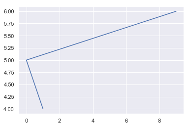


```python
# 设置主题，whitegrid
import matplotlib.pyplot as plt
import seaborn as sns
sns.set_style('whitegrid')
plt.plot([1,0,9],[4,5,6])
plt.show()
```


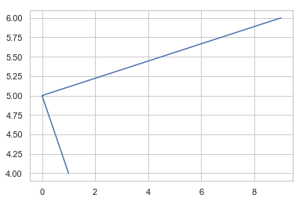


```python
# 设置主题，dark
import matplotlib.pyplot as plt
import seaborn as sns
sns.set_style('dark')
plt.plot([1,0,9],[4,5,6])
plt.show()
```


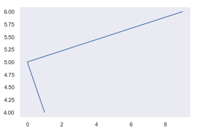


```python
# 设置主题，white
import matplotlib.pyplot as plt
import seaborn as sns
sns.set_style('white')
plt.plot([1,0,9],[4,5,6])
plt.show()
```


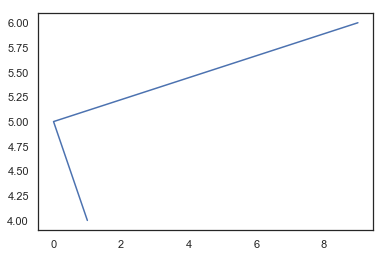


```python
# 设置主题，ticks
import matplotlib.pyplot as plt
import seaborn as sns
sns.set_style('ticks')
plt.plot([1,0,9],[4,5,6])
plt.show()
```


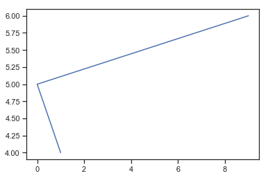


```python
# set()通过设置参数可以用来设置背景，调色板等，更加常用
import matplotlib.pyplot as plt
import seaborn as sns
sns.set(style='white',palette='muted', color_codes=True)
plt.plot([1,0,9],[4,5,6])
plt.show()
```


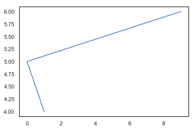


```python
# 默认颜色主题共有六种不同的变化分别是：deep, muted, pastel, bright, dark, 和 colorblind题颜色有6种
current_palette = sns.color_palette()
sns.palplot(current_palette)
plt.show()
```


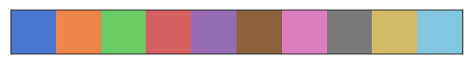


```python
current_palette = sns.color_palette('dark')
sns.palplot(current_palette)
plt.show()
```


```python
# white 和 ticks两个风格都能够移除顶部和右侧的不必要的轴脊柱
import matplotlib.pyplot as plt
import seaborn as sns
sns.set(style='ticks')
plt.plot([1,0,9],[4,5,6])
sns.despine()
plt.show()
```


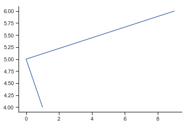


```python
import matplotlib.pyplot as plt
import seaborn as sns
sns.set(style='white')
plt.plot([1,0,9],[4,5,6])
sns.despine()
plt.show()
```


```python
# 同时可以控制哪个轴脊柱被移除
import matplotlib.pyplot as plt
import seaborn as sns
sns.set(style='white')
plt.plot([1,0,9],[4,5,6])
sns.despine(left=True)
plt.show()
```


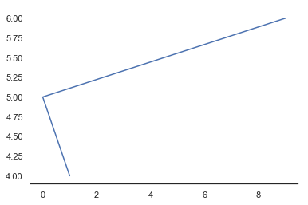


# 绘图方法
## 1seaborn.distplot
http://seaborn.pydata.org/generated/seaborn.distplot.html?highlight=hist  
- seaborn.distplot(a, bins=None, hist=True, kde=True, rug=False, fit=None, hist_kws=None, kde_kws=None, rug_kws=None, fit_kws=None, color=None, vertical=False, norm_hist=False, axlabel=None, label=None, ax=None)
- seaborn的displot()集合了matplotlib的hist()与核函数估计kdeplot的功能，增加了rugplot分布观测条显示与利用scipy库fit拟合参数分布的新颖用途
### 参数
- a : Series, 1d-array, or list.
    - Observed data. If this is a Series object with a name attribute, the name will be used to label the data axis.
    - data: 需要绘制的数据，可以是series对象，一维矩阵或列表；如果是series对象，axlabel的值会被设置为series的名字
- bins : argument for matplotlib hist(), or None, optional
    - Specification of hist bins, or None to use Freedman-Diaconis rule.
    - 设置矩形图的数量 bins=20 bins数量一共是20个
- hist : bool, optional
    - Whether to plot a (normed) histogram.
    - 是否显示图像是直方图
- kde : bool, optional
    - Whether to plot a gaussian kernel density estimate.
    - 是否显示核密度估计图
- rug : bool, optional
    - Whether to draw a rugplot on the support axis.
    - 是否显示观测的小细条，边际毛毯
- fit : random variable object, optional
    - An object with fit method, returning a tuple that can be passed to a pdf method a positional arguments following an grid of values to evaluate the pdf on.
    - 控制拟合的参数分布图形
- {hist, kde, rug, fit}_kws : dictionaries, optional
    - Keyword arguments for underlying plotting functions.
- color : matplotlib color, optional
    - Color to plot everything but the fitted curve in.
    - 控制颜色
- vertical : bool, optional
    - If True, observed values are on y-axis.
    - 显示正交控制
- norm_hist : bool, optional
    - If True, the histogram height shows a density rather than a count. This is implied if a KDE or fitted density is plotted.
    - 如果是True，则直方图纵坐标显示密度而非计数值(含有kde的图像中默认为True)
- axlabel : string, False, or None, optional
    - Name for the support axis label. If None, will try to get it from a.namel if False, do not set a label.
    - x轴的标签
- label : string, optional
    - Legend label for the relevent component of the plot
    - legend标签
- ax : matplotlib axis, optional
    - if provided, plot on this axis  
    - 如果提供的话，就在这个axis上画图

Returns:	

- ax : matplotlib Axes
    - Returns the Axes object with the plot for further tweaking.


```python
%matplotlib inline
import seaborn as sns, numpy as np, matplotlib.pyplot as plt
sns.set()
#当我们设置相同的seed，每次生成的随机数相同。如果不设置seed，则每次会生成不同的随机数
np.random.seed(0)
#randn函数返回一个或一组样本，具有标准正态分布
x = np.random.randn(100)

ax = sns.distplot(x)
```


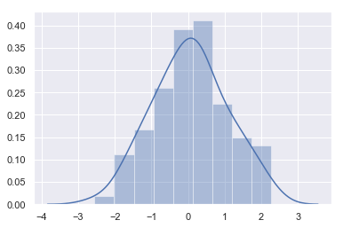


```python
# 添加坐标信息 axlabel
sns.distplot(x,axlabel='x variable',label='label')
plt.legend()
```


    <matplotlib.legend.Legend at 0x1a7a35180b8>


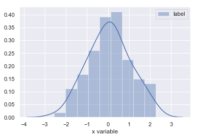


```python
# 添加坐标信息
import pandas as pd
x = pd.Series(x, name="x variable")
ax = sns.distplot(x)
```


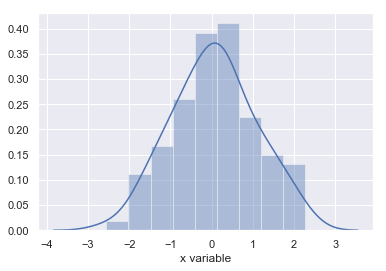


```python
#kde=False关闭核密度分布,rug表示在x轴上每个观测上生成的小细条（边际毛毯）
sns.distplot(x, kde=False, rug=True)
```


    <matplotlib.axes._subplots.AxesSubplot at 0x1a7a3833828>


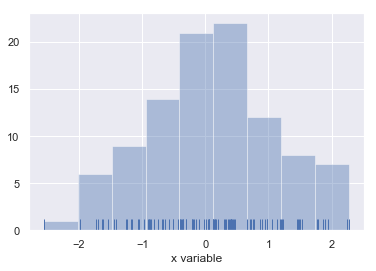


```python
# rug=True, hist=False，生成x轴上每个观测上生成的小细条（边际毛毯，关闭直方图
ax = sns.distplot(x, rug=True, hist=False)
```


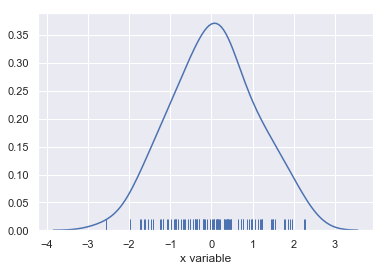


```python
# 利用bins可以设置矩形条的数量
sns.distplot(x,bins=20,kde=False)
```


    <matplotlib.axes._subplots.AxesSubplot at 0x1a7a38dbef0>


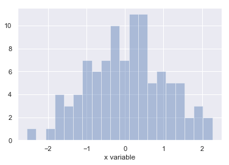


## 2 sns.kdeplot
- Kernel density estimaton核密度估计
- 核密度估计是在概率论中用来估计未知的密度函数，属于非参数检验方法之一。．由于核密度估计方法不利用有关数据分布的先验知识，对数据分布不附加任何假定，是一种从数据样本本身出发研究数据分布特征的方法，因而，在统计学理论和应用领域均受到高度的重视
- http://seaborn.pydata.org/generated/seaborn.kdeplot.html
- seaborn.kdeplot(data, data2=None, shade=False, vertical=False, kernel='gau', bw='scott', gridsize=100, cut=3, clip=None, legend=True, cumulative=False, shade_lowest=True, cbar=False, cbar_ax=None, cbar_kws=None, ax=None, **kwargs)
### 参数
- data : 1d array-like
    - Input data.
- data2: 1d array-like, optional
    - Second input data. If present, a bivariate KDE will be estimated.
- shade : bool, optional
    - If True, shade in the area under the KDE curve (or draw with filled contours when data is bivariate).
- vertical : bool, optional
    - If True, density is on x-axis.
- kernel : {‘gau’ | ‘cos’ | ‘biw’ | ‘epa’ | ‘tri’ | ‘triw’ }, optional
    - Code for shape of kernel to fit with. Bivariate KDE can only use gaussian kernel.
- bw : {‘scott’ | ‘silverman’ | scalar | pair of scalars }, optional
    - Name of reference method to determine kernel size, scalar factor, or scalar for each dimension of the bivariate plot. Note that the underlying computational libraries have different interperetations for this parameter: statsmodels uses it directly, but scipy treats it as a scaling factor for the standard deviation of the data.
- gridsize : int, optional
    - Number of discrete points in the evaluation grid.
- cut : scalar, optional
    - Draw the estimate to cut * bw from the extreme data points.
- clip : pair of scalars, or pair of pair of scalars, optional
    - Lower and upper bounds for datapoints used to fit KDE. Can provide a pair of (low, high) bounds for bivariate plots.
- legend : bool, optional
    - If True, add a legend or label the axes when possible.
- cumulative : bool, optional
    - If True, draw the cumulative distribution estimated by the kde.
- shade_lowest : bool, optional
    - If True, shade the lowest contour of a bivariate KDE plot. Not relevant when drawing a univariate plot or when shade=False. Setting this to False can be useful when you want multiple densities on the same Axes.
    - shade控制阴影
- cbar : bool, optional
    - If True and drawing a bivariate KDE plot, add a colorbar.
- cbar_ax : matplotlib axes, optional
    - Existing axes to draw the colorbar onto, otherwise space is taken from the main axes.
- cbar_kws : dict, optional
    - Keyword arguments for fig.colorbar().
- ax : matplotlib axes, optional
    - Axes to plot on, otherwise uses current axes.
- kwargs : key, value pairings
    - Other keyword arguments are passed to plt.plot() or plt.contour{f} depending on whether a univariate or bivariate plot is being drawn.

Returns:	
- ax : matplotlib Axes
     -Axes with plot.


```python
# np.random.multivariate_normal方法用于根据实际情况生成一个多元正态分布矩阵
# mean：mean是多维分布的均值维度为1
# cov：协方差矩阵，注意：协方差矩阵必须是对称的且需为半正定矩阵
#  size：指定生成的正态分布矩阵的维度（例：若size=(1, 1, 2)，则输出的矩阵的shape即形状为 1X1X2XN（N为mean的长度））
import numpy as np 
np.random.seed(10)
import seaborn as sns
sns.set(color_codes=True)
mean, cov = [0, 2], [(1, .5), (.5, 1)]
x, y = np.random.multivariate_normal(mean, cov, size=50).T
ax = sns.kdeplot(x)
```


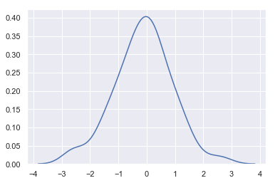


```python
x
```


    array([-1.51082723,  1.34254784, -0.17804996, -0.28421404,  0.08358362,
           -0.97653037,  0.32163435, -0.42056831,  0.91675795, -0.74574431,
            2.58444908, -1.42290719, -1.80945628, -0.78486393, -0.07169444,
            0.50615798,  0.12314225, -1.23067757, -0.17777585, -0.72215215,
           -0.39634135,  1.05824176,  0.80314519,  0.1376191 , -0.41572644,
           -0.12211242,  0.11346898, -0.83117842, -2.53260368,  0.27832104,
            0.45194018, -0.6286516 ,  0.33490191, -0.19674292,  0.37488635,
           -0.50702222, -0.3076567 , -1.5064103 ,  0.99594439,  1.30411574,
           -2.59154076,  1.71889063,  1.12288196, -0.15438215,  0.80903975,
           -1.08157546,  0.43056387, -1.07570917,  0.3727111 ,  0.26105424])


```python
ax = sns.kdeplot(x, y)
```


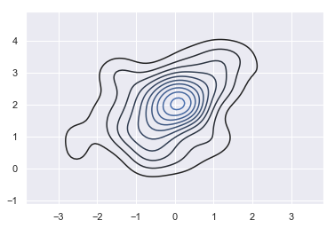


```python
ax = sns.kdeplot(x, y, shade=True)
```


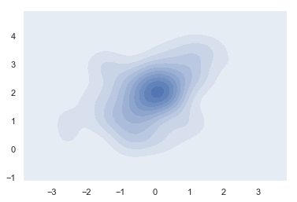


```python
ax = sns.kdeplot(x, y, n_levels=30, cmap="Purples_d")
```


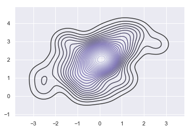


```python
y
```


    array([ 1.20445175,  3.33416399,  1.10186448,  1.82433448,  1.90898341,
            2.22650701,  3.34990843,  2.02456931,  3.05189483,  0.1744508 ,
            2.84107678,  2.96206014,  1.86316594,  2.61313245,  2.54150974,
            1.95684897,  1.64700024,  0.96433571,  1.48459181,  0.54587835,
            1.25278676,  2.56890455,  2.59044755,  2.44978904,  1.4368533 ,
            2.16698178,  2.821629  ,  1.37240238,  0.38485526,  1.91614059,
            1.95021128,  0.67353837,  1.80560583,  0.38470105,  2.25298066,
            1.95388068,  2.68141576,  2.96124076,  3.61654506,  2.50610692,
            1.15327339,  3.49611693,  0.99116985,  2.23895907,  0.81464598,
            1.16296852,  1.67667091,  1.84255998,  2.46229871,  0.30654212])


## 3 barplot
- http://seaborn.pydata.org/generated/seaborn.barplot.html?highlight=barplot#seaborn.barplot
- seaborn.barplot(x=None, y=None, hue=None, data=None, order=None, hue_order=None, estimator=function mean, ci=95, n_boot=1000, units=None, orient=None, color=None, palette=None, saturation=0.75, errcolor='.26', errwidth=None, capsize=None, dodge=True, ax=None, **kwargs)

### 参数
- x, y, hue : names of variables in data or vector data, optional
    - Inputs for plotting long-form data. See examples for interpretation.
    - 设置x,y以及颜色控制的变量
- data : DataFrame, array, or list of arrays, optional
    - Dataset for plotting. If x and y are absent, this is interpreted as wide-form. Otherwise it is expected to be long-form.
    - 设置输入的数据集
- order, hue_order : lists of strings, optional
    - Order to plot the categorical levels in, otherwise the levels are inferred from the data objects.
    - 制变量绘图的顺序
- estimator : callable that maps vector -> scalar, optional
    - Statistical function to estimate within each categorical bin.
    - 设置对每类变量的计算函数，默认为平均值，可修改为max、median、max等
- ci : float or “sd” or None, optional
    - Size of confidence intervals to draw around estimated values. If “sd”, skip bootstrapping and draw the standard deviation of the observations. If None, no bootstrapping will be performed, and error bars will not be drawn.
- n_boot : int, optional
    - Number of bootstrap iterations to use when computing confidence intervals.
- units : name of variable in data or vector data, optional
    - Identifier of sampling units, which will be used to perform a multilevel bootstrap and account for repeated measures design.
- orient : “v” | “h”, optional
    - Orientation of the plot (vertical or horizontal). This is usually inferred from the dtype of the input variables, but can be used to specify when the “categorical” variable is a numeric or when plotting wide-form data.
    - 控制绘图的方向，水平或者竖直
- color : matplotlib color, optional
    - Color for all of the elements, or seed for a gradient palette.
- palette : palette name, list, or dict, optional
    - Colors to use for the different levels of the hue variable. Should be something that can be interpreted by color_palette(), or a dictionary mapping hue levels to matplotlib colors.
- saturation : float, optional
    - Proportion of the original saturation to draw colors at. Large patches often look better with slightly desaturated colors, but set this to 1 if you want the plot colors to perfectly match the input color spec.
- errcolor : matplotlib color
    - Color for the lines that represent the confidence interval.
- errwidth : float, optional
    - Thickness of error bar lines (and caps).
- capsize : float, optional
    - Width of the “caps” on error bars.
    - 设置误差棒帽条的宽度
- dodge : bool, optional
    - When hue nesting is used, whether elements should be shifted along the categorical axis.
- ax : matplotlib Axes, optional
    - Axes object to draw the plot onto, otherwise uses the current Axes.
    - 设置子图位置
- kwargs : key, value mappings
    - Other keyword arguments are passed through to plt.bar at draw time.

Returns:	
- ax : matplotlib Axes
    - Returns the Axes object with the plot drawn onto it.


```python
import seaborn as sns
sns.set_style("whitegrid")
tips = sns.load_dataset("tips") #载入自带数据集
#x轴为分类变量day,y轴为数值变量total_bill
tips.head()
```


<div>
<style>
    .dataframe thead tr:only-child th {
        text-align: right;
    }

    .dataframe thead th {
        text-align: left;
    }

    .dataframe tbody tr th {
        vertical-align: top;
    }
</style>
<table border="1" class="dataframe">
  <thead>
    <tr style="text-align: right;">
      <th></th>
      <th>total_bill</th>
      <th>tip</th>
      <th>sex</th>
      <th>smoker</th>
      <th>day</th>
      <th>time</th>
      <th>size</th>
    </tr>
  </thead>
  <tbody>
    <tr>
      <th>0</th>
      <td>16.99</td>
      <td>1.01</td>
      <td>Female</td>
      <td>No</td>
      <td>Sun</td>
      <td>Dinner</td>
      <td>2</td>
    </tr>
    <tr>
      <th>1</th>
      <td>10.34</td>
      <td>1.66</td>
      <td>Male</td>
      <td>No</td>
      <td>Sun</td>
      <td>Dinner</td>
      <td>3</td>
    </tr>
    <tr>
      <th>2</th>
      <td>21.01</td>
      <td>3.50</td>
      <td>Male</td>
      <td>No</td>
      <td>Sun</td>
      <td>Dinner</td>
      <td>3</td>
    </tr>
    <tr>
      <th>3</th>
      <td>23.68</td>
      <td>3.31</td>
      <td>Male</td>
      <td>No</td>
      <td>Sun</td>
      <td>Dinner</td>
      <td>2</td>
    </tr>
    <tr>
      <th>4</th>
      <td>24.59</td>
      <td>3.61</td>
      <td>Female</td>
      <td>No</td>
      <td>Sun</td>
      <td>Dinner</td>
      <td>4</td>
    </tr>
  </tbody>
</table>
</div>


```python
#x轴为分类变量day,y轴为数值变量total_bill
ax = sns.barplot(x="day", y="total_bill", data=tips) 
```


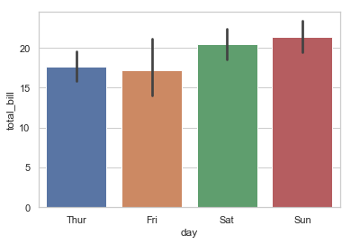


```python
#x轴为分类变量day,y轴为数值变量total_bill，利用颜色再对sex分类
ax = sns.barplot(x="day", y="total_bill", hue="sex", data=tips) 
```


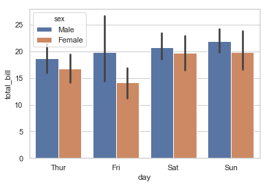


```python
#设置中位数为计算函数，注意y轴已显示为median
from numpy import median
ax = sns.barplot(x="day", y="tip", data=tips, estimator=median)
```


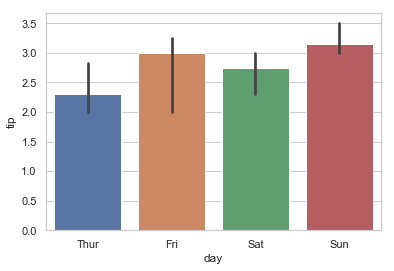


```python
# 将图像转换成水平
ax = sns.barplot(x="tip", y="day", data=tips)
```


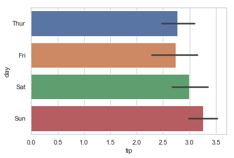


```python
ax = sns.barplot(x="time", y="tip", data=tips,order=["Dinner", "Lunch"])
```


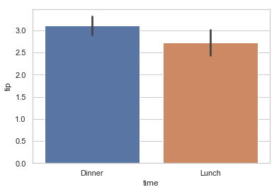


```python
# Show standard deviation of observations instead of a confidence interval
ax = sns.barplot(x="day", y="tip", data=tips, ci='sd')
```


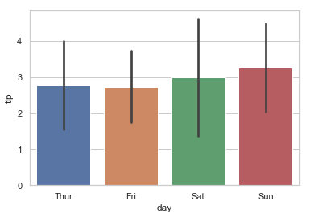


```python
# 修改光柱的颜色
ax = sns.barplot(x="day", y="tip", data=tips, ci='sd',palette="Blues_d")
```


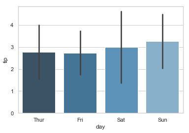


## 4seaborn.countplot
- seaborn.countplot(x=None, y=None, hue=None, data=None, order=None, hue_order=None, orient=None, color=None, palette=None, saturation=0.75, dodge=True, ax=None, **kwargs)
- http://seaborn.pydata.org/generated/seaborn.countplot.html
- 故名思意，计数图，可将它认为一种应用到分类变量的直方图，也可认为它是用以比较类别间计数差，调用count函数的barplot
### 参数
- x, y, hue : names of variables in data or vector data, optional
    - Inputs for plotting long-form data. See examples for interpretation.
- data : DataFrame, array, or list of arrays, optional
    - Dataset for plotting. If x and y are absent, this is interpreted as wide-form. Otherwise it is expected to be long-form.
- order, hue_order : lists of strings, optional
    - Order to plot the categorical levels in, otherwise the levels are inferred from the data objects.
    - 设置顺序
- orient : “v” | “h”, optional
    - Orientation of the plot (vertical or horizontal). This is usually inferred from the dtype of the input variables, but can be used to specify when the “categorical” variable is a numeric or when plotting wide-form data.
    - 设置水平或者垂直显示
- color : matplotlib color, optional
    - Color for all of the elements, or seed for a gradient palette.
- palette : palette name, list, or dict, optional
    - Colors to use for the different levels of the hue variable. Should be something that can be interpreted by color_palette(), or a dictionary mapping hue levels to matplotlib colors.
- saturation : float, optional
    - Proportion of the original saturation to draw colors at. Large patches often look better with slightly desaturated colors, but set this to 1 if you want the plot colors to perfectly match the input color spec.
- dodge : bool, optional
    - When hue nesting is used, whether elements should be shifted along the categorical axis.
- ax : matplotlib Axes, optional
    - Axes object to draw the plot onto, otherwise uses the current Axes.
- kwargs : key, value mappings
    - Other keyword arguments are passed to plt.bar.

Returns:	
- ax : matplotlib Axes
- Returns the Axes object with the plot drawn onto it


```python
import seaborn as sns
sns.set(style="darkgrid")
titanic = sns.load_dataset("titanic")
titanic.head()
```


<div>
<style>
    .dataframe thead tr:only-child th {
        text-align: right;
    }

    .dataframe thead th {
        text-align: left;
    }

    .dataframe tbody tr th {
        vertical-align: top;
    }
</style>
<table border="1" class="dataframe">
  <thead>
    <tr style="text-align: right;">
      <th></th>
      <th>survived</th>
      <th>pclass</th>
      <th>sex</th>
      <th>age</th>
      <th>sibsp</th>
      <th>parch</th>
      <th>fare</th>
      <th>embarked</th>
      <th>class</th>
      <th>who</th>
      <th>adult_male</th>
      <th>deck</th>
      <th>embark_town</th>
      <th>alive</th>
      <th>alone</th>
    </tr>
  </thead>
  <tbody>
    <tr>
      <th>0</th>
      <td>0</td>
      <td>3</td>
      <td>male</td>
      <td>22.0</td>
      <td>1</td>
      <td>0</td>
      <td>7.2500</td>
      <td>S</td>
      <td>Third</td>
      <td>man</td>
      <td>True</td>
      <td>NaN</td>
      <td>Southampton</td>
      <td>no</td>
      <td>False</td>
    </tr>
    <tr>
      <th>1</th>
      <td>1</td>
      <td>1</td>
      <td>female</td>
      <td>38.0</td>
      <td>1</td>
      <td>0</td>
      <td>71.2833</td>
      <td>C</td>
      <td>First</td>
      <td>woman</td>
      <td>False</td>
      <td>C</td>
      <td>Cherbourg</td>
      <td>yes</td>
      <td>False</td>
    </tr>
    <tr>
      <th>2</th>
      <td>1</td>
      <td>3</td>
      <td>female</td>
      <td>26.0</td>
      <td>0</td>
      <td>0</td>
      <td>7.9250</td>
      <td>S</td>
      <td>Third</td>
      <td>woman</td>
      <td>False</td>
      <td>NaN</td>
      <td>Southampton</td>
      <td>yes</td>
      <td>True</td>
    </tr>
    <tr>
      <th>3</th>
      <td>1</td>
      <td>1</td>
      <td>female</td>
      <td>35.0</td>
      <td>1</td>
      <td>0</td>
      <td>53.1000</td>
      <td>S</td>
      <td>First</td>
      <td>woman</td>
      <td>False</td>
      <td>C</td>
      <td>Southampton</td>
      <td>yes</td>
      <td>False</td>
    </tr>
    <tr>
      <th>4</th>
      <td>0</td>
      <td>3</td>
      <td>male</td>
      <td>35.0</td>
      <td>0</td>
      <td>0</td>
      <td>8.0500</td>
      <td>S</td>
      <td>Third</td>
      <td>man</td>
      <td>True</td>
      <td>NaN</td>
      <td>Southampton</td>
      <td>no</td>
      <td>True</td>
    </tr>
  </tbody>
</table>
</div>


```python
ax = sns.countplot(x="class", data=titanic)
```


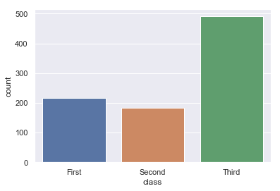


```python
ax = sns.countplot(x="class", hue="who", data=titanic)
```


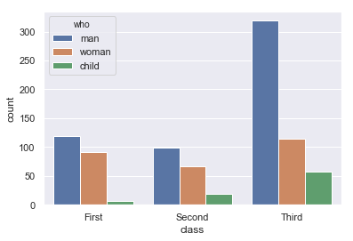


```python
# 图像可以修改位置
ax = sns.countplot(y="class", hue="who", data=titanic)
```


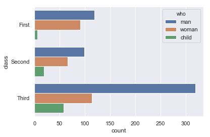


```python
# 修改颜色
ax = sns.countplot(x="who", data=titanic, palette="Set3")
```


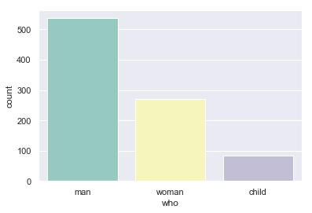


## 5boxplot
- seaborn.boxplot(x=None, y=None, hue=None, data=None, order=None, hue_order=None, orient=None, color=None, palette=None, saturation=0.75, width=0.8, dodge=True, fliersize=5, linewidth=None, whis=1.5, notch=False, ax=None, **kwargs)
- http://seaborn.pydata.org/generated/seaborn.boxplot.html?highlight=boxplot#seaborn.boxplot
- 箱线图
    - "盒式图"或叫"盒须图" "箱形图",，其绘制须使用常用的统计量，能提供有关数据位置和分散情况的关键信息，尤其在比较不同的母体数据时更可表现其差异。
    - 主要包含五个数据节点，将一组数据从大到小排列，分别计算出他的上边缘，上四分位数，中位数，下四分位数，下边缘。

### 参数

- x, y, hue : names of variables in data or vector data, optional
    - Inputs for plotting long-form data. See examples for interpretation.
    - 设置x,y以及颜色控制的变量
- data : DataFrame, array, or list of arrays, optional
    - Dataset for plotting. If x and y are absent, this is interpreted as wide-form. Otherwise it is expected to be long-form.
    - 设置输入的数据集
- order, hue_order : lists of strings, optional
    - Order to plot the categorical levels in, otherwise the levels are inferred from the data objects.
    - 控制变量绘图的顺序
- orient : “v” | “h”, optional
    - Orientation of the plot (vertical or horizontal). This is usually inferred from the dtype of the input variables, but can be used to specify when the “categorical” variable is a numeric or when plotting wide-form data.
- color : matplotlib color, optional
    - Color for all of the elements, or seed for a gradient palette.
- palette : palette name, list, or dict, optional
    - Colors to use for the different levels of the hue variable. Should be something that can be interpreted by color_palette(), or a dictionary mapping hue levels to matplotlib colors.
- saturation : float, optional
    - Proportion of the original saturation to draw colors at. Large patches often look better with slightly desaturated colors, but set this to 1 if you want the plot colors to perfectly match the input color spec.
- width : float, optional
    - Width of a full element when not using hue nesting, or width of all the elements for one level of the major grouping variable.
- dodge : bool, optional
    - When hue nesting is used, whether elements should be shifted along the categorical axis.
- fliersize : float, optional
    - Size of the markers used to indicate outlier observations.
- linewidth : float, optional
    - Width of the gray lines that frame the plot elements.
- whis : float, optional
    - Proportion of the IQR past the low and high quartiles to extend the plot whiskers. Points outside this range will be identified as outliers.
- notch : boolean, optional
    - Whether to “notch” the box to indicate a confidence interval for the median. There are several other parameters that can control how the notches are drawn; see the plt.boxplot help for more information on them.
- ax : matplotlib Axes, optional
    - Axes object to draw the plot onto, otherwise uses the current Axes.
- kwargs : key, value mappings
    - Other keyword arguments are passed through to plt.boxplot at draw time.

Returns:	
- ax : matplotlib Axes
    - Returns the Axes object with the plot drawn onto it.


```python
import seaborn as sns
sns.set(style="whitegrid")
tips = sns.load_dataset("tips")
tips.head()
```


<div>
<style>
    .dataframe thead tr:only-child th {
        text-align: right;
    }

    .dataframe thead th {
        text-align: left;
    }

    .dataframe tbody tr th {
        vertical-align: top;
    }
</style>
<table border="1" class="dataframe">
  <thead>
    <tr style="text-align: right;">
      <th></th>
      <th>total_bill</th>
      <th>tip</th>
      <th>sex</th>
      <th>smoker</th>
      <th>day</th>
      <th>time</th>
      <th>size</th>
    </tr>
  </thead>
  <tbody>
    <tr>
      <th>0</th>
      <td>16.99</td>
      <td>1.01</td>
      <td>Female</td>
      <td>No</td>
      <td>Sun</td>
      <td>Dinner</td>
      <td>2</td>
    </tr>
    <tr>
      <th>1</th>
      <td>10.34</td>
      <td>1.66</td>
      <td>Male</td>
      <td>No</td>
      <td>Sun</td>
      <td>Dinner</td>
      <td>3</td>
    </tr>
    <tr>
      <th>2</th>
      <td>21.01</td>
      <td>3.50</td>
      <td>Male</td>
      <td>No</td>
      <td>Sun</td>
      <td>Dinner</td>
      <td>3</td>
    </tr>
    <tr>
      <th>3</th>
      <td>23.68</td>
      <td>3.31</td>
      <td>Male</td>
      <td>No</td>
      <td>Sun</td>
      <td>Dinner</td>
      <td>2</td>
    </tr>
    <tr>
      <th>4</th>
      <td>24.59</td>
      <td>3.61</td>
      <td>Female</td>
      <td>No</td>
      <td>Sun</td>
      <td>Dinner</td>
      <td>4</td>
    </tr>
  </tbody>
</table>
</div>


```python
ax = sns.boxplot(x=tips["total_bill"])
```


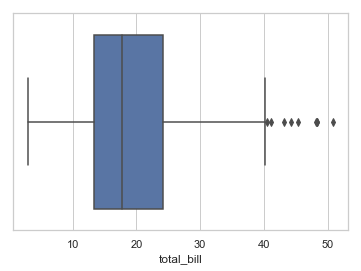


```python
ax = sns.boxplot(x="day", y="total_bill", data=tips)
```


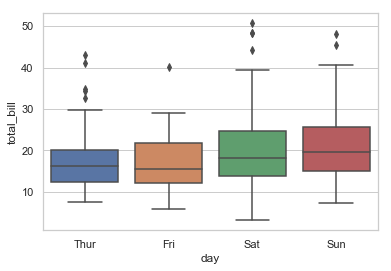


```python
ax = sns.boxplot(x="day", y="total_bill", hue="smoker",data=tips, palette="Set3")
```


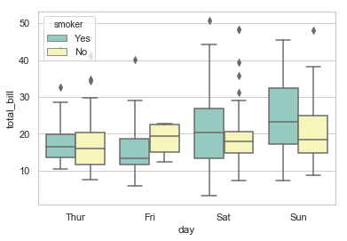


```python
ax = sns.boxplot(x="day", y="total_bill", hue="time",data=tips, linewidth=2.5)
```


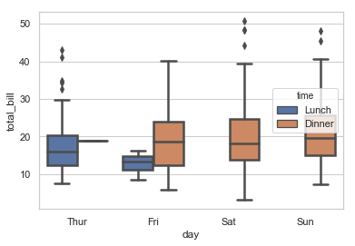


## 6Violinplot 
- Violinplot结合了箱线图与核密度估计图的特点，它表征了在一个或多个分类变量情况下，连续变量数据的分布并进行了比较，它是一种观察多个数据分布有效方法。
- http://seaborn.pydata.org/generated/seaborn.violinplot.html?highlight=violinplot#seaborn.violinplot
- seaborn.violinplot(x=None, y=None, hue=None, data=None, order=None, hue_order=None, bw='scott', cut=2, scale='area', scale_hue=True, gridsize=100, width=0.8, inner='box', split=False, dodge=True, orient=None, linewidth=None, color=None, palette=None, saturation=0.75, ax=None, **kwargs)
### 参数

- split : bool, optional #琴形图是否从中间分开两部分
    - When using hue nesting with +9*a variable that takes two levels, setting split to True will draw half of a violin for each level. This can make it easier to directly compare the distributions.
- scale : {“area”, “count”, “width”}, optional #用于调整琴形图的宽带。area——每个琴图拥有相同的面域；count——根据样本数量来调节宽度；width——每个琴图则拥有相同的宽度。
    - The method used to scale the width of each violin. If area, each violin will have the same area. If count, the width of the violins will be scaled by the number of observations in that bin. If width, each violin will have the same width.
- inner : {“box”, “quartile”, “point”, “stick”, None}, optional #控制琴图内部数据点的形态。box——绘制微型boxplot；quartiles——绘制四分位的分布；point/stick——绘制点或小竖条。
    - Representation of the datapoints in the violin interior. If box, draw a miniature boxplot. If quartiles, draw the quartiles of the distribution. If point or stick, show each underlying datapoint. Using None will draw unadorned violins.


```python
import seaborn as sns
sns.set(style="whitegrid")
tips = sns.load_dataset("tips")
ax = sns.violinplot(x=tips["total_bill"])
```


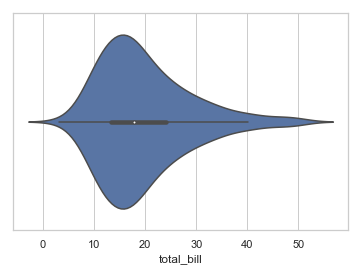


```python
ax = sns.violinplot(x="day", y="total_bill", data=tips)
```


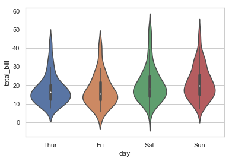


```python
ax = sns.violinplot(x="day", y="total_bill", hue="smoker",data=tips, palette="muted")
```


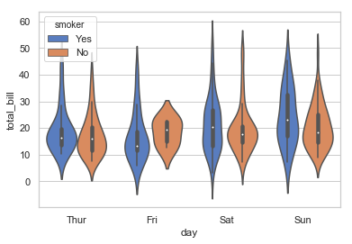


```python
ax = sns.violinplot(x="day", y="total_bill", hue="smoker",data=tips, palette="muted", split=True)
```


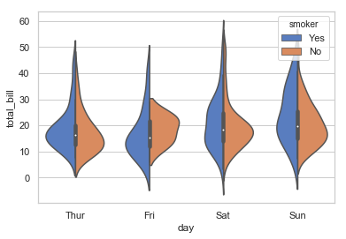


## 7联合分布jointplot
- http://seaborn.pydata.org/generated/seaborn.jointplot.html


```python
import seaborn as sns
sns.set(style="whitegrid")
tips = sns.load_dataset("tips")
ax = sns.jointplot('total_bill','tip',tips)
```


```python
ax = sns.jointplot('total_bill','tip',tips,kind = 'reg')
```


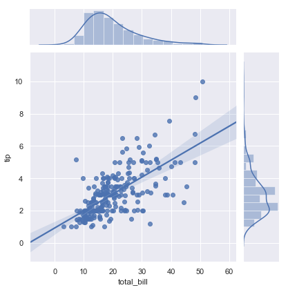


```python
ax = sns.jointplot('total_bill','tip',tips,kind = 'hex')
```


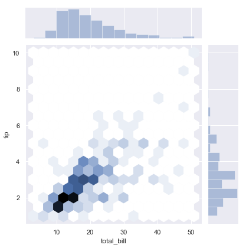


## 8热点图heatmap
- 热图也是常用的数据分析工具，一般会配合相关系数的计算(说白了就是将计算的相关系数矩阵用热图展示出来)
- http://seaborn.pydata.org/generated/seaborn.heatmap.html
- heatmap(data, vmin=None, vmax=None, cmap=None, center=None,annot=None, fmt=".2g", annot_kws=None,linewidths=0, linecolor="white",square=False, xticklabels="auto", yticklabels="auto",mask=None, ax=None, **kwargs)
### 参数
- data：你所要展示的数据。
- vmin：右侧坐标最小值。
- vmax：右侧坐标最大值。
- cmap： 你所使用的颜色图（color map）。
- annot：是否在每个格子中显示数值。
- linewidths： 每个格子之间的线宽。
- linecolor： 每个格子之间线的颜色。
- square：格子是否为正方形。


```python
import numpy as np; np.random.seed(0)
import seaborn as sns; sns.set()
x = np.random.rand(10, 12)
ax = sns.heatmap(x)
```


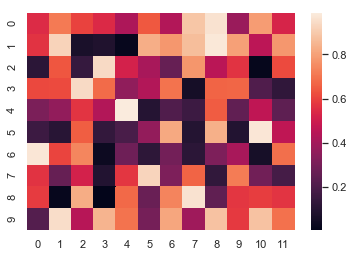


```python
ax = sns.heatmap(uniform_data, vmin=0, vmax=1)
```


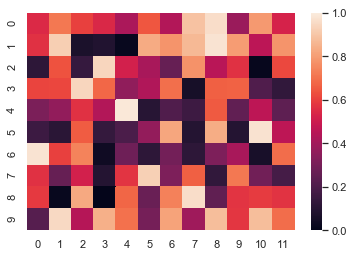


```python
ax = sns.heatmap(uniform_data, vmin=0, vmax=1,annot=True)
```


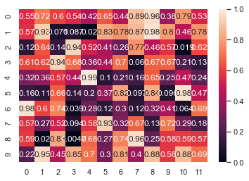

