# 数据来源
泰坦尼克号是当时世界上体积最庞大、内部设施最豪华的客运轮船，有“永不沉没”的美誉 。然而不幸的是，在它的处女航中，泰坦尼克号便遭厄运——它从英国南安普敦出发，途经法国瑟堡-奥克特维尔以及爱尔兰科夫(Cobh)，驶向美国纽约。1912年4月14日23时40分左右，泰坦尼克号与一座冰山相撞，造成右舷船艏至船中部破裂，五间水密舱进水。次日凌晨2时20分左右，泰坦尼克船体断裂成两截后沉入大西洋底3700米处。2224名船员及乘客中，逾1500人丧生，其中仅333具罹难者遗体被寻回。


# 数据信息
- PassengerId    乘客编码
- Survived       是否幸存 (0=遇难 1=幸存)
- Pclass         船票类型 (1=一等票，2=二等票，3=三等票)
- Name           名字
- Sex            性别
- Age            年龄
- SibSp          船上该成员兄弟姐妹的数量
- Parch          船上该成员的父母或子女数量
- Ticket         船票编号
- Fare           乘客票价
- Cabin          客舱号码
- Embarked       起航运港（C = Cherbourg, Q = Queenstown, S = Southampton）


# 数据分析
## 导入数据


```python
import pandas as pd
import seaborn as sns
import matplotlib.pyplot as plt
import numpy as np
```


```python
data = pd.read_csv('./titanic_train.csv')
data.info()
```

    <class 'pandas.core.frame.DataFrame'>
    RangeIndex: 891 entries, 0 to 890
    Data columns (total 12 columns):
    PassengerId    891 non-null int64
    Survived       891 non-null int64
    Pclass         891 non-null int64
    Name           891 non-null object
    Sex            891 non-null object
    Age            714 non-null float64
    SibSp          891 non-null int64
    Parch          891 non-null int64
    Ticket         891 non-null object
    Fare           891 non-null float64
    Cabin          204 non-null object
    Embarked       889 non-null object
    dtypes: float64(2), int64(5), object(5)
    memory usage: 83.6+ KB
    

- 观察数据集信息


```python
data.head()
```


<div>
<style>
    .dataframe thead tr:only-child th {
        text-align: right;
    }

    .dataframe thead th {
        text-align: left;
    }

    .dataframe tbody tr th {
        vertical-align: top;
    }
</style>
<table border="1" class="dataframe">
  <thead>
    <tr style="text-align: right;">
      <th></th>
      <th>PassengerId</th>
      <th>Survived</th>
      <th>Pclass</th>
      <th>Name</th>
      <th>Sex</th>
      <th>Age</th>
      <th>SibSp</th>
      <th>Parch</th>
      <th>Ticket</th>
      <th>Fare</th>
      <th>Cabin</th>
      <th>Embarked</th>
    </tr>
  </thead>
  <tbody>
    <tr>
      <th>0</th>
      <td>1</td>
      <td>0</td>
      <td>3</td>
      <td>Braund, Mr. Owen Harris</td>
      <td>male</td>
      <td>22.0</td>
      <td>1</td>
      <td>0</td>
      <td>A/5 21171</td>
      <td>7.2500</td>
      <td>NaN</td>
      <td>S</td>
    </tr>
    <tr>
      <th>1</th>
      <td>2</td>
      <td>1</td>
      <td>1</td>
      <td>Cumings, Mrs. John Bradley (Florence Briggs Th...</td>
      <td>female</td>
      <td>38.0</td>
      <td>1</td>
      <td>0</td>
      <td>PC 17599</td>
      <td>71.2833</td>
      <td>C85</td>
      <td>C</td>
    </tr>
    <tr>
      <th>2</th>
      <td>3</td>
      <td>1</td>
      <td>3</td>
      <td>Heikkinen, Miss. Laina</td>
      <td>female</td>
      <td>26.0</td>
      <td>0</td>
      <td>0</td>
      <td>STON/O2. 3101282</td>
      <td>7.9250</td>
      <td>NaN</td>
      <td>S</td>
    </tr>
    <tr>
      <th>3</th>
      <td>4</td>
      <td>1</td>
      <td>1</td>
      <td>Futrelle, Mrs. Jacques Heath (Lily May Peel)</td>
      <td>female</td>
      <td>35.0</td>
      <td>1</td>
      <td>0</td>
      <td>113803</td>
      <td>53.1000</td>
      <td>C123</td>
      <td>S</td>
    </tr>
    <tr>
      <th>4</th>
      <td>5</td>
      <td>0</td>
      <td>3</td>
      <td>Allen, Mr. William Henry</td>
      <td>male</td>
      <td>35.0</td>
      <td>0</td>
      <td>0</td>
      <td>373450</td>
      <td>8.0500</td>
      <td>NaN</td>
      <td>S</td>
    </tr>
  </tbody>
</table>
</div>


## 数据清洗
- 观察数据集中是否存在重复数据


```python
data['PassengerId'].count()
```


    891


```python
data['unique_PassengerId'] =data['PassengerId'].unique()
data['unique_PassengerId'].count()
```


    891


- 数据集中不包含重复数据
- 观察数据集中是否存在缺失数据


```python
data.isnull().any()
```


    PassengerId    False
    Survived       False
    Pclass         False
    Name           False
    Sex            False
    Age             True
    SibSp          False
    Parch          False
    Ticket         False
    Fare           False
    Cabin           True
    Embarked        True
    dtype: bool


- Age, Cabin, Embarked字段中存在缺失值，考虑填补或者删除缺失值

## 解决问题
### 所有乘客的存活情况


```python
data_survived = data[data['Survived']==1]['PassengerId'].count()
data_not_survived = data[data['Survived']==0]['PassengerId'].count()
print('生还者有{0}人,遇难者有{1}人'.format(data_survived, data_not_survived))
```

    生还者有342人,遇难者有549人
    


```python
plt.figure(figsize=(10,4),dpi=80)
plt.subplot(121)
#sns.countplot(x='Survived',data=data)
sns.countplot(data['Survived'])
plt.title('Survived count')

plt.subplot(122)
data.groupby('Survived').count()['PassengerId'].plot('bar')
plt.title('Survived count')
plt.show()
```


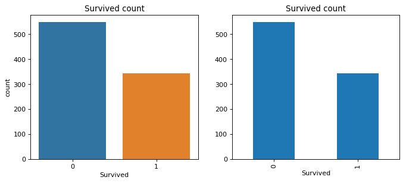


```python
plt.figure(figsize=(10,4),dpi=80)
plt.subplot(121)
data.groupby('Survived').count()['PassengerId'].plot('pie',labels=data['Survived'].unique(),autopct="%1.2f%%")
plt.axis('equal')
plt.legend()

plt.subplot(122)
plt.pie([data_not_survived,data_survived],labels=['not_Survived','Survived'],autopct="%1.2f%%")
plt.axis('equal')
plt.legend()
plt.show()
```


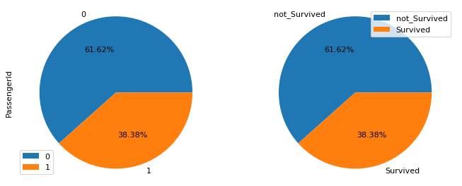


- 生还者有342人,占总人数的38.38%，遇难者有549人，占总人数的61.61%

### 1乘客存活情况和性别的关系
#### 数据集总体性别情况


```python
data['PassengerId'].count()
```


    891


```python
male_number = data[data['Sex']=='male']['PassengerId'].count()
male_number
```


    577


```python
female_number = data[data['Sex']=='female']['PassengerId'].count()
female_number
```


    314


```python
plt.figure(figsize=(10,4),dpi=80)
plt.subplot(121)
sns.countplot(data['Sex'])
plt.subplot(122)
plt.pie([male_number,female_number],labels=data['Sex'].unique(),autopct='%1.2f%%')
plt.axis('equal')
plt.show()
```


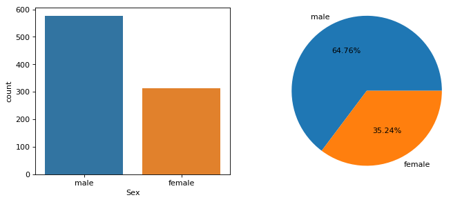


- 数据集中一共有人数891人，其中女性314人占35.24%，男性577人占64.76%

#### 数据集生存下来的人中男女的占比


```python
data_survived = data[data['Survived']==1]['PassengerId'].count()
data_survived
```


    342


```python
# 存活数据集
data_survived = data[data['Survived']==1]
# 存活数据集中的男性
male_survived_number = data_survived[data_survived['Sex']=='male']['Sex'].count()
male_survived_number
```


    109


```python
# 存活数据集
data_survived = data[data['Survived']==1]
# 存活数据集中的女性
female_survived_number = data_survived[data_survived['Sex']=='female']['Sex'].count()
male_survived_number
```


    109


```python
plt.figure(figsize=(10,4),dpi=80)
plt.subplot(121)
sns.countplot(x='Sex',data=data_survived)
plt.subplot(122)
plt.pie([male_survived_number,female_survived_number],labels=['male','female'],autopct='%1.2f%%')
plt.axis('equal')
plt.legend()
plt.show()
```


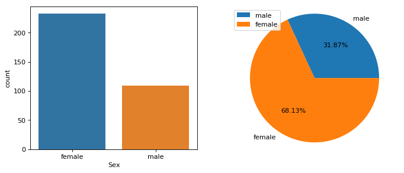


```python
sns.countplot(data['Survived'],hue=data['Sex'])
plt.show()
```


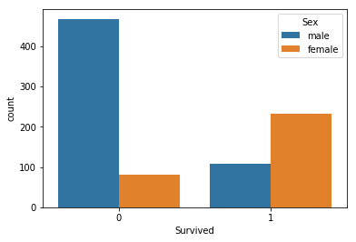


- 一共存活了342人，其中女性存活233人，占总存活人数的68.13%，男性存活109人，占总存活人数的31.87%

#### 男性乘客的存活状况


```python
male = data[data['Sex']=='male']
male_number = data[data['Sex']=='male']['PassengerId'].count()
male_number
```


    577


```python
data_survived = data[data['Survived']==1]
male_survived_number = data_survived[data_survived['Sex']=='male']['Sex'].count()
male_survived_number
```


    109


```python
data_not_survived = data[data['Survived']==0]
male_not_survived_number = data_not_survived[data_not_survived['Sex']=='male']['Sex'].count()
male_not_survived_number
```


    468


```python
plt.figure(figsize=(10,4),dpi=80)
plt.subplot(121)
sns.countplot(x='Survived',data=male)
plt.subplot(122)
plt.pie([male_not_survived_number,male_survived_number],labels=['male_not_survived_number','male_survived_number'],autopct='%1.2f%%')
plt.axis('equal')
plt.legend()
plt.show()
```


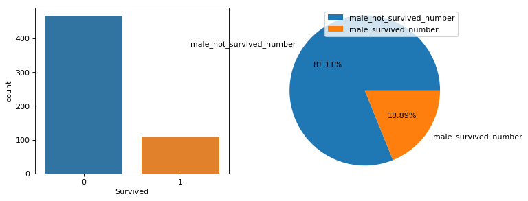


- 男性一共有577人，其中存活了109人，占男性总人数的18.89%

#### 女性乘客的存活状况


```python
female = data[data['Sex']=='female']
female_number = data[data['Sex']=='female']['PassengerId'].count()
female_number
```


    314


```python
data_survived = data[data['Survived']==1]
female_survived_number = data_survived[data_survived['Sex']=='female']['Sex'].count()
female_survived_number
```


    233


```python
data_not_survived = data[data['Survived']==0]
female_not_survived_number = data_not_survived[data_not_survived['Sex']=='female']['Sex'].count()
female_not_survived_number
```


    81


```python
plt.figure(figsize=(10,4),dpi=80)
plt.subplot(121)
sns.countplot(x='Survived',data=female)
plt.subplot(122)
plt.pie([female_not_survived_number,female_survived_number],labels=['female_not_survived_number','female_survived_number'],autopct='%1.2f%%')
plt.axis('equal')
plt.legend()
plt.show()
```


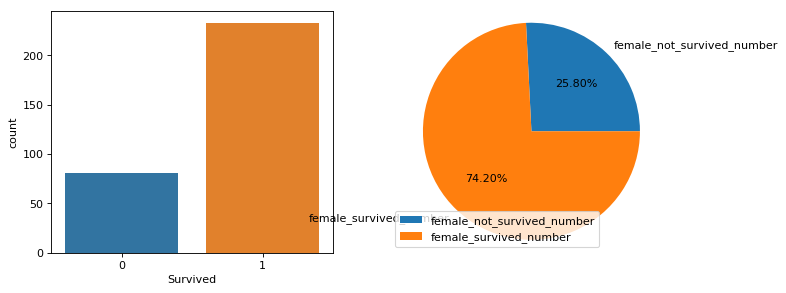


- 女性一共有314人，其中存活了233人，占女性总人数的74.2%


```python
sns.countplot(data['Sex'],hue=data['Survived'])
plt.show()
```


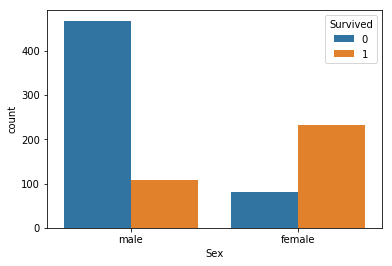


- 占男性总人数的18.89%男性存活，占女性总人数的74.2%女性存活

### 2乘客存活情况和所在客舱的关系

#### 海难发生前，各个客舱人员的情况


```python
data.groupby('Pclass')['PassengerId'].count()
```


    Pclass
    1    216
    2    184
    3    491
    Name: PassengerId, dtype: int64


```python
plt.figure(figsize=(10,4),dpi=80)
plt.subplot(121)
sns.countplot(data['Pclass'])
plt.subplot(122)
plt.pie(data.groupby('Pclass')['PassengerId'].count(),labels=['1','2','3'],autopct='%1.2f%%')
plt.axis('equal')
plt.legend()
plt.show()
```


- 一等舱、二等舱、三等舱的乘客分别为216、184、491人，分别占总人数的 24.24%， 20.65%， 55.11%

#### 海难发生之后，各个客舱存活人员的情况


```python
data_survived = data[data['Survived']==1]
```


```python
data_survived.groupby('Pclass')['PassengerId'].count()
```


    Pclass
    1    136
    2     87
    3    119
    Name: PassengerId, dtype: int64


```python
plt.figure(figsize=(10,4),dpi=80)
plt.subplot(121)
sns.countplot(x='Pclass',data=data_survived)
plt.subplot(122)
plt.pie(data_survived.groupby('Pclass')['PassengerId'].count(),labels=['1','2','3'],autopct='%1.2f%%')
plt.axis('equal')
plt.legend()
plt.show()
```


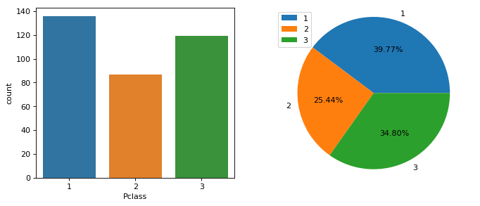


- 海难发生后，一等舱、二等舱、三等舱的乘客存活人数变为136、87、119人，分别占总人数的 39.77%, 25.44%, 34.80%

#### 各等级客舱存活的人员的比例


```python
pclass1 = data[data['Pclass']==1]
pclass1['PassengerId'].count()
```


    216


```python
pclass1_survived =pclass1[pclass1['Survived']==1]
pclass1_survived['PassengerId'].count()
```


    136


```python
pclass1_not_survived = pclass1['PassengerId'].count() - pclass1_survived['PassengerId'].count()
pclass1_not_survived
```


    80


```python
plt.figure(figsize=(10,4),dpi=80)
plt.pie([pclass1_survived['PassengerId'].count(),pclass1_not_survived],labels=['pclass1_survived','pclass1_not_survived'],autopct='%1.2f%%')
plt.axis('equal')
plt.legend()
plt.show()
```


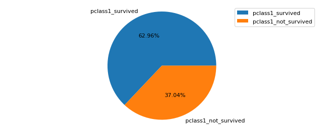


```python
pclass2 = data[data['Pclass']==2]
pclass2['PassengerId'].count()
```


    184


```python
pclass2_survived =pclass2[pclass2['Survived']==1]
pclass2_survived['PassengerId'].count()
```


    87


```python
pclass2_not_survived = pclass2['PassengerId'].count() - pclass2_survived['PassengerId'].count()
pclass2_not_survived
```


    97


```python
plt.figure(figsize=(10,4),dpi=80)
plt.pie([pclass2_survived['PassengerId'].count(),pclass2_not_survived],labels=['pclass1_survived','pclass1_not_survived'],autopct='%1.2f%%')
plt.axis('equal')
plt.legend()
plt.show()
```


```python
pclass3 = data[data['Pclass']==3]
pclass3['PassengerId'].count()

```


    491


```python
pclass3_survived =pclass3[pclass3['Survived']==1]
pclass3_survived['PassengerId'].count()
```


    119


```python
pclass3_not_survived = pclass3['PassengerId'].count() - pclass3_survived['PassengerId'].count()
pclass3_not_survived
```


    372


```python
plt.figure(figsize=(10,4),dpi=80)
plt.pie([pclass3_survived['PassengerId'].count(),pclass3_not_survived],labels=['pclass1_survived','pclass1_not_survived'],autopct='%1.2f%%')
plt.axis('equal')
plt.legend()
plt.show()
```


```python
sns.countplot(data['Pclass'],hue=data['Survived'])
plt.show()
```


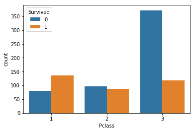


- 一等舱存活率为 62.96%，二等舱为 47.28%，三等舱为 24.24%；客舱等级越高，生还率越高

### 3乘客存活情况和其年龄的关系

- 因为Age存在缺失值，我们需要先填补缺失值，一般我们选择填补空缺值，但是这样很容易造成数据堆叠，如果我们选择删除，本来只有800多列的数据，要一次删除100多列，会造成数据结果的不准确性
- 我们选择求出这列数组的平均值和标准差，然后在范围内随机抽取数值插入数组中


```python
data_age_avarage = data['Age'].mean()
data_age_std = data['Age'].std()
data_age_null = data['Age'].isnull().sum()
```


```python
random_number = np.random.randint(data_age_avarage - data_age_std, data_age_avarage + data_age_std, data_age_null)
```


```python
random_number.shape
```


    (177,)


```python
type(data['Age'])
```


    pandas.core.series.Series


```python
# 填补缺失值
data['Age'][np.isnan(data['Age'])] = random_number
```

    D:\anaconda\lib\site-packages\ipykernel_launcher.py:1: SettingWithCopyWarning: 
    A value is trying to be set on a copy of a slice from a DataFrame
    
    See the caveats in the documentation: http://pandas.pydata.org/pandas-docs/stable/indexing.html#indexing-view-versus-copy
      """Entry point for launching an IPython kernel.
    


```python
data['Age'].isnull().any()
```


    False


```python
data['Age'].plot('hist',bins=80)
plt.show()
```


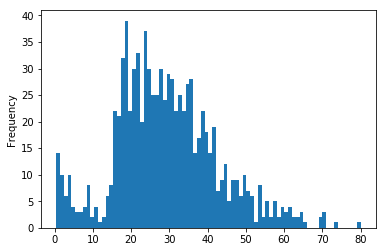


```python
data.boxplot(column = 'Age', showfliers = False)
plt.show()
```


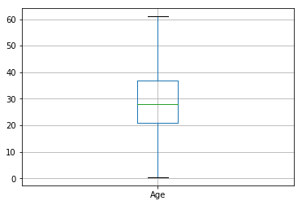


```python
data['Age'].describe()
```


    count    891.000000
    mean      29.504119
    std       13.506851
    min        0.420000
    25%       21.000000
    50%       28.000000
    75%       37.000000
    max       80.000000
    Name: Age, dtype: float64


- 这组数据中，年龄最大80岁，年龄最小0.42岁，平均年龄29.5岁
- 将年龄分成四组 0-19 20-39 40-59 60-80


```python
data1 = data[data['Age'] <= 19]
```


```python
data1['PassengerId'].count()
```


    199


```python
data1['Survived'].sum()
```


    91


```python
data1_not_survived = data1['PassengerId'].count() - data1['Survived'].sum()
data1_not_survived
```


    108


```python
plt.figure(figsize=(10,4),dpi=80)
plt.subplot(121)
sns.countplot(x= 'Survived',data = data1)
plt.subplot(122)
plt.pie([data1_not_survived,data1['Survived'].sum()],labels=['not survived','survived'], autopct='%1.2f%%')
plt.axis('equal')
plt.legend()
plt.show()
```


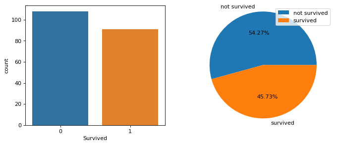


```python
data2 = data[(data['Age'] >= 20) & (data['Age'] <=39)]
```


```python
data2['PassengerId'].count()
```


    510


```python
data2['Survived'].sum()
```


    184


```python
data2_not_survived = data2['PassengerId'].count() - data2['Survived'].sum()
data2_not_survived
```


    326


```python
plt.figure(figsize=(10,4),dpi=80)
plt.subplot(121)
sns.countplot(x= 'Survived',data = data2)
plt.subplot(122)
plt.pie([data2_not_survived,data2['Survived'].sum()],labels=['not survived','survived'], autopct='%1.2f%%')
plt.axis('equal')
plt.legend()
plt.show()
```


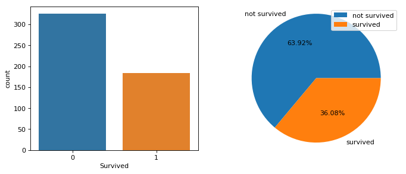


```python
data3 = data[(data['Age'] >= 40) & (data['Age'] <=59)]
```


```python
data3['PassengerId'].count()
```


    156


```python
data3['Survived'].sum()
```


    60


```python
data3_not_survived = data3['PassengerId'].count() - data3['Survived'].sum()
data3_not_survived
```


    96


```python
plt.figure(figsize=(10,4),dpi=80)
plt.subplot(121)
sns.countplot(x= 'Survived',data = data3)
plt.subplot(122)
plt.pie([data3_not_survived,data3['Survived'].sum()],labels=['not survived','survived'], autopct='%1.2f%%')
plt.axis('equal')
plt.legend()
plt.show()
```


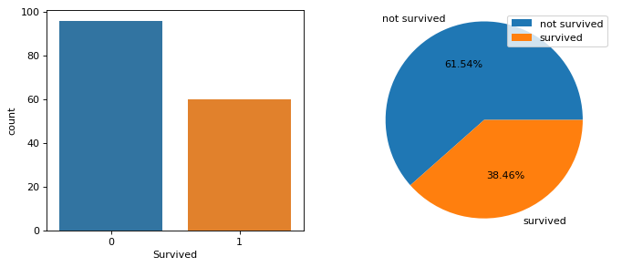


```python
data4 = data[(data['Age'] >= 60) & (data['Age'] <=80)]
```


```python
data4['PassengerId'].count()
```


    26


```python
data4['Survived'].sum()
```


    7


```python
data4_not_survived = data4['PassengerId'].count() - data4['Survived'].sum()
data4_not_survived
```


    19


```python
plt.figure(figsize=(10,4),dpi=80)
plt.subplot(121)
sns.countplot(x= 'Survived',data = data4)
plt.subplot(122)
plt.pie([data4_not_survived,data4['Survived'].sum()],labels=['not survived','survived'], autopct='%1.2f%%')
plt.axis('equal')
plt.legend()
plt.show()
```


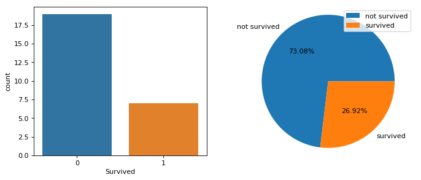


- 0-19岁之间有199人 幸存91人，幸存率45.73%
- 20-39岁之间有510人，幸存144人，幸存率36.08%
- 40-59岁之间有156人，幸存60人，幸存率38.46%
- 60-80岁之间有26人，幸存7人，幸存率26.92%
- 20-39岁之间幸存人数最多，0-19岁之间幸存率最高

### 4乘客存活情况和其在船上是否有兄弟姐妹


```python
data['SibSp'].unique()
```


    array([1, 0, 3, 4, 2, 5, 8], dtype=int64)


```python
data.groupby('SibSp')['PassengerId'].count()
```


    SibSp
    0    608
    1    209
    2     28
    3     16
    4     18
    5      5
    8      7
    Name: PassengerId, dtype: int64


```python
sibsp = data[data['SibSp']!=0]
no_sibsp = data[data['SibSp']==0]
```


```python
sibsp['PassengerId'].count()
```


    283


```python
sibsp_survived = sibsp[sibsp['Survived']==1]
sibsp_survived['PassengerId'].count()
```


    132


```python
sibsp_not_survived =sibsp['PassengerId'].count() - sibsp_survived['PassengerId'].count()
sibsp_not_survived
```


    151


```python
plt.pie([sibsp_survived['PassengerId'].count(),sibsp_not_survived],labels=['survived','not survived'],autopct='%1.2f%%')
plt.axis('equal')
plt.legend()
plt.show()
```


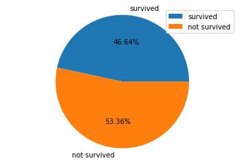


- 有兄弟姐妹的乘客，一共有283人，存活了132人，存活率46.64%


```python
no_sibsp = data[data['SibSp']==0]
no_sibsp['PassengerId'].count()
```


    608


```python
no_sibsp_survived = no_sibsp[no_sibsp['Survived']==1]
no_sibsp_survived['PassengerId'].count()
```


    210


```python
no_sibsp_not_survived =no_sibsp['PassengerId'].count() - no_sibsp_survived['PassengerId'].count()
no_sibsp_not_survived
```


    398


```python
plt.pie([no_sibsp_survived['PassengerId'].count(),no_sibsp_not_survived],labels=['survived','not survived'],autopct='%1.2f%%')
plt.axis('equal')
plt.legend()
plt.show()
```


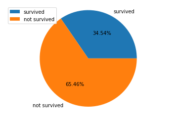


- 没有兄弟姐妹的乘客，一共有608人，存活了210人，存活率34.54%


```python
sns.countplot(data['SibSp'],hue=data['Survived'])
plt.show()
```


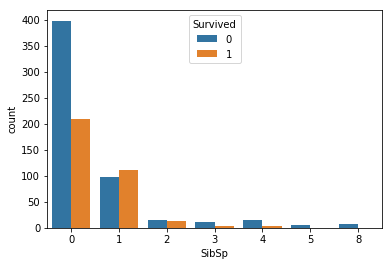


- 有兄弟姐妹在船上的人的生存率要大于没有兄弟姐妹在船上的人

### 5乘客存活情况和其在船上是否有父母或子女


```python
data['Parch'].unique()
```


    array([0, 1, 2, 5, 3, 4, 6], dtype=int64)


```python
parch = data[data['Parch']!=0]
parch['PassengerId'].count()
```


    213


```python
parch_survived =parch[parch['Survived']==1]
parch_survived['PassengerId'].count()
```


    109


```python
parch_not_survived =  parch['PassengerId'].count() - parch_survived['PassengerId'].count()
parch_not_survived
```


    104


```python
plt.figure(figsize=(10,4),dpi=80)
plt.pie([parch_survived['PassengerId'].count(),parch_not_survived],labels=['survived','not survived'],autopct='%1.2f%%')
plt.axis('equal')
plt.legend()
plt.show()
```


- 父母子女在船上的乘客有213人，其中109人存活，存活率为51.17%


```python
no_parch = data[data['Parch']==0]
no_parch['PassengerId'].count()
```


    678


```python
no_parch_survived =no_parch[no_parch['Survived']==1]
no_parch_survived['PassengerId'].count()
```


    233


```python
no_parch_not_survived =  no_parch['PassengerId'].count() - no_parch_survived['PassengerId'].count()
no_parch_not_survived
```


    445


```python
plt.figure(figsize=(10,4),dpi=80)
plt.pie([no_parch_survived['PassengerId'].count(),no_parch_not_survived],labels=['survived','not survived'],autopct='%1.2f%%')
plt.axis('equal')
plt.legend()
plt.show()
```


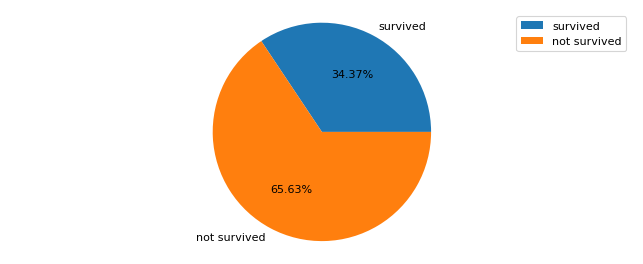


- 船上没有父母子女的乘客一共有678人，其中存活233人，存活率为34.37%

### 6乘客存活情况和其所持船票的票价


```python
data['Fare'].unique()
```


    array([   7.25  ,   71.2833,    7.925 ,   53.1   ,    8.05  ,    8.4583,
             51.8625,   21.075 ,   11.1333,   30.0708,   16.7   ,   26.55  ,
             31.275 ,    7.8542,   16.    ,   29.125 ,   13.    ,   18.    ,
              7.225 ,   26.    ,    8.0292,   35.5   ,   31.3875,  263.    ,
              7.8792,    7.8958,   27.7208,  146.5208,    7.75  ,   10.5   ,
             82.1708,   52.    ,    7.2292,   11.2417,    9.475 ,   21.    ,
             41.5792,   15.5   ,   21.6792,   17.8   ,   39.6875,    7.8   ,
             76.7292,   61.9792,   27.75  ,   46.9   ,   80.    ,   83.475 ,
             27.9   ,   15.2458,    8.1583,    8.6625,   73.5   ,   14.4542,
             56.4958,    7.65  ,   29.    ,   12.475 ,    9.    ,    9.5   ,
              7.7875,   47.1   ,   15.85  ,   34.375 ,   61.175 ,   20.575 ,
             34.6542,   63.3583,   23.    ,   77.2875,    8.6542,    7.775 ,
             24.15  ,    9.825 ,   14.4583,  247.5208,    7.1417,   22.3583,
              6.975 ,    7.05  ,   14.5   ,   15.0458,   26.2833,    9.2167,
             79.2   ,    6.75  ,   11.5   ,   36.75  ,    7.7958,   12.525 ,
             66.6   ,    7.3125,   61.3792,    7.7333,   69.55  ,   16.1   ,
             15.75  ,   20.525 ,   55.    ,   25.925 ,   33.5   ,   30.6958,
             25.4667,   28.7125,    0.    ,   15.05  ,   39.    ,   22.025 ,
             50.    ,    8.4042,    6.4958,   10.4625,   18.7875,   31.    ,
            113.275 ,   27.    ,   76.2917,   90.    ,    9.35  ,   13.5   ,
              7.55  ,   26.25  ,   12.275 ,    7.125 ,   52.5542,   20.2125,
             86.5   ,  512.3292,   79.65  ,  153.4625,  135.6333,   19.5   ,
             29.7   ,   77.9583,   20.25  ,   78.85  ,   91.0792,   12.875 ,
              8.85  ,  151.55  ,   30.5   ,   23.25  ,   12.35  ,  110.8833,
            108.9   ,   24.    ,   56.9292,   83.1583,  262.375 ,   14.    ,
            164.8667,  134.5   ,    6.2375,   57.9792,   28.5   ,  133.65  ,
             15.9   ,    9.225 ,   35.    ,   75.25  ,   69.3   ,   55.4417,
            211.5   ,    4.0125,  227.525 ,   15.7417,    7.7292,   12.    ,
            120.    ,   12.65  ,   18.75  ,    6.8583,   32.5   ,    7.875 ,
             14.4   ,   55.9   ,    8.1125,   81.8583,   19.2583,   19.9667,
             89.1042,   38.5   ,    7.725 ,   13.7917,    9.8375,    7.0458,
              7.5208,   12.2875,    9.5875,   49.5042,   78.2667,   15.1   ,
              7.6292,   22.525 ,   26.2875,   59.4   ,    7.4958,   34.0208,
             93.5   ,  221.7792,  106.425 ,   49.5   ,   71.    ,   13.8625,
              7.8292,   39.6   ,   17.4   ,   51.4792,   26.3875,   30.    ,
             40.125 ,    8.7125,   15.    ,   33.    ,   42.4   ,   15.55  ,
             65.    ,   32.3208,    7.0542,    8.4333,   25.5875,    9.8417,
              8.1375,   10.1708,  211.3375,   57.    ,   13.4167,    7.7417,
              9.4833,    7.7375,    8.3625,   23.45  ,   25.9292,    8.6833,
              8.5167,    7.8875,   37.0042,    6.45  ,    6.95  ,    8.3   ,
              6.4375,   39.4   ,   14.1083,   13.8583,   50.4958,    5.    ,
              9.8458,   10.5167])


```python
data['Fare'].describe()
```


    count    891.000000
    mean      32.204208
    std       49.693429
    min        0.000000
    25%        7.910400
    50%       14.454200
    75%       31.000000
    max      512.329200
    Name: Fare, dtype: float64


```python
data['Fare'].plot('hist',bins=70)
plt.show()
```


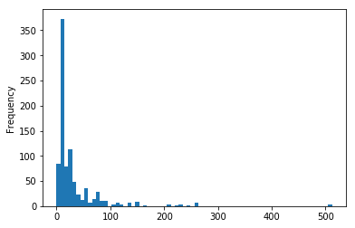


```python
data.boxplot(column = 'Fare', by = 'Pclass',showfliers = False)
plt.show()
```

    D:\anaconda\lib\site-packages\numpy\core\fromnumeric.py:57: FutureWarning: reshape is deprecated and will raise in a subsequent release. Please use .values.reshape(...) instead
      return getattr(obj, method)(*args, **kwds)
    


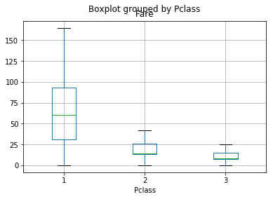


```python
fare_survived = data_survived['Fare']
```


```python
fare_survived.mean()
```


    48.39540760233917


```python
fare_survived.std()
```


    66.59699811829472


```python
fare_not_survived = data_not_survived['Fare']
```


```python
fare_not_survived.mean()
```


    22.117886885245877


```python
fare_not_survived.std()
```


    31.388206530563984


```python
data.boxplot(column = 'Fare', by = 'Survived',showfliers = False)
plt.show()
```

    D:\anaconda\lib\site-packages\numpy\core\fromnumeric.py:57: FutureWarning: reshape is deprecated and will raise in a subsequent release. Please use .values.reshape(...) instead
      return getattr(obj, method)(*args, **kwds)
    


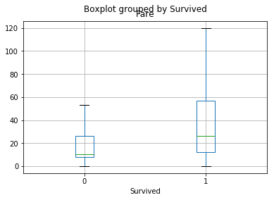


- 生存者的平均票价是高于未生存者，票价和生存性有一定关系

### 7乘客存活情况和其所持客舱号码


```python
data['Cabin'].isnull().sum()
```


    687


- 数据集中一共有891行数据，'Cabin'这列有687个缺失值，缺失值太多，这列不予讨论

### 8乘客存活情况和其起航运港


```python
data['Embarked'].isnull().sum()
```


    2


```python
data['Embarked'].unique()
```


    array(['S', 'C', 'Q', nan], dtype=object)


```python
data[data['Embarked'] =='S']['PassengerId'].count()
```


    644


```python
data[data['Embarked'] =='C']['PassengerId'].count()
```


    168


```python
data[data['Embarked'] =='Q']['PassengerId'].count()
```


    77


- 我们可以选择填补或者删除缺失值，因为样本本来只有800多行，我们选择填补缺失值，填补的数据为3个港口中登船人数最多的S港


```python
data['Embarked'].fillna('S',inplace=True)
```


```python
data.isnull().any()
```


    PassengerId    False
    Survived       False
    Pclass         False
    Name           False
    Sex            False
    Age             True
    SibSp          False
    Parch          False
    Ticket         False
    Fare           False
    Cabin           True
    Embarked       False
    dtype: bool


```python
data['Embarked'].isnull().sum()
```


    0


```python
data[data['Embarked'] =='S']['PassengerId'].count()
```


    646


```python
Embarked_S = data[data['Embarked'] =='S']
Embarked_S_survived = Embarked_S[Embarked_S['Survived']==1]
Embarked_S_survived['PassengerId'].count()
```


    219


```python
Embarked_S_not_survived = data[data['Embarked'] =='S']['PassengerId'].count() - Embarked_S_survived['PassengerId'].count()
Embarked_S_not_survived
```


    427


```python
plt.figure(figsize=(10,4),dpi=80)
plt.pie([Embarked_S_survived['PassengerId'].count(),Embarked_S_not_survived],labels=['survived','not survived'],autopct='%1.2f%%')
plt.axis('equal')
plt.legend()
plt.title('Southampton')
plt.show()
```


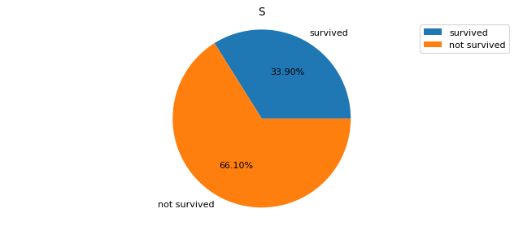


- Southampton一共有646人上船，其中存活219人，存活率33.90%


```python
data[data['Embarked'] =='C']['PassengerId'].count()
```


    168


```python
Embarked_C = data[data['Embarked'] =='C']
Embarked_C_survived = Embarked_C[Embarked_C['Survived']==1]
Embarked_C_survived['PassengerId'].count()
```


    93


```python
Embarked_C_not_survived = data[data['Embarked'] =='C']['PassengerId'].count() - Embarked_C_survived['PassengerId'].count()
Embarked_C_not_survived
```


    75


```python
plt.figure(figsize=(10,4),dpi=80)
plt.pie([Embarked_C_survived['PassengerId'].count(),Embarked_C_not_survived],labels=['survived','not survived'],autopct='%1.2f%%')
plt.axis('equal')
plt.legend()
plt.title('Cherbourg')
plt.show()
```


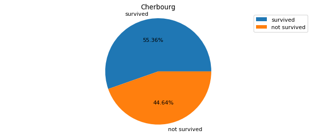


- Cherbourg一共有168人上船，其中存活93人，存活率55.36%


```python
data[data['Embarked'] =='Q']['PassengerId'].count()
```


    77


```python
Embarked_Q = data[data['Embarked'] =='Q']
Embarked_Q_survived = Embarked_Q[Embarked_Q['Survived']==1]
Embarked_Q_survived['PassengerId'].count()
```


    30


```python
Embarked_Q_not_survived = data[data['Embarked'] =='Q']['PassengerId'].count() - Embarked_Q_survived['PassengerId'].count()
Embarked_Q_not_survived
```


    47


```python
plt.figure(figsize=(10,4),dpi=80)
plt.pie([Embarked_Q_survived['PassengerId'].count(),Embarked_Q_not_survived],labels=['survived','not survived'],autopct='%1.2f%%')
plt.axis('equal')
plt.legend()
plt.title('Queenstown')
plt.show()
```


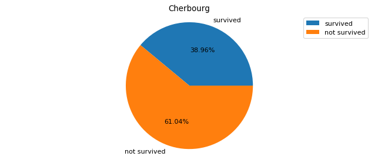


- Queenstown一共有77人上船，其中30人幸存，幸存率38.96%


```python
sns.countplot(data['Embarked'],hue=data['Survived'])
plt.show()
```


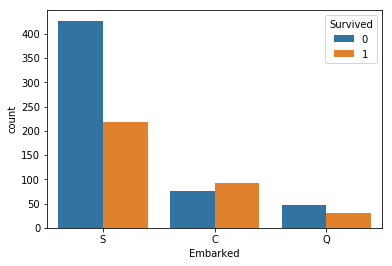


- 虽然在Southampton上船最后幸存的人数最多，但是Southampton却是三座港口中幸存率最低的；Cherbourg港口的幸存率最高，达到了55.36%

# 总结
## 1
- 生还者有342人,占总人数的38.38%，遇难者有549人，占总人数的61.61%
- 一共有人数891人，其中女性314人占35.24%，男性577人占64.76%
- 一共存活了342人，其中女性存活233人，占总存活人数的68.13%，男性存活109人，占总存活人数的31.87%
- 男性一共有577人，其中存活了109人，占男性总人数的18.89%
- 女性一共有314人，其中存活了233人，占女性总人数的74.2%
## 2
- 一等舱、二等舱、三等舱的乘客分别为216、184、491人，分别占总人数的 24.24%， 20.65%， 55.11%
- 海难发生后，一等舱、二等舱、三等舱的乘客存活人数变为136、87、119人，分别占总人数的 39.77%, 25.44%, 34.80%
- 一等舱存活率为 62.96%，二等舱为 47.28%，三等舱为 24.24%；客舱等级越高，生还率越高
## 3
- 年龄最大80岁，年龄最小0.42岁，平均年龄29.5岁
- 将年龄分成四组 0-19 20-39 40-59 60-80
- 0-19岁之间有199人 幸存91人，幸存率45.73%
- 20-39岁之间有510人，幸存144人，幸存率36.08%
- 40-59岁之间有156人，幸存60人，幸存率38.46%
- 60-80岁之间有26人，幸存7人，幸存率26.92%
- 20-39岁之间幸存人数最多，0-19岁之间幸存率最高
## 4
- 有兄弟姐妹的乘客，一共有283人，存活了132人，存活率46.64%
- 没有兄弟姐妹的乘客，一共有608人，存活了210人，存活率34.54%
## 5
- 父母子女在船上的乘客有213人，其中109人存活，存活率为51.17%
- 船上没有父母子女的乘客一共有678人，其中存活233人，存活率为34.37%
## 6
- 生存者的平均票价是高于未生存者，票价和生存性有一定关系
## 7
- Southampton一共有646人上船，其中存活219人，存活率33.90%
- Cherbourg一共有168人上船，其中存活93人，存活率55.36%
- Queenstown一共有77人上船，其中30人幸存，幸存率38.96%
- 虽然在Southampton上船最后幸存的人数最多，但是Southampton却是三座港口中幸存率最低的；Cherbourg港口的幸存率最高，达到了55.36%
